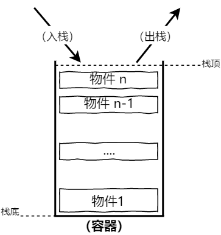
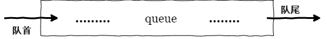

# 《JavaScript 高级程序设计》第五章：Array 类型

## 简介

组成数组的每一项可以称之为 “数组元素”，也可以称之为 “数据项”，并且每个数组元素都有一个与之对应的下标（索引）。

ECMAScript 中创建数组主要有两种方式：

**构造函数**

```javascript
var arr = new Array(); //创建一个默认的空数组
var arr2 = new Array(3); //创建一个空数组，但初始化好数组的长度
var arr3 = new Array(1, 2, "a"); //创建一个数组，并依次按顺序保存传入的数组元素的值。
```

> 在这个例子中 `arr` 、`arr2` 、 `arr3` 都是构造函数 `Array()` 的实例数组对象。

**字面量**

```javascript
var arr = [1, 2, 3, "a", "b", "c"];
```

> 需要注意的是，如果数组中存在以逗号隔开的空值，那么数组元素的数量，在不同的浏览器将存在兼容性问题。

```javascript
var arr = [1, 2];

/* IE 8.0 - */

arr.length; // 3;

/* IE 9.0 + / Chrome / Firefox */

arr.length; //2
```

> 在 `IE8.0-` 下只要有逗号分隔就存在着数组元素，默认为 `undefined` 。

## legnth

Array 的长度是动态的，通过 `length` 属性可以实时获取数组的当前长度，但 `length` 属性却并非是只读的，通过 `length` 属性我们可以手动调整数组的长度，删除数组尾部的元素，也或者向数组的尾部新增数组元素。

- 获取数组长度

```javascript
var arr = [1, "a", true];

arr.length; //3
```

- 删除数组最后一个元素

```javascript
arr.length = 2;
arr[2]; // undefined
```

- 新增數組元素（在尾部）

```javascript
arr.length = 3; //(3) [1, "a", empty]
arr[arr.length] = false; //(4) [1, "a", empty, false]
```

## 检测数组

`isArray()` 是 ES5 为 Array 类型最新添加的静态方法，它可以有效的解决不是一个全局环境中的“引用类型”是否为数组的判断。

例如：从 A 框架(iframe)中传入到 B 框架的数组就不是一个全局环境，对于这种情况，单纯的 `instanceof` 操作符将会失效。

```javascript
Array.isArray(arr); //true
Array.isArray(window.frames[0].Array()); //true

window.frames[0].Array() instanceof Array; //false
```

返回值是一个 `Boolean`类型，兼容性：IE9+。

如果考虑兼容性并且笃定当前的引用类型不会跨全局环境，则可以直接使用 `instanceof` 操作符。

```javascript
arr instanceof Array; //true
```

也或者通过引用类型的 `constructor` 属性来判断：

```javascript
arr.constructor == Array; // true
```

更或者可以基于行为来判断：

```javascript
function isArray(target) {
  if (typeof target != "object") return;
  return target.length >= 0 && target.pop && target.push;
}
```

最后，还可以通过 `Object.toString()` 方法返回的固定格式结果来进行类型的匹配。

```javascript
function isType(target, type) {
  return Object.prototype.toString.call(target) === "[object " + type + "]";
}

isType([], "Array");
```

多种方法相比较，第一种最适用，但存在兼容性问题，而第二种无法解决跨全局的问题，最后的两种无疑更加通用。

## 转换方法

在 JavaScript 中一切皆对象，其中 `Object` 是一切其它对象的基础对象，所有其它对象都继承于 `Object`，所以同理，Array 也具有 `toString()`、`toLocaleString()`、`valueOf()` 这三个方法，只是 Array 中这三个方法并不是单纯的继承于 Object，而是对这三个方法进行了一定特殊的重写，差异则体现在 Array 中这三个方法返回值并不与 Object 的相同，而是更契合自身的结果。

```javascript
var a1 = [];
var a2 = ["red", "green", "blue"];
var a3 = [{}, {}];
```

**toString()**
`toString()` 与 `toLocaleString()` 方法会将数组元素转换为字符串，并以“逗号”作为默认的分隔符进行拼接返回。

```javascript
a1.toString(); //"";
a2.toString(); //"red,green,blue"
```

当数组元素是基本数据类型时，这一转换会很直观，但是当数组元素的值是一个“引用类型”时，结果将会有些不同。

```javascript
a3.toString(); //"[object Object],[object Object]"
```

这是因为 Array 的 `toString()` 方法遇到“引用类型”的值时会继续调用这个“引用类型”的 `toString()` 方法或 `toLocaleString()`，直到返回的结果是一个基本类型为止。

```javascript
var f = function() {};
var r = new RegExp();
var b = new Boolean(false);

[f, r, b].toString(); // "function(){},/(?:)/,false"
```

更严谨的说当 Array 的 `toString()` 方法遇到的是一个“引用类型”的值时会先调用这个引用对象的 `valueOf()` 方法，当 `valueOf()` 方法的返回值依然是一个引用类型时，才会调用这个对象的 `toString()` 方法，直到返回的值是一个基本数据类型为止。

```javascript
var arr = [
  {
    valueOf: () => {
      return 1;
    },
    toString: () => {
      return "A";
    }
  },
  {
    valueOf: () => {
      return {
        toString: () => {
          return 2;
        }
      };
    },
    toString: () => {
      return "B";
    }
  }
];

arr.toString(); // "A,B"
```

**valueOf()**

返回数组实例对象本身。

**join()**
数组除了以上所有引用类型都具有的三个基本转换方法，还有一个私有的转换方法 — `join()`。

`join()` 与 `toString()` 功能非常相似，区别只是 `toString()` 只能默认以“逗号”作为分隔符来拼接每个转换为字符串的数组元素，而 `join()` 方法则可以自定义要拼接的分隔符。当然如果不指定特定的分隔符，`join()` 方法默认的也是以“逗号”作为分隔符。

```javascript
var arr = ["red", "green", "blue"];
arr.join(); // "red,green,blue"
arr.join("|"); // "red|green|blue"
arr.join("||"); // "red||green||blue"
```

## 栈方法

利用 Array 自带的一些方法，我们可以很轻易的模拟其它的数据结构，例如：“栈”(堆栈)。

“栈”是一种后进先出（先进后出），LIFO 的数据结构，也就是最新添加的最早被删除，不过在栈这种数据结构中，向栈中添加数据被称之为“入栈”(推入)，移除数据则称之为“出栈”(弹出)，因此在栈中，数据的入栈与出栈只会在一个位置进行 — 既“栈”的顶部（栈头）。

对“栈”的更形象理解，可以想像成一个空的容器，容器的底部是栈底，而容器的入口便是栈头，然后不断的向这个容器内部加入物件，一直塞满为止，当容器已经塞满的时候，若想再加入只能在容器的入口处将最近一次新添加的物件移出。



ECMAScript 实现栈的行为主要借助 `push()` 、`pop()` 等方法。

- `push()` ：向数组的尾部追加新的数组元素。返回更新后的数组长度。
- `pop()` ：删除数组尾部的最后一项，返回被删除的数组元素。

通过使用 `pop()` 、`push()` 来模拟“栈”的结构。那么栈头的位置就是数组的尾部，因为这两个方法都是对数组的尾部进行操作。

```javascript
//假设“栈”最多只能放置3个物件。
var number = new Array(3);

number.push(1);
number.push(2);
number.push(3);

//此时重新加入第4个物件，则必须将栈顶的物件3移除。
number.pop();

//移出后，便可以再加入物件4.
number.push(4);
```

## 队列

“栈”的数据结构使其操作与访问要遵循“后进先出（LIFO）”的规则，而“队列”这种数据结构使其访问与操作要遵循 “先进先出（FIFO）”的规则，队列中的数据，从队列的末端被添加，然后在队列的前端移除。

形象的理解，队列（Queue）就像是现实生活中排队买东西一样，先排先处理，后来者则在队尾进行排队等待处理。


使用数组来模拟队列，需要借助 `shift()` 、`push()` 等方法。

- `shift()` ：删除数组第一个元素，并返回被删除的数组元素。

```javascript
//已经排好的队伍
var queue = [1, 2, 3];

//此时来了第四个人，则向后排队
queue.push(4);
//开始处理每次队列的第一个人
queue.shift();

queue.push(5);
queue.shift();

//....
```

一般来说这种从队首移除，从队尾添加的顺序是默认的队列规则，当然也可以从队首添加，队尾删除，像这种队列则称之为 “反向队列 (reverse queue)”。



实现反向队列则需要借助 `unshift()` 与 `pop()`。

- `unshift()` ：向数组的首部添加元素，并返回添加后的数组长度。

```javascript
var colors = new Array();

colors.unshift("red", "green");
colors.unshift("black");

colors.pop(); //green
```

## 数组排序

数组中最简单的排序方法便是 `reverse()`。

`reverse()` 方法会对原数组进行颠倒重排，并永远改变原数组中数组元素的顺序。

```javascript
var arr = [1, 2, 3];

arr.reverse();
arr; //[3,2,1]
```

再复杂些的排序方法便是数组的 `sort()` 方法，`sort()` 方法默认升序排序，并且会自动将数组元素转换为字符串，然后按照 ASCII 码大小进行排序。例如：

```javascript
var arr = [0, 1, 5, 15, 10];

arr.sort();
arr; //[0,1,10,15,5];
```

如果只是单单的将数组元素转换为字符进行大小比较，必然无法满足一些更为复杂的使用场景，因此 `sort()` 方法也接收一个回调函数，来自定义排序的行为：

```javascript
function compare(value1, value2) {
  if (value1 < value2) return -1;
  if (value1 > value2) return 1;
  return 0;
}

arr.sort(compare); //[0,1,5,10,15];
```

`sort()` 的回调函数可以接收两个参数，如果第一个参数应在第二个参数之前，则回调函数返回一个负数，如果第一个参数在第二个参数之后，则返回一个正数，如果两个参数相等则返回 0 .

在上面的示例中，因为采用的是升序排序，所以会对值的大小进行判断（如果第一个值小于第二个值，既第一个值要在第二个值之前，此时返回 -1，如果第一个值大于第二个值，既第一个值实际要在第二个值之后，此时返回 1，除了以上两种情况，默认则返回 0）。

同样的，如果打算降序排序，则只需将以上条件的返回值取反即可。

```javascript
if (value1 < value2) return 1;
if (value1 > value2) return -1;
```

通常情况下，如果我们能保证要进行排序的数组，其数组的元素都是数值类型，并默认升序排序，直接返回两个参数的的差值即可。

```javascript
function compare() {
  return value1 - value2;
}
```

通过传入自定义排序方法，还可以解决结构较为复杂的数据排序问题。

```javascript
[{ id: 3, name: 3 }, { id: 5, name: 5 }, { id: 4, name: 4 }];
```

若要对这样的 JSON 数据按照 id 排序，则只需在 `sort()` 方法中进行 id 大小的比较即可。

```javascript
arr.sort(function(a, b) {
  return a.id - b.id;
});
```

实际上 `sort` 方法的实现标准并没有纳入 ECMAScript 中，因此不同的浏览器，采用的算法也不相同，就以 Chrome 为例，在排序数组长度较短的时候，采用“插入排序”，当数组较为复杂的时候则采用“快速排序”算法。

这里简单的介绍下“插入排序”，我们可以想象现在有一个队伍（数组），队伍中人的年龄分布是无序的，现在要按照人的年龄大小来对对队伍进行排序（升序），若采用“插入排序”算法，便是从队伍的第二个人开始，让它与之前的人对比，如果前面的人年龄比自己大，则调换位置，调换位置后继续向当前位置的前一个比较，按照这个顺序继续比较下去，直到发现前一个人的年龄比自己小为止。

当第二个比较完毕后，接着便是队伍中的第三个数也依次进行大小比较和位置的相互交替，直到队伍的最后一个人对比完成方才结束整个轮番对比。

简单的说，插入排序的方式有些傻，首先不考虑队伍中的第一个人，直接从第二个人开始抓壮丁，先拉着第二个人与被忽略的第一个人比较，如果第二个大于第一个，则保持位置不变，接着再拉第三个壮丁，再依次于第二个人，第一个人比，如果第三个人的年龄小于第二个人，则两者交替位置（原本的第三变成了第二，原本的第二现在是第三）再接着从当前的位置继续向第一个比较.... 按照这样的规则每次用一个人跟队伍所有人轮番比较，直到最后一个人为止，所以“插入排序”在数据量小的情况下更简单明了，但是在数据量大的情况下，性能并非最理想。

下面是用 ECAMScript 来实现一个简单的 “插入排序”：

```javascript
function insertSort(arry) {
  var temp;
  var j;

  //从第二个开始
  for (var i = 1; i < arry.length; i++) {
    //保存被对比的数 (每次的壮丁)
    temp = arry[i];

    //初始化第一个要对比数的下标。
    j = i - 1;

    while (arry[j] > temp) {
      //如果被对比数小于当前进行对比的数，则互换位置。
      arry[j + 1] = arry[j];

      //继续轮询对比
      j--;
    }
    /*
     * 循环结束，则最后一个位置的索引 +1
     * 满足条件: j--，不满足条件：j=i-1，便总是当前对比数的位置
     * 也就是不论有没有满足条件，总要把壮丁再放回去。
     */

    arry[j + 1] = temp;
  }

  return arry;
}
```

下面是 “插入排序的 GIF” 演示：


> 注意的是 `sort()` 方法也会永远改变原数组中元素的排列顺序。

## 数组操作

下面是 ECMAScript 提供的一些对数组进行操作处理的方法。

### 合并数组

```javascript
var rgb = [000, 255];
var hex = ["#000", "#fff"];
var color = rgb.concat(hex);

console.log(rgb); //(2) [0, 255]
console.log(hex); //(2) ["#000", "#fff"]
console.log(color); //(4) [0, 255, "#000", "#fff"]
```

`concat()` 方法还可以同时合并多个数组。

```javascript
rgb.concat(hex, hsl, ymlk);
```

`concat()` 只是合并数组，返回一个所有数组的合集，并不会像 `sort`，`reverse` 等方法一样会永远改变数组的结构与数据项的顺序。

除此之外，`concat(args...)` 方法不仅可以接收数组作为参数，还可以接受其它的基本类型值作为参数，然后相同的方式合并到新的数组中。

```js
var num = [].concat(1,2,3);
//[1,2,3]
```

### 截取数组

`slice` 方法可以根据参数的起始位置与结束位置，从原数组中截取一段数组元素组成一个新的数组，并不会改变原数组对象。

```javascript
Array.slice(start, end);
```

`start` 是截取的起始位置，`end` 则是截取的结束位置，但并不会包含 `end` 所指向的那个数据项，也就是每次截取的都是 `(start ~ end - 1)`。用区间表示：`[a,b)`。

```javascript
var colorArr = ["red", "green", "blue"];

colorArr.slice(1, 1); //[]
colorArr.slice(1, 2); //["green"]
```

如果 `end` 结束位置为空，则表示从开始位置值截取到数组的末尾。

如果 `end` 结束位置为负数，则用这个负数加上数组的长度，得到的结果才是 end 真正的值。

```javascript
colorArr.slice(0, -2); //["red"]
```

### 插入/删除/覆盖

使用数组的 `splice` 方法可以对原数组进行插入/删除/覆盖操作。

其返回值是数组中被删除的或被覆盖的元素组成的新数组。如果进行的是插入操作那么返回的值便是一个空数组。

注意：splice 方法会改变原数组。

格式：`Array.splice(S[, R, item1, item2, item3, ...])`

`S` 指的是在原数组中进行操作的起始位置。

`R` 表示要删除或要覆盖的元素个数。

`item` 是要插入或覆盖（R 值存在）的数组元素，数量不限。当 `item` 存在并且 `R` 为 0 ，则进行的是插入操作，当 `R` 不为 0，也存在 item 时，则进行的是覆盖操作。

```javascript
//删除操作
var colors = ["red", "green", "blue"];
var A = colors.splice(0, 1);

console.log(colors); //(2) ["green", "blue"]
console.log(A); //["red"]

//插入操作
var B = colors.splice(0, 0, "yellow");
console.log(colors); //(3) ["yellow", "green", "blue"
console.log(B); //[]

//覆盖操作
var C = colors.splice(1, 1, "purple");
console.log(colors); //(3) ["yellow", "purple", "blue"]
console.log(C); //["green"]
```

## 位置方法

ECMAScript5 为数组对象新增了两个位置方法：`indexOf()` 与 `lastIndexOf()`。

它们与 `String` 对象的方法在参数与功能上非常相同。都接收两个参数，一个是要查找的数组元素，另一个则是被查找数组中的起始位置（默认为 0）。

它们的区别，顾名思义，一个从数组的开头向后查找(indexOf)，另一个则从数组的末尾向前查找(lastIndexOf)，它们的返回值都是一个数值型，即该元素在被查找数组中的索引位置。

如果没有匹配到，则返回 -1。

```javascript
[1, 2, 3].indexOf(3, 1); //2
[1, 2, 3].indexOf(2, 2); //-1
```

`indexOf` 与 `lastIndexOf` 也可以查找一个引用类型的数组元素，但被查找数组中若没有相同引用的数组元素，那么必然返回 -1 。

```javascript
var person = { name: "zhangsan" };

var poople = [{ name: "zhangsan" }];
var wrapPerson = [person];

poople.indexOf(person); // -1;
wrapPerson.indexOf(person); //0
```

另外 `indexOf()` 与 `lastIndexOf()` 的结合使用还可以巧妙的对数组进行去重。例如去除数组 A 与数组 B 中重复的元素，并用一个新的数组保存两者不重复的元素。

```javascript
var A = [1, 2, 3, 4, 3, 2, 1];
var B = [1, 2, 3, 5, 3, 2, 1];
var C = A.concat(B);
var repet = [];

for (var i = 0; i < C.length; i++) {
  if (C.indexOf(C[i]) === C.lastIndexOf(C[i])) {
    repet.push(C[i]);
  }
}
```

## 迭代方法

ECMAScript5 专门为数组新增了 5 个迭代方法：`some、every、filter、map、forEach`。

它们都接收两个参数：

- 迭代处理器：迭代回调函数。
- 迭代器函数中的作用域对象：`this`。

其中迭代器方法又接受三个参数，每次迭代的数据项，每次数据项的索引以及数组对象本身。

```javascript
var Arr = [1, 2, 3];
var className = { name: "班" };
var classes = Arr.map(function(item, index, arr) {
  console.log(index);
  console.log(arr);

  return item + this.name;
}, className);
```

迭代器函数中的作用域对象可以解决迭代器函数内部对上一级作用域的引用，当然如果学到了 ES6 箭头函数则会更加方便高效。

下面从这五个迭代方法的使用频率来逐个讲解：

**some / ervery**

关键字：迭代查询

返回值：Boolean。

- some：只要迭代器方法中返回 `true`，则 `some` 迭代的结果便为 true。除非全为 false。
- every: 只要迭代器方法返回 false，则 every 迭代的结果便为 false，除非全为 true，则结果为 true。

```javascript
var Arry = [1, 2, 3, 4, 5];
var Some = Arry.some(function(item) {
  return item > 2;
});
var Every = Arry.every(function(item) {
  return item > 2;
});

Some; // true。
Every; // false。
```

简单来说：`some()` 方法只要数组中有某一个元素满足特定条件，则返回 `true`。`every()` 方法只有数组中的所有元素都满足特定的条件，才会返回 `true`。

**filter**

关键字：迭代筛选

返回值：数组（Array）

功能：返回由迭代器方法返回值为 true 时的数据项组成的新数组。

示例：

```javascript
var Filter = Arry.filter(function(item) {
  return item > 2;
});
Filter; //[3,4,5]
```

**map**

关键字：迭代返回

功能：通过迭代器方法每次返回的数组元素组成新的数组，如果没有指定返回(`return`)值，则默认返回 `undefined`。

返回值：Array。

```javascript
var map = Arry.map(function(item) {
  if (item > 2) return item * 2;
  return item;
});

nap; // [1, 2, 6, 8, 10]
```

**forEach**

关键字：纯粹(pure)迭代。

说明：`forEach` 类似于 for 循环，单纯只为迭代数组元素，并不返回值。

最后，迭代方法一览表：

| 方法名  | 返回值  | 应用场景                             |
| :-----: | :-----: | :----------------------------------- |
|  some   | Boolean | 遍历检索数组中元素是否满足特定的条件 |
|  every  | Boolean | 遍历检索数组中元素是否满足特定的条件 |
| filter  |  Array  | 筛选符合条件的数组项，组成新的数组   |
|   map   |  Array  | 通过每次遍历返回的值组成新的数组     |
| forEach |    /    | 单纯遍历，无返回值                   |

## 归并方法

数组的归并方法与迭代方法相同都可以对数组进行遍历。

归并方法也接收一个迭代器函数，作为遍历时的处理函数，这个处理函数同时也接收四个参数。

```javascript
Arry.reduce(prev, cur, index, array);
```

- prev : 上一个值。
- cur : 当前值
- index : 当前遍历的索引
- array : 数组本身

与迭代方法不同的是，归并方法的第二个参数不是用于指定回调函数的“作用域对象”，而是初始遍历的基础值（可以理解这个值才是遍历数组的第一个元素）。

数组的归并方法，常用于获取数组中所有项之和。

```javascript
var Arry = [1, 2, 3, 4, 5];
var reduce = Arry.reduce(function(prev, cur, index, array) {
  return prev + cur;
}, 1);

reduce; //16
```

如果要执行合并的数组元素是引用类型，则需要进行特定的使用：

```javascript
var arr = [{ num: 1 }, { num: 2 }, { num: 3 }];
arr.reduce((a, b, c) => {
  return a + b.num;
}, 0);
```

另外还有一个 `reduceRight` 方法，其功能与 `reduce` 相同，参数也相同，区别只是遍历的方向相反。此时作为第二个参数的初始值在 `reduceRight` 便是最后一个元素。
