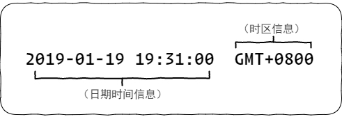

# 《JavaScript 高级程序设计》第五章： Date 类型

## 简介

ECMAScript 中的 `Date` 类型是从早期 `Java` 的 `java.util.date` 类的基础上构建的，因此也采用了 UTC(Coordinated Universal Time, 国际协调时间) 的格式，以 1970 年 1 月 1 日为基准点，保存之前或之后经过的时间戳（毫秒数）。

使用 `new` 运算符结合 `Date()` 构造函数即可创建一个 `Date` 类型的实例对象。

```javascript
var date = new Date();
```

在 ECMAScript 中日期时间数据可以是一段字符串也可以是数值类型的时间戳，下面是一个字符串类型的日期时间数据的格式：



`GMT` (格林威治时间，Green Wich Mean Time)，对比于 `UTC`，它们几乎是同一个概念，都是基于“格林威治标准时间”，只不过 `UTC` 的称呼更为正式，其次 `GMT` 更多的是天文学上的概念，既以本初子午线 “0 度经线” 将每日太阳穿过的瞬间规定为正午时刻，然后以此制定时间，但是受限于地球自转的不均衡，其误差会越来越大。所以最终 `UTC` 继承自原有的以经线划分东西半球的基础，将地球再次划分为二十四时区，并使用原子钟来进行时间的测量，所以 `UTC` 于 `GMT` 在概念上是相同的，指的都是英国伦敦的本地时间（标准时）只是前者在时间测量上更为精准。

`UTC` 时间将地球划分为二十四个时区，每个时区都有着自己的“本地时间”，而不同时区的本地时间若想进行交换，则需要借助于“时区信息”进行转换。

例如在中国向英国的一位友人发送一段时间信息：

```
2019/01/19 23:00:00 GMT+0800
```

那么当英国的朋友接收到这条时间信息后，便能马上得出自己的时间，即在当地（英国）下午 17 点接收到来自你的这条信息，这就是因为本初子午线在英国，所以英国为 0 度时区，相比位于东八区的中国要差上八个小时，相同的换算要是放在美国就要复杂一些，因为美国国内就存在着不同的本地时间（美国当地时间）它们分别是，“夏令时”与“冬令时”，而中国只有一个“北京时间”。又因为中国处于东八区，所以时区信息上要加 `GMT + 0800` 进行标识。

在浏览器中调用 `new Date()` 创建的日期对象，其默认的日期时间值都是本地时间 —— 即非 `UTC` 时间。

```javascript
new Date(); //Sate Jan 19 2019 21:26:54 GMT+0800
new Date("2019/01/19"); //Sat Jan 19 2019 00:00:00 GMT+0800 (中国标准时间)
```

或者你也可以传入多个逗号隔开的表示年、月、日、时、分、秒的数值给 `Date()` 构造函数。

```javascript
new Date(2019, 0, 19, 21, 26, 0); //Sat Jan 19 2019 21:26:00 GMT+0800 (中国标准时间)
```

需要注意的是，月份是从 0 开始，既 0 为 1 月。

使用 `Date()` 构造函数创建的日期时间都是本地时间，也就是非 `UTC` 时间，如果想创建一个 `UTC` 时间，则需要使用本地时间减去当前的时区时差。

好在关于当前时区的差值我们可以通过实例对象的 `getTimezoneOffset()` 方法来获取本地时间与 UTC 时间相差的分钟数，值为一个负数。

```javascript
var date = new Date();
var utcDate = date * 1 + date.getTimezoneOffset() * 60 * 1000;

new Date(utcDate);
```

> 由此我们可以看出，UTC = 本地时间 - TimeZone(时区值)。

最后，还有一点关于日期在年、月、日的分隔符上，国内常用是 `/` 与 `-`   两种分隔符号，但是实际上它们是有兼容性的，看下面的示例：

```javascript
new Date("2019/01/19"); //Sat Jan 19 2019 00:00:00 GMT+0800 (中国标准时间)
new Date("2019-01-19"); //Sat Jan 19 2019 08:00:00 GMT+0800 (中国标准时间)
```

从中我们可以看出使用 `/` 分隔符，并且缺省时间数据，系统默认创建的是以 `00:00:00` 为起点的 `GMT` 时间，而 `-` 分隔符则会在缺省时间段数据时，会以当前时区的时差值作为起始时间，还有就是在 `IE9-` 及以下的浏览器中会出现 `invild data` 或者直接抛出异常。因此 `\` 作为分隔符是我们推荐使用的。

## 静态方法

- **now()**

返回当前系统日期时间的时间戳（毫秒数）。

```javascript
Date.now(); //1553699554229
```

- **UTC()**

返回 `UTC` 时间 `1970/01/01 00:00:00` 到指定日期时间的时间戳，参数必须是表示年、月、日、时、分、秒的数值。

```javascript
Date.UTC(2019, 0, 19); //1547856000000
```

需要注意的是，`UTC()` 方法默认会对传入的小时值再加上当前时区的时差。

```javascript
new Date(1547856000000); //Sat Jan 19 2019 08:00:00 GMT+0800 (中国标准时间)
```

> 可以看到时间默认是 8 点。

- **parse()**

用来专门解析字符串格式的日期时间值，其行为与 `UTC()` 方法类似，返回 `1970/01/01 00:00:00` 到指定日期时间的时间戳。

不同的是 `parse()` 方法不会像 `UTC()` 方法那样默认追加上当前时区的时差。

```javascript
Date.parse("2019/01/19"); //1547827200000
new Date(1547827200000); //Sat Jan 19 2019 00:00:00 GMT+0800 (中国标准时间)
```

## 实例方法

实例方法指的是 `Date` 对象构造函数原型(prototype)上定义的方法，可以被其通过使用 `new` 运算符实例出来的对象所继承。

## 转换方法

“转换方法” 也是 `Date` 对象的“实例方法”，因为 `Date` 对象支持转换的日期/时间格式较多，所以这里就单独的列举出来说明。

| 方法名               | 说明                                                           |
| :------------------- | :------------------------------------------------------------- |
| toString()           | 返回带有时区信息国际通用格式的日期时间字符串。                 |
| toLocaleString()     | 返回符合本地格式的日期时间字符串                               |
| valueOf()            | 返回当前实例化对象的时间戳信息（数值）                         |
| toDateString()       | 返回通用格式带有周、月、日、年等信息的日期字符串               |
| toTimeString()       | 返回通用格式带有时、分、秒、时区等信息的时间字符串             |
| toLocaleDateString() | 返回符合本地格式的包含年、月、日等信息的日期字符串             |
| toLocaleTimeString() | 返回符合本地格式的包含时、分、秒等信息的时间字符串             |
| toUTCString()        | 返回符合 `UTC` 日期时间格式的字符串                            |
| toISOString()        | 返回符合 `ISO` 格式的日期时间字符串                            |
| toJSON()             | 返回符合 `JSON` 格式使用的日期时间字符串(使用 `toISOString()`) |

- 本地格式

当我们编写的应用不能确保在一个固定的地域中使用时，在日期时间的展示上最稳妥的方式莫非就是调用 `toLocaleString`、`toLocaleDateString`、`toLocaleTimeString` 等符合本地格式的日期时间转换方法。

当然，使用国际通用格式也是不错的解决方法。

- `ISO` 日期时间格式

`ISO` 日期时间格式指的是符合 “国际标准化组织” 制定的 ISO 8601 日期和时间的表示方法，目前最新版本是第三版的 ISO8601:2004。具体格式如下所示：

```javascript
"2019-03-28T15:09:38.151Z";
```

`ISO` 格式的日期和时间使用大写字母`T`作分隔，`T` 字符可以理解为占位符，在特殊的使用场景中可以被其它字符替换，例如 `GMT` 格式下就用空格代替，若时间段采用的是 `GMT` 时间则需要附加上一个大写字母 `Z`，当然也可以是具体的时区信息，例如：`+08`，时间段中秒与毫秒则用 “.” 点号符进行连接。

- `JSON` 格式

`JSON` 数据中关于日期时间的值推荐采用的也是 ISO-8601 标准，既`YYYY-MM-DDTHH:mm:ss.sssZ` 格式。

需要注意的是 `toJSON()` 方法 IE8- 以下浏览器并不支持。

## 日期/时间组件方法

“日期/时间组件方法” 也是 `Date` 对象的“实例方法”，这些方法都是 `Date` 对象最常用的也是最核心的方法。

| 方法名              | 说明                                            |
| :------------------ | :---------------------------------------------- |
| getTime()           | 获取当前日期时间的时间戳（毫秒级）              |
| setTime()           | 以毫秒数来更新当前日期时间对象的值              |
| getFullYear()       | 获取 4 位数的年份                               |
| setFullYear()       | 设置年份                                        |
| getMonth()          | 获取月份，取值范围（0~11）                      |
| setMonth()          | 设置月份，取值范围（0~11）                      |
| getDate()           | 获取天数，取值范围（1~31）                      |
| setDate()           | 设置日期对象的天数，取值范围（1~31）            |
| getDay()            | 获取周，取值范围（0~6），0 表示周日，6 表示周六 |
| getHours()          | 获取小时，取值范围（0~23）                      |
| setHours()          | 设置小时，取值范围（0~23）                      |
| getMinutes()        | 获取分钟，取值范围（0~59）                      |
| setMinutes()        | 设置分钟，取值范围（0~59）                      |
| getSeconds()        | 获取秒数，取值范围（0~59）                      |
| setSeconds()        | 设置秒数，取值范围（0~59）                      |
| getMilliseconds()   | 获取毫秒数秒数，取值范围（0~1000）              |
| setMilliseconds()   | 设置毫秒数秒数，取值范围（0~1000）              |
| getTimezoneOffset() | 返回当前时区与世界统一协调时之间相差的分钟数。  |

> 同样的，相同的方法对于 `UTC` 时间都有另一套实现，格式是：`getUTC***` 或者 `setUTC***`。

应用示例

- 获取时间戳

```javascript
var date = new Date();

Date.now();

+date;
date * 1;
date.valueOf();
date.getTime();
```

> `* date` 与 `date * 1` 涉及到了对象的隐式转换问题。

- 耗时分析

```javascript
var start = Date.now();

// doSomething...

Date.now() - start;
```

- 时间戳快速格式化

```javascript
var date = new Date("2019/01/20 13:40:00");
var timeStamp = (Date.now() - date * 1) / 1000; // Convert Seconds

timeStamp / 3600; // Hours
(timeStamp % 3600) / 60; // Minutes
(timeStamp % 3600) % 60; //Seconds
```
