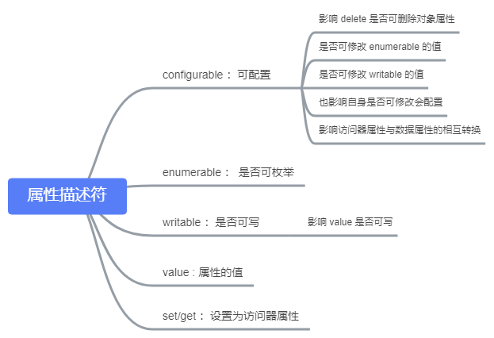

# 《JavaScript 高级程序设计》第六章 : 对象属性

## 简介

对象属性大致可以分为两大类型：

- 基于数据的存储，即对象属性是否可以保存值，如果能保存值则为“数据”属性，若不能则为“访问器属性”。
- 基于属性的访问路径，如果访问的是对象自身的属性则为“实例属性”，如果访问的属性是通过对象的原型链继承的则属于“原型属性”。

## 特征属性

通过“属性描述符”来赋予对象成员特殊的特性。例如是否可枚举、可写入、配置等，这些特性在 ECMAScript 第 3 版的时候还是 JS 引擎内部才能使用，但是到了第 5 版后我们完全可以通过特定的方法来自定义。

“特征属性” 根据是否可写入/保存数据又分为：“数据属性”与 “访问器属性”两类。

### 数据属性

“数据属性” 用于数据的读取与保存，其值的类型并不固定。

“数据属性” 具有四种特性(attribute)，分别是可配置性、可枚举性、可写性以及默认值。这些特性分别使用四种不同的“描述符”来进行描述（可理解为“属性”的属性），这一点非常类似于正则表达式的“修饰符”，它们分别是：`configurable、enumerable、writable、value`。在 EMCAScript 规范内部，对于修饰对象属性的“修饰符属性”则会使用两个方括号 `[[propertyName]]` 的格式进行展示，例如：`[[Writable]]、[[Configurable]] 、[[Value]]` 等。

下面是对四个“描述符”的详细讲解：

- configurable：是否可配置，默认值 `true`。这个配置包含对象的属性是否可用 `delete` 删除；是否可以将“数据属性”转换为“访问器属性”；是否可以修改下面将要介绍的其它两个描述符属性的值。
- enumerable：属性是否可用 `for-in` 枚举，默认值 `true`。其修改受限于 `configurable` 的值。
- writable：属性是否只读，默认值 `true`。其修改受限于 `configurable` 的值。
- value：属性的初始值，默认值 `undefined`。其修改受限于 `writable` 可写性。

具体关系与影响可见下图：


对于直接在对象上定义的属性，它们的 `[[Writable]]、[[Configurable]] 、[[Writable]]` 默认的值都为 `true`，`[[Value]]` 的值被设置为指定的值或默认值。

通过 `Object.defineProperty(o, "propertyKey, attributes)` 方法可以对对象属性的特征（即配置对象成员的属性描述符）进行定义。

**Object.defineProperty(o, propertyKey, attributes)**

`defineProperty` 方法接收三个参数，分别是要定义的属性所在的对象，需要定义的属性本身和对象属性的描述符属性，其中属性描述符是一个对象。

```javascript
var obj = {
  name: "Writable"
};
Object.defineProperty(obj, "name", {
  writable: false,
  value: "read-only"
});
obj.name = "Writable";
obj.name; //read-only
```

如果将 `configurable` 属性设置为 `false`，则对象属性将无法使用 `delete` 进行删除，后续也将无法对其它两个描述符以及自身进行重新定义，但这并不影响 `value` 的可写性（只要 `writable` 没有设置为不可写）

```javascript
var obj = {
  name: "Writable"
};
Object.defineProperty(obj, "name", {
  configurable: false,
  enumerable: false,
  value: "test"
});

delete obj.name;
obj.name; //'test'

Object.defineProperty(obj, "name", {
  configurable: true,
  enumerable: true
});
//Uncaught TypeError: Cannot redefine property: name
```

也就是说只要 `configurable` 属性不设置为 `false`，就可以继续调用`Object.defineProperty()` 来修改 `enumerable` 与 `writable` 的值，而一旦`configurable` 定义为不可配置后，则 `enumerable`、`writable` 以及自身 `configurable` 都不能通过调用 `Object.defineProperty()` 来修改。即此时的状态为：`Cannot redefine property: name：不能重新定义属性 name`

`defineProperty()` 方法不仅能修改已经定义的对象属性，还可以创建新的对象属性：

```javascript
var obj = {
  name: "Writable"
};

//不可写[[Writable:false]]，不可枚举[[enumerable:false]]，不可配置[[configurable:false]]
Object.defineProperty(obj, "birthday", {});

//可写[[Writable:true]]，不可枚举[[enumerable:false]]，不可配置[[configurable:false]]
Object.defineProperty(obj, "age", { writable: true });

//可写[[Writable:true]]，可枚举[[enumerable:true]]，不可配置[[configurable:false]]
Object.defineProperty(obj, "sex", { writable: true, enumerable: true });

//可写[[Writable:true]]，可枚举[[enumerable:true]]，可配置[[configurable:true]]
Object.defineProperty(obj, "address", {
  writable: true,
  enumerable: true,
  configurable: true
});
```

> 当然，实际上一般我们无需使用 `defineProperty` 这种更高级的方式来创建对象属性。

### 访问器属性

“访问器属性” 不保存数据值。

“访问器属性” 也有四个特性描述符，其中有两个与 “数据属性” 中的完全相同。

- [[Configurable]] ：是否可配置，默认值为 `true`，与 “数据属性” 中的 `configurable` 不同的是，它也控制了是否可将 “访问器属性” 转换为 “数据属性”。
- [[Enumberable]] ：是否可枚举，默认值为 `true`。

与“数据属性”不同的是 “访问器” 属性还包含了一对 `setter` 和 `getter` 的描述符，它们都接收一个方法（函数）作为值。

我们可以将`setter` 和 `getter` 这两个属性描述符理解为对象属性的特定事件监听，其中 `getter` 方法被定义用来返回有效的数据值，当我们读取(访问)访问器属性时，`getter` 方法便会被触发，而 `setter` 方法则被定义为如何处理数据，当我们为访问器属性赋值的时候，则会触发 `setter` 方法并用函数参数来接收为对象所赋的值，然后对该值进行所需的处理和加工。

不论是 `setter` 或者是 `getter` ，它们方法内部的 `this` 默认指向的都是该属性(访问器属性)所在的对象本身，这也方便了在这两个方法内部对“对象”自身的其它属性进行处理以及访问。

- [[Get]] ：在读取对象属性(访问器属性)时调用，默认值为 `undefined`。
- [[Set]] ：在为对象属性 (访问器属性) 赋值的时候调用，默认值为 `undefined`。

与“数据属性”相同的是，“访问器属性”也需要使用`defineProperty`来定义：

```javascript
var obj = {
  _year: 2018
};

Object.defineProperty(obj, "year", {
  set: function(v) {
    if (v > this._year) this._year = v;
  },
  get: function() {
    return this._year;
  }
});

obj.year; //2018;
obj.year = 2019; //2019;
```

> 对象属性名称前面添加 `_` 是我们约定通俗用来表示只有对象的特权方法才能访问的属性。

在不支持 ECMAScript 5 的老版本浏览器中，我们可以通过兼容性的写法来创建“访问器属性”。

```javascript
var obj = {
  _year: 2018
};

obj.__defineSetter__("year", function(v) {
  if (v > this._year) this._year = v;
});

obj.__defineGetter__("year", function() {
  return this._year;
});

obj.year; //2018;
obj.year = 2019; //2019;
```

> `object.__defineGetter__()` 与 `object.__defineSetter__()` 最早是由 `Firefox` 提出，后面也被 Chrome、Opera 所支持。

### 批量定义

**Object.defineProperties(o, properties)**

相比 `defineProperty` 而言，`defineProperties` 可以一次性批量定义多个“数据属性”或“访问器属性”。

`defineProperties`接收两个参数，第一个参数是要修改属性的对象，第二个参数也是一个对象，既描述对象属性的特征属性集。

```javascript
var obj = {};

Object.defineProperties(obj, {
  name: {
    value: "xiaoming",
    writable: true
  },
  sex: {
    value: "男",
    writable: false,
    enumerable: false,
    configurable: false
  },
  sayName: {
    enumerable: false,
    configurable: false,
    get: function() {
      alert(this.name);
    }
  }
});
```

### 获取描述符

**getOwnPropertyDescriptor(o , propertyKey)**

使用 `getOwnPropertyDescriptor` 方法可以获取对象中指定属性的特征集合，返回值是一个对象。

```javascript
var obj = {
  name: "xiaoming",
  _sex: "man"
};

Object.defineProperty(obj, "age", {});
Object.defineProperty(obj, "sex", {
  get: function() {
    return this._sex;
  },
  set: function(v) {
    this._sex = v;
  }
});

Object.getOwnPropertyDescriptor(obj, "name");
/*
{
    "value": "xiaoming",
    "writable": true,
    "enumerable": true,
    "configurable": true
}
*/

Object.getOwnPropertyDescriptor(obj, "age");
/*
{
    "writable": false,
    "enumerable": false,
    "configurable": false
}
*/

Object.getOwnPropertyDescriptor(obj, "sex");
/*{
    configurable: false
    enumerable: false
    get: ƒ ()
    set: ƒ (v)
    }*/
```

如果需要批量一次性的获取指定对象所有属性的特征描述符，则可以使用 `Object.getOwnPropertyDescriptors(o)` 方法。

### 小结

将对象属性划分为“数据属性”、“访问器属性”的关键点在于具有不同的描述符，例如数据属性于访问器属性共有 `[[Configurable]]` 与 `[[Enumerable]]` 描述符属性，但是 `[[Value]]` 和 `[[Writable]]`则是“数据属性”才具有的描述符属性，而 `[[Set]]` 和 `[[Get]]` 又则是“访问器属性”才具有的描述符属性。因为没有 `value` 与 `writable` 所以“访问器属性”无法进行数据值的保存。而 “数据属性” 就是我们平常定义的普通对象属性，只是通过重定义属性描述符可以更加灵活的使用。

本节除了认识对象属性的类型外，还掌握了三个 `Object` 构造函数的静态方法的用法：

- Object.defineProperty() : 单次创建数据属性或访问器属性。
- Object.defineProperties() : 批量创建数据属性或访问器属性。
- Object.getOwnPropertyDescriptor() : 获取指定对象属性的描述符属性。
- Object.getOwnPropertyDescriptors() : 批量获取指定对象所有属性的描述符属性。

最后我们还掌握了创建访问器属性的兼容性写法 `__defineGetter__` 和 `__defineSetter__`。

## 实例属性与继承属性

“实例属性” 是对象自身上的成员属性，即通过构造函数实例化得到的属性，而“继承属性”则是对象原型上的属性，可以被该对象继承访问。

它们的读取顺序是，每当代码读取对象的某个属性时，都会执行一次搜索，目标是具有给定名字的属性，搜索首先从对象实例本身开始，如果在实例中找到了具有给定名字的属性，则返回该属性的值；如果没有找到，则继续搜索指针指向的原型对象，在原型对象中查找具有给定名字的属性。如果在原型对象中找到了这个属性，则返回该属性的值。如果没有找到则继续沿着原型链查找原型对象的原型对象，依次类推，知道最终。

它们的优先关系，当对象实例上存在要查找给定名字的属性，那么只会返回实例对象自身的属性，屏蔽原型上的同名属性；对象实例虽然可以访问继承属性，但是无法修改原型上的属性（当然原型上具有引用类型值时则是另外的情况）。

> “继承属性”也常称之为“原型属性”

## 属性运算符

在 ECMAScript 中可用于对象属性运算的操作符有：`.`、`[]`、`in`、`delete`。

其中 `.`、`[]` 用于对象成员访问。

`in` 运算符则是判断给定的对象成员是否存在（不论实例属性还是继承属性）。

`delete` 运算符则是用来删除指定对象的对象成员。

**in**

如果指定的属性在指定的对象或其原型链中，则 in 运算符返回 true。

```javascript
var obj = { a: 1 };
obj.__proto__.b = 2;

"a" in obj; // true
"b" in obj; // true
"c" in obj; // false
```

`in` 操作符常用于判断对象上是否可访问到该属性（即属性是否存在）。

`in` 操作符除了可以单独用于检测对象属性，还可以结合 `for` 语句，组合 `for...in` 来遍历对象成员。

> 如果一个属性是从原型链上继承来的，in 运算符也会返回 true。

**delete**

删除对象的实例属性，返回值为删除是否成功的状态，值为布尔值，但需要注意的是：

- 删除不存在的对象属性，永远返回 `true`。
- 无法删除通过 `const、var、let` 等关键字定义的属性/方法/变量以及 `function` 声明的函数。
- 设置了不可配置 `configurable:false` 的特征属性无法删除。
- 无法删除单体内置对象的属性或方法。
- 删除数组元素时，会将对应的数组元素值重置为 `undefined`（即删除元素对应的值），但并不会改变数组长度。

```javascript
const a = 1;
var b = 2;
let c = 3;
var d = {
  x: 1
};
var e = {};

Object.defineProperty(e, "y", {
  configurable: false,
  value: "1"
});

var f = [1, 2, 3];

delete a; //false;
delete b; //false;
delete c; //false;
delete d.x; //true
delete e.y; // false;
delete f[1]; //(3) [1, empty, 3]
delete Math.PI; //false
```

> 如果需要精准的判断某个对象属性是否成功删除，可以配合 `in` 运算符一起使用。

```javascript
function remove(obj, attr) {
  return attr in obj && delete obj[attr];
}
```

## 类型判断

ECMAScript 中提供了一个 `hasOwnProperty()` 的方法，可以判断当前的属性是否为对象的“实例属性”而非通过原型链继承的属性。

`hasOwnProperty()` 定义在 `Object` 构造函数的原型上，所以只要继承 `Object` 的对象都可以使用该方法，返回值为“布尔值”，`true` 表示是实例属性，`false` 表示为继承属性（也可能是根本就不存在的属性）

```javascript
function Person() {
  this.name = "Alan";
}
Person.prototype.getName = function() {
  return this.name;
};

var p1 = new Person();

p1.hasOwnProperty("name"); //true
p1.hasOwnProperty("getName"); //false
```

`hasOwnProperty()` 方法的不足在于无法检测出对象上不存在的属性，或者说对与不存在的属性也会返回 `false` ，因此就无法区分它到底是对象上不存在的属性，还是原型上的继承属性。

```javascript
p1.hasOwnProperty("getName"); //false
p1.hasOwnProperty("empty"); //false
```

如果我们需要严谨的判断对象上的指定属性是否为“继承属性”，可以与 `in` 运算符结合使用，先判断对象实例上有无该属性，再判断属性是否为“实例属性”。

```javascript
function isProrotypeAttr(obj, attr) {
  return attr in obj && !obj.hasOwnProperty(attr);
}

var obj = { a: 1 };
console.log(isProrotypeAttr(obj, "a")); //false
console.log(isProrotypeAttr(obj, "b")); //false
console.log(isProrotypeAttr(obj, "hasOwnProperty")); //true
```

## 遍历属性

在 ES5 中像遍历数组一样遍历对象的成员属性，主要有三种方式：

- for..in 循环
- Object.keys()
- Object.getOwnPropertyNames();

以上三种方式都只会遍历对象自身的实例属性，其中 `for..in` 循环与 `Object.keys()` 相同，不能遍历对象的不可枚举属性（enumable 为 false），而 `Object.getOwnPropertyNames()` 方法则可以遍历对象的所有实例属性（可枚举与不可枚举）。
