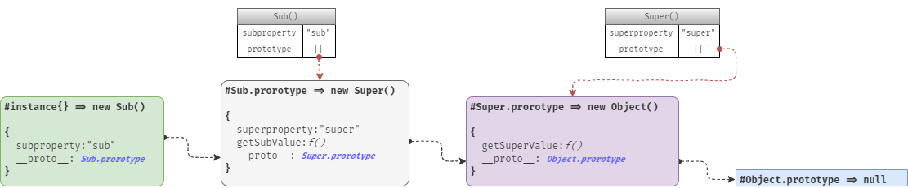

# 《JavaScript 高级程序设计》第六章 : 对象继承

## 继承与“原型链”

回顾前面内容，我们知道构造函数创建的对象其内部包含了一个 `__proto__` 属性，用来引用其构造函数的“原型对象”，这样实例对象便可以访问其“原型对象”中的属性或方法，而实际上“原型对象”也只是普通的对象，其内部也会包含一个引用它的构造函数原型对象的 `[[Prototype]]` 属性，这样通过`[[Prototype]]`属性建立的引用关系，一个引用类型可以访问另一个“引用类型”的成员信息的特性，我们就称之为“继承”。

ECMAScript 没有像其它 OO 语言那样具有丰富的继承方式，EMCAScript 只支持实现继承，而且主要依靠原型链来实现继承。

如果我们把“原型链”看作为一条链条，那么通过构造函数创建的对象与其自身 `__proto__` 属性所引用的 `prototype` 原型对象之间，便是这链条中的一环，而原型对象 `prototype` 与其自身`__proto__` 属性所引用的其它原型对象，则是紧邻相交的又一环，依次类推，每个对象与其自身 `__proto__` 属性所引用继承的另一个对象之间都是单独一环的话，那么整个“原型链”就是通过原型属性 `__proto__` 将多个对象环环相扣串联一起而成，链条的首端则是我们的实例对象，链条的末端则是 `null`，在首端与末端之间的所有被串联的对象充当了两种角色，它们即是原型对象也是实例对象。

## 继承与 new 运算符

在学习创建对象的时候，我们知道使用 `new` 运算符结合构造函数可以创建自定义引用类型的对象，而学习过“原型模式”来创建对象后，我们则掌握了继承的本质（通过 `__proto__` 建立的引用关联关系），最终通过“组合构造函数与原型模式”，我们将两者结合在一起使用，使之不仅可以创建对象，还实现了创建对象的继承关联。

那么 `new` 运算符结合 “组合构造函数与原型模式” 到底做了什么呢?

```javascript
function Person(id, name, age) {
  this.id = id;
  this.name = name;
  this.age = age;
}
Person.prototype.sayName = function() {
  alert(this.sayName);
};

var p1 = new Person(0001, "Alan", 29);
var p2 = new Person(0002, "Blob", 25);
```

通过 `new` 运算符来调用构造函数，所创建的对象会经过以下几个处理步骤。

- ① 创建一个对象。
- ② 设置对象继承与构造函数的原型对象。
- ③ 构造函数通过 `call` 来调用这个对象，此时对象就作为构造函数的 `this` 以此来实现对象的初始化：`Person.call(obj)`。
- ④ 返回这个对象。

因此 `new Person(0001, 'Alan', 29)` 的执行就相当于执行下面的代码：

```javascript
function New(Person) {
  var obj = {}; //创建临时对象。
  obj.__proto__ = Person.prototype; //将临时对象设置继承于指定构造函数的原型对象。
  Person.call(obj); //通过将临时对象作为this来调用构造函数来初始化实例对象的成员。
  return obj; //返回对象
}

var p1 = New(Person);
var p2 = New(Person);
```

因此 `new` 运算符实际上就相当于上面功能的语法糖，正因为它是语法糖，所以我们只能固定的使用构造函数的 `prototype` 原型对象属性作为继承的载体，如果我们需要自定义对象的继承，则需要手动为 `__proto__` 原型属性重新赋值：

```javascript
p1.__proto__ = Other;
```

## 继承与自定义引用类型

“引用类型”是对所有对象类型的统称，除了 ECMAScript 内置的引用类型外，我们还可以通过自定义构造函数来创建自定义的引用类型。

```javascript
var p1 = new Person();
```

关于对象是何种“引用类型”的判断依据在于对象的继承关系，即某个对象继承于指定构造函数的原型对象，那么这个对象就属于该构造函数所定义的引用类型，代入上例，`p1` 继承于自定义构造函数 `Person` 的原型对象 `p1.__proto__ === Person.prototype` 所以 `p1`对象就是自定义引用类型 —— Person 类型。

目前检测对象类型的常用方式主要有三种，以下三种方式不仅适用于内置的引用类型，同时也适用于我们创建的自定义引用类型。

- instanceof 操作符
- constructor 比较
- constructor.prototype.isPrototypeOf()

**_ instanceof _**

`instanceof` 运算符用于检测构造函数的原型对象 `prototype` 是否出现在指定对象的原型链中，返回值为布尔值。

`instanceof` 运算符左侧是要检测的对象，右侧则是一个对象的类（构造函数）。

```javascript
p1 instanceof Person; //true
p2 instanceof Person; //true

p1 instanceof Object; //true
p2 instanceof Object; //true
```

上例中，因为 `Object` 是一切对象的基础对象，所以 `p1`、`p2` 的原型链中也会继承至 `Object.prototype` 对象，所以返回也是 `true`，与因此我们说 `p1`，`p2` 既是 `Person` 类型也是 `Object` 类型。

`instanceof` 使用时需要注意的是它无法实现跨全局(窗口)的数据类型判断，以数组为例：

```javascript
window.frames[0].Array() instanceof window.Array(); //false
Object.isArray(window.frames[0].Array()); //true
```

**constructor**

构造函数的原型对象 `prototype` 内存在着一个循环引用自身(构造函数)的 `constructor` 属性。而构造函数创建的实例对象，又会继承其构造函数的 `prototype` 对象，所以通过比较对象的 `constructor` 属性，也可以判断对象的类型。

```javascript
p1.constructor === p1.__proto__.constructor; //true
p1.constructor === Person; //true
p1.constructor === Object; //false
```

**isPrototypeOf**

`isPrototypeOf` 方法是 `Object.prototype` 上定义的方法，所以只要继承自 `Object`类型的所有对象都可以使用。

`isPrototypeOf` 用于检测给定对象是否在参数对象的原型链上（即参数对象是否继承于给定的对象），在使用形式上它与 `instanceof` 操作符参数是相反的，返回值也为布尔值。

```javascript
var obj1 = {};
var obj2 = {};

obj2.__proto__ = obj1;
obj1.isPrototypeOf(obj2); //true
```

同理：

```javascript
Person.prototype.isPrototypeOf(p1); //true
Person.prototype.isPrototypeOf(p2); //true
```

> 所以对象类型的判断依据就是判断对象是否继承至某个构造函数的原型对象。

```javascript
function Plant() {}
Plant.prototype = Person.prototype;
Plant.prototype.constructor = Plant;

p1 instanceof Plant; // true
```

## 原型链实例

```javascript
function Super() {
  this.superproperty = "super";
}
Super.prototype.getSuperValue = function() {
  return this.superproperty;
};

function Sub() {
  this.subproperty = "sub";
}

//重写构造函数 SubType 的原型对象。
Sub.prototype = new Super();
Sub.prototype.getSubValue = function() {
  return this.subproperty;
};

var instance = new Sub();

console.log(instance.getSubValue());
console.log(instance.getSuperValue());
console.log(instance.toString());
```

原型链示意图如下：



在这个示例中，`instance` 对象的原型链属性引用了构造函数 `Sub` 的原型对象，而 `Sub` 构造函数原型对象的原型链属性原本引用的是 `Object.prototype` 对象，但是因为 `Sub.prorotype = new Super()` 其构造函的原型对象被重写成了构造函数 `Super` 的实例对象，即此时 `Sub.prototype` 继承自 `Super.prototype` 对象，而 `Super.prorotype` 则又继承自 `Object.prototype` 对象，一直到 `null` 为止。

所以目前 `instance` 对象的继承关系（原型链）则是：`instance => [ Sub.prorotype = new Super() ] => Super.prorotype => Object.prorotype => null`。一句话 `Sub` 继承了 `Super`，而 `Super` 又继承了 `Object`，最终 `instance` 则继承了它们的所有成员属性。

## 原型链的问题

“原型链”是通过使用“原型”来实现继承的方式，所以也具有“原型模式”一样的缺陷，即如果某个原型属性的值是一个引用类型，当通过原型来实现继承时，实例对象就可以访问其原型对象上的属性，而基于“引用类型”动态变更的特点，很自然就会造成实例对象可以改变原型属性的值。从而扩散影响所有继承该原型的实例对象。

```javascript
function Super() {
  this.colors = [];
}

function Sub() {}
Sub.prototype = new Super();

var in1 = new Sub();
var in2 = new Sub();

in1.colors.push("red");
in2.colors.push("green");

console.log(in1.colors); //(2) ["red", "green"]
console.log(in2.colors); //(2) ["red", "green"]
```

`Super` 的实例是一个含有 `colors` 属性的对象，但该对象被赋值给了 `Sub.prorotype`，成为了构造函数 `Sub` 的原型对象，这就相当于执行了 `Sub.prorotype.colors = []` 的操作，而两个实例对象 `in1` 与 `in2` 在原型链上又继承自 `Sub.prorotype`，再结合“引用类型”成员动态变更的特性，此时任何一个 `Sub` 的实例对象都可以修改原型上的 `colors` 属性，从而影响所有的其它实例对象。

## 借用构造函数

既然问题的原因是因为子类构造函数的原型对象是超类构造函数的实例对象，在超类函数的实例对象中原本私有的用来保存引用类型值的成员属性，被子类构造函数的所有对象实例所继承，那么我们完全可以这一点来规避这个问题，例如避免采用这种子类继承超类的多重继承方式。

“借用构造函数” 就是把一个构造函数纯粹的作为另一个构造函数在实例化对象过程中进行私有成员属性的附加方法。实现起来也很简单，例如在子类的构造函数中调用超类的构造函数，并把当前实例对象的 `this` 传进去。

```javascript
function Super() {
  this.colors = [];
}
function Sub() {
  Super.call(this);
}
Sub.prototype.getColors = function() {
  return this.colors;
};

var in1 = new Sub();
var in2 = new Sub();

in1.colors.push("red");
in1.getColors(); //(1) ["red"]
in2.getColors(); //[]
```

而且“借用构造函数” 还支持子类构造函数向被调用的超类构造函数进行传参。

```javascript
function Sub() {
  Super.call(this, "Alan");
}
```

## 借用构造函数的不足

实际上“借用构造函数”方式中已经不存在“子类构造函数”与“超类构造函数”之分，因为两个构造函数之间已经不存在继承关系，“超类构造函数”纯粹的只是为“子类构造函数”的实例对象绑定私有成员信息的方法。

使用 “借用构造函数” 时我们必须要明白它的使用特点，以判断是否符合当下的使用场景

- 将多个实例对象中相同的私有成员抽象剥离出来单独定义一个构造函数来进行处理。
- 因为采用构造函数的方式来为实例对象添加私有成员，并没有使用到原型，因此会产生大量不可复用的对象成员属性。
- 因为两个构造函数之间没有继承关系，所以使用 `instanceof` 与 `isPrototypeOf()` 无法判断实例对象与超类构造函数是否有关联关系（虽然实例对象上有部分属性是通过超类附加的）。

因此就使用上而言 “借用构造函数” 模式很少被使用到，它完全是“组合继承”模式的过度方案。

## 组合继承

组合继承（combination inheritance），有时候也叫做伪经典继承，指的是将原型继承和借用构造函数的技术组合一起使用，从而发挥二者之长的一种继承模式。

```javascript
function Super(name) {
  this.colors = [];
  this.name = name;
}
Super.prototype.getName = function() {
  return this.name;
};

function Sub(name) {
  //借用构造函数方式
  Super.call(this, name);
  this.age = 29;
}

//原型对象继承
Sub.prototype = new Super();
Sub.prototype.constructor = Sub;
Sub.prototype.getAge = function() {
  return this.age;
};

var in1 = new Sub("Alan");
var in2 = new Sub("Blob");

in1.colors.push("red");
in2.colors.push("green");

in1.colors; //["red"]
in2.colors; //["green"]

in1.getName(); //"Alan"
in2.getName(); //"Blob"
```

通过重写子类构造函数的原型对象，来继承超类构造函数中的实例属性与超类构造函数的原型对象，再通过“借用构造函数”的方式来覆盖掉同名的原型属性。

虽然子类构造函数的原型对象引用了超类构造函数的实例对象，但是子类构造函数的内部也借用了超类构造函数来协助实例化对象，这样子类构造函数的实例对象就会存在与其所继承的原型对象中完全同名的对象成员属性，从而覆盖掉实例对象自身所继承的在子类构造函数原型上的同名属性，以规避实例对象利用“引用类型”的特性来修改其原型属性。

利用 “组合继承” 还可以通过 `instanceof` 与 `isPrototypeOf()` 来进行引用类型的判断。

就目前而言，“组合模式”是最合适的继承方式，但缺点依然是没有解决“借用构造函数”导致的对象成员属性复用的下降。

## 原型式继承

“原型式继承” 就是利用一个模版对象作为基础对象来创建其它新的对象，其本质还是利用对象原型引用的继承机制。

使用 “原型式继承” 并不关心创建的对象属于何种引用类型，因为它并没有严格的构造函数，或者说用于创建对象的只是一个临时的构造函数。

```javascript
function createObject(o) {
  function F() {}
  F.prorotype = o;
  return new F();
}
```

实际上充当临时构造函数 `F` 完全可以使用内置的构造函数 `Object` 替代。

```javascript
function createObject(o) {
  var obj = {};
  obj.__proto__ = o;
  return obj;
}
```

ECMAScript 5 通过新增 `Object.create()` 方法规范化了原型式继承。这个方法接收两个参数：一个是作为新对象原型的对象，另一个则是为创建对象增加新成员以及新成员的描述符配置。

```javascript
Object.create(o, properties);
```

通常我们会使用它来创建纯净的空对象：

```javascript
Object.create(null); //{No properties}
//实际上就是将对象的原型链属性置为null.
```

而第二个参数则与 `Object.defineProperties(o , properties)` 方法的第二个参数完全相同，在为创建的对象添加新的成员属性的同时，也支持使用属性描述符来为对象成员的特征进行描述。

“原型式继承” 也是基于对象的原型继承，因此如果作为基础模版的对象上具有引用类型的成员属性，那么继承它的所有其它对象都会共享这个成员属性，但个人以为这并不是什么令人惊恐的缺陷，反而这种特点会满足一些特殊的使用场景，比如有多个对象需要共享一个数据源的情况，如果真的需要规避这种问题，与使用 `组合继承` 一样的思路，通过 `Object.create` 方法的第二个参数定义同名的属性来覆盖原型上对应的同名属性即可。

## 寄生式继承

在我看来“寄生式继承”就是“原型式继承”与“工厂方法”的结合使用，根据模版对象来创建新对象，然后在工厂方法内对这个新对象附加属性或方法，以隐藏对象的创建细节，最终返回对象。

```javascript
//工厂方法
function Parasitic(o) {
  //原型式继承
  var clone = createObject(o);
  clone.name = "parasitic";
  clone.getName = function() {
    return this.name;
  };

  return clone;
}
```

“寄生式继承”的优点就是简单快速的创建对象，其使用场景我总结了以下节点

- 不关心创建的对象属于何种引用类型。
- 所有创建的对象都具有某些完全相同的对象属性（通过原型式继承得到）。
- 在具有部分完全相同的对象成员属性之外，还可以定制化私有的对象成员（通过工厂方法附加）。

因为使用到了“原型式”和“工厂方法模式”，因此它们的不足之处在“寄生式继承”也有体现，例如工厂方法内附加的方法或属性因为不能复用，从而加大内存的开销、其次原型上引用类型的属性会被继承于该原型的实例对象共享。

以创建手机对象为例，所有的手机对象都具有相同的属性参数，对于这些参数我们可以通过“原型式继承”继承得到，而不同品牌的手机也都有自己特殊的功能，如果按照品牌分类我们可以通过“工厂方法”来实现。

```javascript
var params = {
  os: "Android",
  cpu: "骁龙845",
  ram: "4GB"
};

function createViov() {
  var clone = createObject(params);
  clone.openDsp = function() {
    //开启DSP拍照
  };
  clone.openHiFi = function() {
    //开启Hifi功能
  };
  return clone;
}

function createHuaWei() {
  var clone = createObject(params);
  clone.openGupTurbo = function() {
    //开启GPU Turbo
  };
  clone.openX50Zoom = function() {
    //开启50倍变焦拍摄
  };
  return clone;
}
```

## 寄生组合式继承

“组合继承”是原型继承与“借用构造函数继承”的混合继承方式，它的优点是可以实现基于原型链的多重继承，同时又通过“借用构造函数继承”来屏蔽原型上同名的属性。

“组合继承”的缺点也很很明显，那就是作为超类的构造函数被执行了两次。

```
① Sub.prorotype = new Super();
② Super.call(this)
```

因此子类构造函数的原型(prorotype) 就完全拥有了超类构造函数 `Super` 的所有实例属性，但是子类构造函数内部又再次通过 `call` 调用超类的构造函数，将超类构造函数内的实例属性又重复的附加给了每个子类构造函数的实例对象上，这样，子类构造函数的实例对象自身具有超类构造函数的实例属性，同时所继承的原型对象上也具有超类的所有实例属性，当然造成这样的原因是因为我们需要子类的实例对象通过自身的成员属性来覆盖所继承原型对象上同名的属性，以解决原型上具有引用类型的属性。

但是在掌握了“原型式”继承，我们完全可以将这二者分离开来，即子类构造函数的内部依然借用超类构造函数来对进行对象的实例化操作，但是子类构造函数的原型对象不在继承于超类构造函数的实例对象，而是通过“原型式”继承来直接继承至超类构造函数的原型对象。

结合了 “借用构造函数”、“原型式继承”的“寄生式组合继承”看上去如下：

```javascript
function create(sup) {
  function F() {}
  F.prototype = sup.prototype;
  return new F();
}

function inherit(sub, sup) {
  var prototype = create(sup);
  prototype.constructor = sub;
  sub.prototype = prototype;
}

function Super(name) {
  this.colors = [];
  this.name = name;
}

Super.prototype.getName = function() {
  return this.name;
};

function Sub() {
  Super.apply(this, arguments);
  this.age = 27;
}

inherit(Sub, Super);

Sub.prototype.getAge = function() {
  return this.age;
};

var instance = new Sub("Alan");
```

在我看来 “寄生组合式继承” 不再为子类构造函数的原型附加与其实例对象同名的成员属性，以覆盖具有引用类型的属性，而是更提倡我们再定义一个用于被继承的原型对象时，要尽可能考虑周全，是否要在一个原型对象上定义包含引用类型值的成员属性，虽然实例可以修改原型对象上引用类型的成员，但这本身就是 ECMAScript 的特性，在一些特殊的应用场景中也将非常有效。

> “寄生组合式继承” 是 ES5 中最常用的继承方式。
