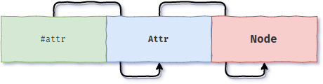

# 《JavaScript 高级程序设计》第十章 :  DOM

简介

`DOM` (Document Object Model) 文档对象模型。

`DOM` 是一个跨平台语言中立的应用程序编程接口，它为 ECMAScript 提供了操作 HTML 或 XML 文档的 API，通过对文档中层次化的节点树进行操作，从而实现添加、修改、删除页面某一部分的内容，并且结合 HTTP 请求技术，还可以实现基于 Ajax 的无刷新 Web 应用。

`DOM` 的前身是微软与 Netspace 公司的 DHTML 技术，于 1998 年 10 月由 W3C 推荐标准。

> 需要注意的是 IE8- 版本中 DOM 对象都是基于系统的 COM 对象实现的，这意味着 IE 低版本中的 DOM 会与原生 DOM 在行为或表现上都具有差异。

## 文档树

对于开发者而言，HTML 文档表面上是由 HTML 标签(元素)、文本内容、标签属性、注释内容等组成，而实际上对于 DOM 而言，一切皆是“节点(Node)”，DOM 会将一个 HTML 文档或 XML 文档描绘成由多层节点构成的文档树，而“文档树”本身则是一个“文档节点”，“文档节点”的内部包含了许许多多具有层次差异且类型不同的子节点，其中节点的层次反应了节点之间的嵌套关系，而节点类型则代表了文档中不同的内容种类，例如：

- HTML 文档是 “文档节点”。对于 DOM 而言，会将其描绘成一个文档树。
- HTML 标签(元素) 是 “元素节点”。
- 标签属性是“属性节点”。
- 文本内容是“文本节点”。
- 注释内容是“注释节点”
- ...

在文档树中，每个节点都具有自己的方法、属性和数据。“文档节点”的直接子节点（第一层子节点）只有一个，就是我们常说的“根节点”或“根元素” 即 `<html>` 标签，“根节点”是文档树中所有子节点的最外层元素，文档中的其它所有元素或节点，都包含在“根元素”中。对于 HTML 而言每个文档最多只能有一个“根节点”，始终都是 html 元素，而在 XML 文档中由于没有于定义的根元素，因此任何元素都可以是根元素。

下面是“文档树”及其内部层次化节点的示意图，形象的理解上我们可以将其看作是一本“家谱”，节点间的层次关系就是 `父子孙...` 的继承以及从属关系，不同类型的节点则代表了文档中不同类别的文档内容。


## 节点类型

### Node

#### 简介

DOM1 级定义了一个 `Node` 接口，它在 JavaScript 中是作为一个 Node 类型（构造函数）实现的，它也是所有节点的公共接口，几乎文档树中的所有 DOM 节点都继承自 Node 类型(IE8- 出外)，因此所有的 DOM 节点都具有 Node 类型的属性和方法。

如果想具体了解 `Node` 类型都具有哪些属性和方法，可以通过打印构造函数的原型对象来获得明细：

```javascript
console.dir(Node.prototype);
```

下面只列举常用的 Node 属性以及方法加以说明：

#### 节点继承示意图


#### nodeType

用于返回节点的类型。下面列举了 DOM 中常用的节点类型：

| nodeType | 常量属性                    |
| :------: | :-------------------------- |
|    1     | Node.ElEMENT_NODE           |
|    2     | Node.ATTRIBUTE_NODE         |
|    3     | Node.TEXT_NODE              |
|    8     | Node.COMMENT_NODE           |
|    9     | Node.DOCUMENT_NODE          |
|    10    | Node.DOCUMENT_TYPE_NODE     |
|    11    | Node.DOCUMENT_FRAGMENT_NODE |

由于 IE9+以上的浏览器都可以通过 JavaScript 访问到 Node 类型，所以判断一个节点是否为元素节点可以采用如下方式：

```javascript
var isElementNode = element.nodeType === Node.ELEMENT_NODE;
```

> 注意：由于 IE8-版本不支常量属性，因此最好依然采用数值进行兼容性判断。

#### nodeName && nodeValue

这两个属性可以返回节点的基本信息，例如节点的名称以及节点的内容（值）。

需要注意的是不同类型的节点，其返回值的形式并不相同，下面是一个详细的对照表：

|   节点类型   |      nodeName      | nodeValue |
| :----------: | :----------------: | :-------: |
|   元素节点   |   TagName(大写)    |   null    |
|   属性节点   |      属性名称      |  属性值   |
|   文本节点   |       #text        | 文本内容  |
|   注释节点   |      #comment      | 注释内容  |
|   文档节点   |     #document      |   null    |
| 文档类型节点 |        html        |   null    |
| 文档碎片节点 | #document-fragment |   null    |

> 注意：对于元素节点 `nodeName` 返回值是大写字母形式的标签名，例如 `DIV` ，在具体的判断中可以使用 `toLowerCase` 进行风格的统一。

#### childNodes

`childNodes` 属性用于反应节点层次中的 —— “子节点”。

`childNodes` 属性可以获取“调用节点”的所有子节点（包括元素节点、文本节点、注释节点等），其返回值是一个 `NodeList` 集合对象，我们可以将其看作为一个 `Like Array`(类数组结构)，其内部有序的保存了“调用元素”的所有子节点。

与普通的数组类型相同，对于一个 `NodeList` 对象我们也可以通过 `length` 属性来获取其内部节点的数量，或者使用下标索引的方式来获取对应的 DOM 节点：

```javascript
node.childNodes.length; //2
node.childNodes[0].nodeType; //#text
```

除此之外，`NodeList` 集合对象还提供了 `item(index)` 方法，可以根据索引来获取对应的节点，不过最常用的还是数组下标的方式来访问。

另外与普通数组不同的是，`NodeList` 是一个动态的集合对象，其内部保存的所有子节点都是基于 DOM 结构执行动态查询的结果，而不是在我们第一次访问获取时瞬间拍摄下来的“快照 (snapshot)”一般永不改变，而是会动态实时更新的，形象的理解，我们可以将其想象成有“呼吸”，有“生命”的对象。

```javascript
var nodes = node.childNodes;
node.removeChild(node.firstChild);
nodes.length; //1
```

`NodeList` 对象与函数中的 `arguments` 对象相同，通过借用数组类型的 `slice` 方法，我们可以很快捷的将其转换成一个真正的数组对象：

```javascript
Array.prototype.slice.call(node, 0);
```

但是由于 `IE8-` 中 DOM 对象不是通过普通对象实现的，而是一个 COM 对象，所以直接使用 javaScript 的转换方法则会报错，因此对于低版本浏览器，最有效的解决方案就是遍历 `NodeList` 对象，然后一一保存到一个数组中。

```javascript
function convertToArray(node) {
  try {
    return Array.prototype.slice.call(node, 0);
  } catch (ex) {
    var arr = [];
    for (var i = 0; i < node.length; i++) {
      arr.push(node[i]);
    }
    return arr;
  }
}
```

> 这里我们运用了能力检测+错误检测的方式来自动选择可用的功能。

#### firstChild / lastChild

`fistChild` 与 `lastChild` 分别用于返回“调用节点”的第一个子节点与最后一个子节点，可以看作是对 `childNodes`属性的便捷操作。用于反应节点关系中的父子关系。

通过 `childNodes` 属性我们可以获取调用节点的所有子节点，那么其中 `firstChild` 就是 `childNodes[0]`，而 `lastChild` 就等于 `childNodes[childNodes.length-1]`。

```javascript
node.firstChild === node.childNodes[0];
node.lastChild === node.childNodes[node.childNodes.length - 1];
```

#### previousSibling / nextSibling

`previousSibling` 与 `nextSibling` 属性用于反应节点关系中的同级相邻的节点。

`previousSibling` 用于返回调用节点的上一个相邻节点。

`nextSibling` 用于返回调用节点的下一个相邻节点。

#### parentNode

`parentNode` 属性用于反应节点层次中的 —— “父子节点”。

> `childNodes` 属性中的所有子节点都具有同一个父节点。

#### ownerDocument

返回“调用节点”所处的文档节点，以免去层层循环递归。

```javascript
node.ownerDocument === window.document; //true
```

#### hasChildNodes()

用于检测“调用节点”是否存子节点，返回值为布尔值。

使用 `hasChildNodes()` 方法要比使用 `childNodes.length` 属性更具有性能优势。

```javascript
var ulbox = document.querySelector("ul");
console.time();
console.log(ulbox.childNodes.length);
console.timeEnd(); //default: 0.6279296875ms

console.time();
console.log(ulbox.hasChildNodes());
console.timeEnd(); //default: 0.11083984375ms
```

#### appendChild()

该方法用于向指定节点（调用节点）的内部新增一个子节点，即对调用节点的 `childNodes` 列表尾部新增一个节点，并重新更新 NodeList 中的所有指针关系。

```javascript
node.appenChild(newNode);
node.lastChild === newNode; // true
```

如果要追加的子节点在文档中已经存在，那么结果就是将该子节点从原来的位置移动到新的位置，因此在 DOM 树中，任何节点都不能同时出现在文档中的多个位置。

#### insertBefore()

与 `appendChild()` 方法相同 `insertBefore()` 也可以向一个指定的节点内部插入一个新的子节点，但与 `appendChild()` 不同的是，它除了需要一个要插入的新节点，还需要一个与插入节点同级的“参考节点”，最终将“新节点”添加到“参考节点”之前（也就是需要参考节点来定位）。所以“新节点”与“参考节点”具有一个共同的父节点，也就是“调用节点”。

使用格式：`调用节点.insertBefore(新节点,参考节点)`。

`insertBefore()` 的返回值就是要插入的新节点， 插入完成后，“调用节点”的 NodeList 中所有指针关系将会得到更新。

```javascript
node.insertBefore(newNode, node) === newNode; //true
node.firstChild === node.insertBefore(newNode, node.firstChild); // false
```

如果`insertBefore()` 方法的第二个参数（参考节点）为 `null`，则其功能与 `appendChild` 相同。

```javascript
node.insertBefore(li, null) === node.lastChild; //true
```

#### replaceChild()

`replaceChild()` 可以使用新的子节点来替换“调用节点”内部的某个旧子节点，也即 `replaceChild()` 方法可以替换调用节点 NodeList 对象中的某个节点。

`replaceChild(newNode,node)` 方法接受两个参数，要替换的“新节点(newNode)”，被替换的“旧节点(node)”。其返回值是被替换的旧节点。

与 `appendChild`、`insertBefore` 等方法相同 `replaceChild` 方法操作后，调用节点的 NodeList 集合对象也会被重新更新。

```javascript
var oldNode = node.firstChild;
node.replaceChild(newNode, node.firstChild) === oldNode; //true
oldNode === node.firstChild; // false
```

#### removeChild()

删除指定的子节点，即移除“调用节点” NodeList 列表中的某个节点，其返回值是被移除的节点。

与 `appendChild`、`insertBefore`、`replaceChild` 等方法相同，`removeChild()` 方法操作后，调用节点的 NodeList 集合对象也会被重新更新。

```javascript
node.removeChild(node.firstChild);
```

#### cloneNode()

`cloneNode()` 方法可以“浅复制”调用节点的首层子节点，也可以“深复制”调用节点中的多重子节点（即复制整个子节点树）。

`cloneNode(Boolean)` 方法接受一个布尔值作为参数，`true` 表示进行深复制，`false` 表示浅复制，默认值为 `false`。

使用`cloneNode()` 方法主要注意 IE8-中的兼容性问题：

- IE8- 中不会将空白的字符识别为“文本节点”，而其它浏览器会。
- IE8- 中会将 DOM 节点的事件一同复制过来。

#### normalize()

`normalize` 方法会将“调用元素节点”内的多个“文本节点”合并成一个“文本节点”，并删除空白的文本节点。

### #document

`document` 对象就是文档节点，它是 `HTMLDocument` 类型的实例，表示整个 html 页面。

`document` 对象本身也被 `window` 对象引用，因此可以在全局中直接访问。

#### 节点继承示意图


#### 基本信息

由于`Document`类型继承于 `Node` 类型，所以 document 对象都具有以下的基本信息：

- nodeType 为 9
- nodeName 为 `#document`
- nodeValue 为 `null`
- parentNode 为 `null`
- ownerDocument 为 `null`
- childNodes
  - 文档类型节点 - document-type
  - 元素节点 - element
  - 注释节点 - comment

#### 属性和方法

|        属性方法        |         值         |                                            说明                                             |  继承自类型  |
| :--------------------: | :----------------: | :-----------------------------------------------------------------------------------------: | :----------: |
|    documentElement     |      元素节点      |                                 对 `<html>` 元素的快速引用                                  | HTMLDocument |
|          body          |      元素节点      |                                 对 `<body>` 元素的快速引用                                  | HTMLDocument |
|          head          |      元素节点      |                                 对 `<head>` 元素的快速引用                                  | HTMLDocument |
|        doctype         |    文档类型节点    |                                 对“文档类型”节点的快速引用                                  | HTMLDocument |
|      styleSheets       |   CSS 样式表对象   | 获取文档中所有 `<style>` 元素以及具有 `href` 属性的 `<link/>` 元素它们对应的 css 样式表对象 | HTMLDocument |
|         title          |      元素节点      |                                 对 `<title>` 元素的快速引用                                 | HTMLDocument |
|          URL           |      页面地址      |                             返回当前加载(html)文档的服务器地址                              | HTMLDocument |
|        referrer        |      页面地址      |                返回来源页面的地址，也即浏览器历史访问记录中的上一个页面地址                 | HTMLDocument |
|         domain         |         域         |                                       文档所属的“域”                                        | HTMLDocument |
|    getElementById()    |      元素节点      |                根据元素 id 值来获取对应的 DOM 节点，如果没有查到则返回 null                 | HTMLDocument |
| getElementsByTagName() |   HTMLCollection   |                         获取所有符合匹配条件（标签名称）的元素节点                          | HTMLDocument |
|  getElementsByClass()  |   HTMLCollection   |                 获取当前文档节点下的所有与传入 class 类名相匹配的子元素节点                 | HTMLDocument |
|  getElementsByName()   |      NodeList      |                         获取所有符合匹配条件（name 名称）的元素节点                         | HTMLDocument |
|        anchors         |   HTMLCollectin    |                     获取所有具有`name` 属性的 `<a>` 元素，也即“锚”元素                      | HTMLDocument |
|         links          |   HTMLCollection   |                   获取所有具有 `href` 属性的 `<a>` 元素，也即“超链接”元素                   | HTMLDocument |
|         forms          |   HTMLCollection   |                              获取文档中所有的表单元素 `<form>`                              | HTMLDocument |
|         images         |   HTMLCollection   |                               获取文档中所有的 `` 元素                                | HTMLDocument |
|        scripts         |   HTMLCollection   |                                  获取文档中所有的脚本元素                                   | HTMLDocument |
|        write()         |     undefined      |                                     向文档流中写入内容                                      | HTMLDocument |
|       writeln()        |     undefined      |                              向文档流中写入内容，支持换行写入                               | HTMLDocument |
|         open()         | #document 文档节点 |                         打开一个文档流，常用于打开的子窗口(opener)                          | HTMLDocument |
|        close()         |     undefined      |                           关闭文档流，常用于打开的子窗口(opener)                            | HTMLDocument |

#### doctyp

访问文档类型节点 `<!doctype html>` 的便捷属性，注意该属性存在很严重的兼容性问题，尽量少用。

#### domain

`domain` 即文档的“主域”，具有相同主域的多个页面才可以借助框架技术进行通信。

主域只能设置成两个页面地址共有的部分，而不能设置成与当前页面地址无关的域名，同时浏览器对 `domain` 有一个“紧绷”的限制，即一旦 `domain` 被设置为松散模式，就再也无法设置回“紧绷”状态。

```javascript
# b.a.com
# c.a.com

document.domain = 'b.com' ; //失败，与当前页面地址无关的域
document.domain = 'a.com' ; //成功
document.domain = 'b.a.com'; //失败，一旦设置为松散的模式便再也无法设置为紧绷的状态。
```

#### 关于 DOM 操作

由于 `document` 节点很多内容都是只读的，而且它只会有一个元素节点 (根节点 html)，所以之前 `Node` 类型上的 `appendChild`、`insertBefore`、`replaceChild`、`removeChild`、等基本用不着，但使用 `childNodes`、`firstChild`、`lastChild` 来便捷获取 `document` 的子节点还是满有意义的。

**getElementById()**

返回对应 ID 的 元素节点，如果没有查找到则返回 `null`。

如果页面存在多个相同 ID，那么永远只返回第一次出现的元素。

> 在 IE7-中表单元素的 name 值也会被误认作为 ID 识别。

**getElementsByTagName()**

`getElementsByTagName(tagName)` 方法会获取所有与传入标签名相匹配的元素。如果传入的是通配符 “\*”，则匹配文档中的所有元素节点。

```javascript
document.getElementsByTagName("script"); //document.scripts;
document.getElementsByTagName("form"); //document.forms;
document.getElmeentsByTagName("<a>"); // 等同于 document.links 或 document.anchors
document.getElementsByTagName("div"); //获取所有div元素
document.getElementsByTagName("*"); //获取文档中的所有元素
```

由于 `Element` 类型也继承了 `getElementsByTagName` 方法，所以我们可以更进一步获取指定元素中的所有“元素子节点”。

```javascript
document.getElementById("top").getElementsByTagName("*");
```

`getElementsByTagName()` 方法的返回值是一个 `HTMLCollection` 类型的集合对象，它与我们之前学习的`NodeList` 集合对象相同，是一个动态且实时更新的对象（即有生命的对象）。

与 `NodeList` 类型相比 `HTMLCollection` 对象也具有：

- `length` 属性
- 采用数组下标索引的方式获取指定的元素节点。
- 支持 `item(index)` 方法按索引获取元素节点。

除此之外，`HTMLCollection` 类型还具有一个 `namedItem(name | id)` 方法，根据传入的 `name` 值以及 `id` 来获取集合中对应的元素节点。

```html
<div id="spanbox">
  <span id="first">1</span>
  <span name="last">2</span>
</div>
```

```javascript
var element = document.getElementById("spanbox");
element.getElementsByTagName("span").namedItem("first"); //  <span id="first">1</span>
element.getElementsByTagName("span").namedItem("last"); //  <span name="last">2</span>
```

最后 `HTMLCollection` 类型还支持以元素 `name` 属性值以及 `id` 来作为字符串的索引，直接从集合对象中获取对应的元素节点。

```javascript
element.getElementsByTagName("span")["first"]; //  <span id="first">1</span>
element.getElementsByTagName("span")["last"]; //  <span name="last">2</span>
```

通过比较 `数组下标索引`、`item(index)`、`namedItem(name|id)`、`字符索引`等四种获取节点的方式，我们可以发现最后一种方式如果在得知元素的 id 或 name 属性值，则是从集合对象中获取元素节点最简单的方式，但是比较矛盾的是，如果知道了元素的 ID，使用 `getElementById()` 无疑更简单(毕竟 ID 是唯一的)。

`HTMLCollection` 的结构也是一个“类数组,Like Array”，所以我们也可以通过借用构造函数原型方法来将一个 `HTMLCollection` 类型对象转换为普通的数组对象：

```javascript
Array.prototype.slice.call(HTMLCollection, 0);
```

> 由于 IE8-中会错误的将“注释节点”认作为“元素节点”来处理，所以就为 `HTMLCollection` 集合带来了兼容性问题。

**getElementsByName()**

该方法是在 `HTMLDocument`构造函数原型对象上定义的的，所以只有其实例对象 `document` 才具有该方法，其它的节点类型（包括元素节点） 都是不具有该方法。

该方法可以获取文档中带有给定 `name` 属性值的所有元素节点，我们一般使用该方法来获取具有多个相同 `name` 属性的元素，例如表单的复选框、单选按钮等。

```html
<input type="radio" name="rd" id="" />1 <input type="radio" name="rd" id="" />2
<input type="radio" name="rd" id="" />3
```

```javascript
var rds = document.getElementsByName("rd");
rds; // NodeList(3) [input#c, input, input]
```

`document.getElementsByName()` 方法的返回值是一个 `NodeList` 集合列表对象，相比于 `HTMLCollection` 集合对象，它只提供了少量的用于访问其内部节点的方法：

- 数组下标索引方式
- 类型提供的 `item(index)`方法。

#### 快捷访问属性

`document` 对象还提供了一些用于快捷访问文档中某些类型节点的属性，它们在使用形式上与 `document.documentElement`、`document.head` 、 `document.body`以及 `document.title` 相同，只是这些快捷访问属性的返回值都是一个 `HTMLCollection` 类型的集合对象。

```javascript
document.anchors; //获取文档中所有具有name属性的 <a/> 元素。
document.links; //获取文档中所有具有 href 属性的 <a/> 元素
document.forms; //获取文档中所有的表单元素
document.images; //获取文档中所有的图片元素
document.scripts; //获取文档中所有的脚本元素
```

这些快捷访问获取属性，可以方便我们对文档中某些类型元素的查找。

#### 文档写入

`document` 对象还提供了文档流的打开、写入、关闭等方法。

“文档流” 就是页面（文档）被打开加载、解析的过程，我们可以理解为当浏览器在加载并解析到文档的起始根元素 `<html>`时为文档流的打开，而解析并加载到结束根元素 `</html>` 则为文档流的关闭。

**文档流的写入**

- document.write(text:string) : 向文档流中的当前位置写入内容。
- document.writeln(text:string) : 向文档流的当前位置写入内容，并且每次写入内容的尾部会自动添加一个 `\n` (换行符)

> 注意：如果文档流已经结束，那么使用 `write()` 与 `writeln()` 方法，则会替换当前页面的所有内容。

`write()` 与 `writeln()` 的主要功能就是向文档流中成块的或批量的写入 DOM 结构，也或者在文档流的过程中写入外部资源的加载链接，例如 `<script>` 样式文件等，比如一些老式的 CMS 管理系统，就是使用该方法来实现广告位。

**文档流的打开/关闭**

“主页面”的文档流在页面被加载打开时便自动打开了，如果想手动控制文档流的打开/关闭，我们可以在新建的子窗口(window.opener)中进行操作：

- document.open() : 打开文档流
- document.close() : 关闭文档流

### element

#### 简介

element 对象就是“元素节点”对象。

每个 DOM 元素节点对象要么继承自直接子类型（子级构造函数），要么就是 `HTMLElement` 类型，但总归所有的 `element` 对象都继承自一个共同的父类型“Element” 类型。

#### 节点继承示意图


#### 基本信息

由于`Element`类型也继承与 `Node` 类型，所以每个元素节点对象都具有以下的基本信息：

- nodeType 为 1
- nodeName 为 对应 HTML 标签名（大写形式）
- nodeValue 为 `null`
- parentNode 为 `Element` 节点 或 `document` 节点。
- owenrDocument 为 `document` 节点
- childNodes 可以有
  - 元素节点
  - 文本节点
  - 注释节点
- 附加节点：属性节点

#### 属性和方法

|        属性方法        |                                       说明                                       | 继承自类型 |
| :--------------------: | :------------------------------------------------------------------------------: | :--------: |
|        tagName         |       返回元素节点对应的 HTML 标签名称（大写形式），与 `nodeName` 功能相同       |  Element   |
| getElementsByTagName() |             获取当前元素节点下的所有与传入“标签名”相匹配的子元素节点             |  Element   |
|  getElementsByClass()  |          获取当前元素节点下的所有与传入 “class” 类名相匹配的子元素节点           |  Element   |
|      元素内置属性      |                           与 HTML 标签的默认属性相对应                           |  Element   |
|       attributes       | 返回附加在该元素节点上的所有属性节点集合，值是一个 `NamedNodeMap` 类型的集合对象 |  Element   |
|     getAttribute()     |                                 获取指定属性的值                                 |  Element   |
|     setAttribute()     |                                 设置属性与属性值                                 |  Element   |
|   removeAttribute()    |                                  删除指定的属性                                  |  Element   |
|     hasAttribute()     |                               判断指定属性是否存在                               |  Element   |
|   getAttributeNode()   |                          根据属性名称获取对应的属性节点                          |  Element   |
|   setAttributeNode()   |                   设置属性节点（将指定的属性节点添加到元素上）                   |  Element   |
| removeAttributeNode()  |                                删除指定的属性节点                                |  Element   |

创建元素

使用 document 对象的 `createElement(tagName)` 方法可以创建一个元素节点。

```javascript
document.createElement("p");
```

> 创建的元素节点只有加入到文档树中才会参与展示与渲染。

#### 子节点

由于 `Element` 类型也继承自 `Node` 类型，再加上元素节点可以具有子节点，所以也可以使用 `childNodes` 属性来获取“调用元素节点”内的所有子节点。另外 `Element` 类型也附加了 `getElementsByTagName()` 与 `getElementsByClass()` 等方法可以进一步缩小查询的范围，只对指定元素节点的后代元素节点进行查询。

#### 元素属性

不论在 DOM 中还是 HTML 文档中，元素(标签)的属性可以分为两类：“内置属性”与“自定义属性”。

“内置属性”实际上就是 HTML 标签默认的属性，而“自定义属性”通常由开发人员临时添加以对数据进行暂时性的缓存。

例如下面的属性都是常见的“内置属性”，基本每个 HTML 标签都具有：

> - id : 元素的唯一标识
> - className : 元素的类名，对应字符串属性 `class`（但 js 中不能以 class 作为关键字出现）。
> - title : 元素的标题，用于展示说明信息。
> - lang : 元素内容的语言代码
> - dir : 语言方向
> - tabIndex : 规定元素被 Tab 建选定的顺序。
> - style : 元素的内联（行内）样式
> - on[EventName] : 元素的事件句柄属性，例如常见的 `onclick`、`onmouseover` 等。

对于“内置属性”而言，可以通过操作 DOM 元素对象属性的方式进行添加，修改，然后实时反馈到页面中对应的 HTML 标签上（标签会自动添加对应的属性与属性值）。

```javascript
element.id = "box"; //页面中对应的HTML标签会自动添加一个值为 "box" 的id属性
element.className = "contains"; //页面中对应的HTML标签会自动添加一个值为 "contains" 的class属性
element.lang = "en"; //页面中对应的HTML标签会自动添加一个值为 "en" 的lang属性
```

此时页面中对应的 HTML 标签：

```html
<div id="box" class="contains" lang="en"></div>
```

但使用 DOM 对象属性的方式则无法设置“自定义属性”，因为此时设置的属性会被认作为 DOM 对象的私有属性(元素对象属性)，所以便不会同步到页面中对应的 HTML 标签上。

```javascript
element.custom = "special";
element.custom; //"special"
```

```html
<div id="box" class="contains" lang="en"></div>
```

好在 `Element` 类型提供了一套属性获取、设置、删除的方法，可以同时支持“内置属性”与“自定义属性”，并将结果同步更新到对应的 HTML 标签上。

```javascript
element.hasAttribute("class"); // true
element.getAttribute("lang"); //en
element.removeAttribute("id");
element.setAttribute("custom", "special");
```

此时我们就可以发现页面中不论是自定义属性还是内置属性，都进行了对应的改变。

```html
<div class="contains" lang="en" custom="special"></div>
```

> 注意：在 IE8-版本中是可以通过使用 DOM 对象属性的方式来为 HTML 标签设置自定义属性的。

#### 样式属性与事件属性

“内置属性”中有两个比较特殊的属性需要注意下，它们分别在使用“DOM 元素对象”的方式以及“通用属性方法”的方式中返回的值并不相同。

**style**

使用 DOM 对象的方式来访问 `style` 属性，返回的是一个“CSS 样式声明对象(CSS Style Declaration)”，它与 DOM 的概念类似，是一个样式编程接口，可以让 javaScript 来访问和设置元素的样式信息。但是以元素通用属性方法来获取 `style` 属性的值，则只会返回可能存在的内联样式字符串。

**Event**

使用 DOM 对象的方式来访问元素的事件句柄属性，可以返回对应的 JS 函数代码，而使用元素节点的通用属性方法 `getAttribte()` 方法则只会获取字符串形式的 JS 代码。当然这并不意味着我们不能使用通用属性方法来设置元素的事件处理代码。

```javascript
element.setAttribute("onclick", 'alert("hello")');
```

> 注意： 在 IE8-版本中，以上两种操作方式都会返回代码形式的内容（即保持与 DOM 对象方式相同的结果）。

### #attr

#### 简介

“属性节点” 继承自 `Attr` 类型，在 HTML 中属性节点不是任何其它节点的子节点，所以 `parentNode` 为 `null`。

“属性节点” 与 “元素节点” 的关系更类似于一种依附关系，因此，虽然属性节点也是 DOM 节点类型之一，但是属性节点并不认为是 DOM 文档树的一部分。个人认为原因是因为属性节点用于描述元素的特征，保存元素临时所需的数据，并不直接参与 DOM 树的渲染，而且 99%的属性节点都是不可见的，

，已知可见的属性节点只有 `title` 属性（但它实际上也是不存在文档树中的）。

> 由于 DOM 中 “属性节点” 与 “元素节点” 耦合度很高（唯一能与元素脱离的属性相关内容，就只有一个 `createAttribute` 方法），因此为了精简元素节点的内容，特将与元素属性操作相关的知识点都统一放在属性节点中讲解，

#### 基本信息

由于`Attr`类型也继承与 `Node` 类型，所以每个属性节点对象都具有以下的基本信息：

- nodeType 为 2
- nodeName 为 属性节点的名称
- nodeVlaue 为 属性节点的值(可读可写)
- parentNode 为 `null`
- ownerDocument 为 `#document` 节点
- childNodes 为空 (属性节点没有子节点)

#### 节点继承示意图



#### 属性和方法

|   属性方法   |           值           |                              说明                              | 继承自类型 |
| :----------: | :--------------------: | :------------------------------------------------------------: | :--------: |
|     name     |   返回属性节点的名称   |                        与 nodeName 相同                        |    Attr    |
|    value     | 返回或写入属性节点的值 |                       与 nodeValue 相同                        |    Attr    |
|  specified   |         布尔值         | 用于区别属性是代码中指定的，还是默认的（貌似 HTML 中没啥用处） |    Attr    |
| ownerElement |    元素节点或 null     |                  返回属性节点所依附的元素节点                  |    Attr    |

内置属性设置

设置元素节点的内置属性，设置完成后该属性会自动附加到对应的 HTML 标签上，作为标签属性。

```html
<div>example content</div>
```

```javascript
var div = document.getElementsByTagName("div")[0];

/*元素 div 的内置属性*/
div.id = "divid";
div.tabindex = "2";
div.class = "red";

/* 元素 div 上非内置属性*/
div.name = "divname";
div.for = "divfor";
```

此时浏览器中的 html 标签将会对应的改变为：

```html
<div class="red" id="divid" tabindex="1">example content</div>
```

#### 自定义属性设置

使用 `Element` 类型提供的 `setAttribute`、`getAttribute`、`removeAttribute`、`hasAttribute` 等方法可以同时支持对 “内置属性” 与 “自定义属性” 进行操作。

- setAttribute(name,value): 设置元素属性并赋值。同时支持“自定义属性”与“内置属性”。
- getAttribute(name) : 获取指定属性的值
- removeAttribute(name) : 删除指定的属性
- hasAttribute(name): 判断是否存在指定的属性。返回值为布尔值，`true` 表示存在，`false` 表示不存在。

#### 创建属性节点

使用 `createAttribute` 可以创建自定义的属性节点。

```javascript
var attrNode = document.createAttribute("welcome");
```

属性节点创建好后，我们可以使用属性节点的 `nodeValue` 或者 `value` 属性来设置属性节点的值：

```javascript
attrNode.nodeValue = "hello";
```

自由的属性节点只有附加到元素节点上才有意义，附加一个属性节点的方式有：

- setAttributeNode(attrNode)
- attributes.setNamedItem(attrNode)

#### attributes

元素的 `attributes` 属性可以返回与该元素相关的所有属性集合，值是一个 `NamedNodeMap`。

`NamedNodeMap`（命名节点表）对象，它与 `NodeList`、`HTMLCollection` 等集合对象一样，是一个动态有呼吸的对象，其内部有序的保存了当前元素上的所有属性节点（包括自定义属性与内置属性）。

`NamedNodeMap` 可以通过数组下标索引的方式来访问内部的属性节点:

```javascript
div.attributes[0];
div.attributes[1];
```

`NamedNodeMap` 也支持通过借用 `Array` 构造函数的 `slice` 方法来将自身转换为真正的数组。

```javascript
Array.prototype.slice.call(div.attributes, 0); //['id','tabindex','class'];
```

`NamedNodeMap` 对象还提供了以下方法，用于对属性节点进行操作：

- getNamedItem(name)

根据属性名来获取属性集合表中对应的属性节点，值是一个属性节点对象。

```javascript
div.attributes.getNamedItem("tabindex").name; //'tabindex'
div.attributes.getNamedItem("class").value; //'red'
```

- setNamedItem(attrNode)

向属性集合表中添加一个新的属性节点。

```javascript
var div = document.getElementsByTagName("div")[0];
var attrs = div.attributes;
var attrNode = document.createAttribute("align");

attrNode.value = "center";
attrs.setNamedItem(attrNode);
```

- removeNamedItem(name);

从属性集合表中删除指定的属性节点，值是属性名。

```javascript
div.attributes.removeNamedItem("align");
```

> 成功删除后，返回值是被删除的属性节点。

- item(index)

根据索引来获取集合中对应的属性节点。

#### setAttributeNode / getAttributeNode / removeAttributeNode

`setAttributeNode / getAttributeNode / removeAttributeNode` 与 `setAttribute/getAttribute/removeAttribute/` 是一一相对的，前者针对的是属性节点，而后者主要是针对属性节点的值，但是二者总的来说都是对 `attributes` 属性的快捷用法，通常来说 `setAttribute/getAttribute/removeAttribute/` 等方法更常用。

获取属性节点以及获取属性值：

```javascript
typeof div.getAttributeNode("align"); //"object"
typeof div.getAttribute("align"); //"string"
```

设置属性节点：

```javascript
var cls = document.createAttribute("class");
cls.nodeValue = "blue";

div.setAttributeNode(cls);
div.removeAttributeNode(cls);
```

### #text

#### 简介

“文本节点” 即 “元素节点” 中的文本内容。其继承与 `Text` 类型。

“文本节点” 的值可以是含有 HTML 关键字的字符串，但浏览器通常都会将这些关键字符进行转义，例如`<`、`>` 等关键字符会被转义为 `&lt;`、`&gt;`。

#### 基本信息

由于`Text`类型也继承与 `Node` 类型，所以每个文本节点对象都具有以下的基本信息：

- nodeType 为 3
- nodeName 为 `#text`
- nodeValue 为 文本节点的值 （可读可写）
- parentNode 为 `element`
- ownerDocument 为 `#document`
- childNodes 为 `null`（文本节点不存在子节点）

#### 节点继承示意图


#### 属性和方法

|    属性方法     |                   说明                   |  继承自类型   |
| :-------------: | :--------------------------------------: | :-----------: |
|      data       | 获取或写入文本内容 , 与 `nodeValue` 相同 |     Text      |
|  appendData()   |            为文本节点追加内容            | CharacterData |
|  insertData()   |           向文本节点中插入内容           | CharacterData |
|  replaceData()  |       替换文本节点中指定范围的内容       | CharacterData |
|  deleteData()   |       删除文本节点中指定范围的内容       | CharacterData |
| substringData() |       截取文本节点中指定范围的内容       | CharacterData |
|   splitText()   |  将一个文本节点按照指定的位置拆分成两个  |     Text      |
|   normalize()   |       合并元素节点下的多个文本节点       |     Node      |

假设 HTML 中的标签为：

```html
<div>456</div>
```

**data**

```javascript
element.firstChild.nodeName; //#text
element.firstChild.nodeValue; //456
element.firstChild.data = "123";
```

**appendData(text)**

```javascript
element.firstChild.appendData("abc"); //'123abc'
```

**splitText(offset)**

```javascript
element.firstChild.splitText(3);
console.log(element.childNodes.length); //2
```

**insertData(offset,text)**

```javascript
element.firstChild.insertData(3, "abc");
element.lastChild.insertData(3, "123");
```

**deleteData(offset,count)**

```javascript
element.firstChild.deleteData(0, element.firstChild.length);
element.lastChild.deleteData(0, element.lastChild.length);
```

**replaceData(offset,count,text)**

```javascript
element.firstChild.replaceData(0, element.firstChild.length, "123");
element.lastChild.replaceData(0, element.lastChild.length, "abc");
```

**substringData(offset,count)**

```javascript
element.firstChild.substringData(0, element.firstChild.length); //"123"
element.lastChild.substringData(0, element.lastChild.length); //"abc"
```

**normalize()**

```javascript
element.normalize();
element.childNodes.length; //1
```

#### 创建文本节点

使用 `document.createTextNode(data)` 方法可以创建一个文本节点，传入的值是一个文本字符串（可以是含有 HTML 关键字，JS 引擎会进行自动的转义）。

```javascript
var txtNode = document.createTextNode('<script src="test.js"></script>');
element.appendChild(txtNode);

console.log(element.innerHTML); //&lt;script src="test.js"&gt;&lt;/script&gt;"
```

### #comment

#### 简介

“注释节点” 即 HTML 文档中的注释内容，继承自 `Comment` 类型。

#### 基本信息

由于`Comment`类型也继承与 `Node` 类型，所以每个注释节点对象都具有以下的基本信息：

- nodeType 为 8
- nodeName 为 `#comment`。
- nodeValue 为 注释节点的内容。（可读可写）
- parentNode 为 `element` 或 `document`。
- ownerDocument 为 `#document`
- childNodes 为 null，没有子节点

#### 节点继承示意图


#### 属性和方法

|   属性方法    |         值         |        说明         |  继承自类型   |
| :-----------: | :----------------: | :-----------------: | :-----------: |
|     data      | 获取或写入注释内容 | 与 `nodeValue` 相同 |    Comment    |
|  appendData   |         NA         |    添加注释内容     | CharacterData |
|   inserData   |         NA         |    插入注释内容     | CharacterData |
|  deleteData   |         NA         |    删除注释内容     | CharacterData |
|  replaceData  |         NA         |    替换注释内容     | CharacterData |
| substringData |         NA         |    截取注释内容     | CharacterData |

```javascript
if (element.firstChild.nodeType === 8) {
  element.firstChild.data = "A Comment Content";
}
```

> 由于 `Comment` 类型继承与 `CharacterData` 类型，所以也具有 `appendData`、`insertData`、`deleteData`、`replaceData`、`substringData` 等方法，使用上与文本节点完全相同。

#### 创建注释节点

```javascript
document.body.appendChild(document.createComment("A Comment Content"));
```

### #document-type

#### 简介

“文档类型节点” 继承与 `DocumentType` 类型，它包含着与文档 `doctype` 有关的所有信息。

获取 “文档类型节点” 很简单，即 `document.doctype`。

#### 基本信息

由于`DocumentType`类型也继承与 `Node` 类型，所以每个注释节点对象都具有以下的基本信息：

- nodeType 为 10
- nodeName 为 `html` （HTML 文档）
- nodeValue 为 `null`
- parentNode 为 `#document`
- childNodes 为 `null` (没有子节点)

#### 节点继承示意图


#### 属性和方法

| 属性方法 |       值       |               说明               |  继承自类型  |
| :------: | :------------: | :------------------------------: | :----------: |
|   name   | 文档类型的名称 | 在 HTML 文档中与 `nodeName` 相同 | DocumentType |

#### 创建文档类型节点

DOM 目前不支持动态创建 “文档类型节点”。

### #document-fragment

#### 简介

`document fragment` 即 “文档片段节点”。他继承与 `DocumentFragment` 类型。

“文档片段节点” 是 HTML 中唯一没有对应标签的节点类型。

“文档片段节点” 是一种 “轻量级” 小型化的文档，他可以包含和控制 DOM 节点，但又不像完整的文档那样占有额外的资源。

“文档片段节点” 在使用上我们可以将其理解为一个暂存“仓库”。对于 DOM 的批量生成或操作，我们可以先在 “文档片段” 中处理，处理好后再统一添加到文档中，从而避免每次 DOM 的修改都触发浏览器的重绘机制。

#### 基本信息：

由于`DocumentFragment`类型也继承与 `Node` 类型，所以每个注释节点对象都具有以下的基本信息：

- nodeType 为 11
- nodeName 为 `#document-fragment`
- nodeValue 为 `null`
- parentNode 为 `null` (连对应的标签都没有，怎么可能有父元素)
- ownerDocument 为 `#document`
- childNodes
  - 元素节点
  - 文本节点
  - 注释节点

#### 节点继承示意图


#### 属性和方法

|     属性方法     | 值  |                    说明                    |    继承自类型    |
| :--------------: | :-: | :----------------------------------------: | :--------------: |
|  getElementById  | N/A |        获取文档片段中的指定 ID 元素        | DocumentFragment |
|  querySelector   | N/A |     根据选择符查找文档片段中的指定元素     | DocumentFragment |
| querySelectorAll | N/A | 获取文档片段内所有符合选择符匹配的所有元素 | DocumentFragment |

> 就目前看来，`DocumentFragment` 类型并没有集成 `Element` 类型以及 `Document` 类型都支持的 `getElementsByTagName` 方法。

#### 创建文档片段

```javascript
var ifr = document.createDocumentFragment();
```

#### 应用实例

```html
<ul id="ulbox"></ul>
<script>
  var ifr = document.createDocumentFragment();
  var ul = document.getElementById("ulbox");
  var li = null;
  var num = 3;
  var txt;

  for (var i = 0; i < 3; i++) {
    li = document.createElement("li");
    li.appendChild(document.createTextNode("Item-" + (i + 1)));
    ifr.appendChild(li);
  }

  ul.appendChild(ifr);
  document.body.appendChild(ul);
</script>
```

## DOM 节点继承示意图总览


## DOM 操作

### 动态脚本

掌握动态脚本（内部脚本与外部脚本）的加载技术，运用错误捕获来解决浏览器的兼容性问题，并且掌握 IE 下使用 `text` 属性为 `script` 元素赋值。

内嵌脚本加载：

```javascript
function loadInsideScript(code) {
  var script = document.createElement("script");
  script.type = "text/javascript";
  try {
    script.appendChild(document.createTextNode(code));
  } catch (ex) {
    //hack ie
    script.text = code;
  }
  document.body.appendChild(script);
}
```

外部脚本加载：

```javascript
function loadScript(url, callback) {
  var script = document.createElement("script");
  script.type = "text/javascript";
  script.src = url;

  if (window.attachEvent) {
    script.attachEvent("onload", callback || null);
  } else {
    script.onload = callback || null;
  }

  document.body.appendChild(script);
}
```

### 动态样式

掌握动态样式（内部样式与外部样式）的加载技术并运用错误捕获来解决浏览器的兼容性问题，同时掌握 IE 下使用 `styleSheet.cssText` 属性为 `style` 元素赋值。

创建内嵌样式：

```javascript
function loadInsideStyle(code) {
  var head = document.head || document.getElementsByTagName("head")[0];
  var style = document.createElement("style");

  style.type = "text/css";

  try {
    style.appendChild(document.createTextNode(code || ""));
  } catch (ex) {
    // hack IE
    style.styleSheet.cssText = code;
  }

  head.appendChild(style);
}

loadInsideStyle("body{background:red}");
```

载入外部样式链接：

```javascript
function loadStyle(url, callback) {
  var head = document.head || document.getElementsByTagName("head")[0];
  var link = document.createElement("link");

  link.rel = "stylesheet";
  link.type = "text/css";
  link.href = url;

  if (window.attachEvent) {
    window.attachEvent("onload", callback);
  } else {
    link.onload = callback;
  }

  head.appendChild(link);
}

loadStyle(
  "https://cdn2.jianshu.io/assets/web-30728a1164102859481d.css",
  function() {
    alert("success");
  }
);
```

### 操作表格

在 HTML 中绝大多数的标签元素其结构都非常简单，`标签+属性+内容` 即可在浏览器中渲染出对应的视图，但也存在着一些标签其渲染的内容往往需要结构嵌套的方式来表示，例如表格、表单等。

如果采用标准 DOM 方法来创建表格时，我们就需要不断重复的创建 `table、thead、tbody、tfoot、tr、td`等属于表格结构的元素，这不仅要编写大量的代码，整个过程也非常的麻烦且单调，因此 W3C 又定义了另一种 DOM 规范 —— HTML DOM，我们可以将其看作是对核心 DOM(Core DOM) 的扩展,专们为 JavaScript 定义了操作 HTML/XHTML 文档内容的快捷方法和属性。

### table

```javascript
var table = document.createElement("table");
```

表格元素依然需要标准的 DOM 方法来创建，但是对于 `table` 元素的下级结构，我们可以直接调用 table 对象的 HTML DOM 方法来创建

```javascript
table.createTHead();
table.createTBody();
table.createTFoot();
table.createCaption();

table.inserRows(pos); //在指定位置插入一行(tr)
```

通过 HTML DOM 属性来获取 table 对象内的其它结构标签：

```javascript
table.caption;
table.tBodies; //回值是一个 HTMLCollection
table.tHead;
table.tFoot;
table.rows; //回值是一个 HTMLCollection
```

或者使用 HTML DOM 提供的删除方法来删除内部的标签：

```javascript
table.deleteTHead();
table.deleteTFoot();
table.deleteCaption();
table.deleteRow(pos);
```

> 注意：并没有 `deleteTBody()` 方法。

### tHead/tBody/tFoot

```javascript
var tHead = table.createTHead();
var tBody = table.createTBody();
var tFoot = table.createTFoot();
```

在 `tHead/tBody/tFoot` 都只存在着 `tr`，因此这里 HTML DOM 主要提供了对 `tr` 操作的方法或属性：

```javascript
tBody.insertRow(pos); //指定位置插入 tr
tHead.deleteRow(pos); //删除 thead 中指定位置的 tr
tFoot.rows(); //获取 tfoot 中的所有 tr，其返回值是一个 HTMLCollection
```

### tr

HTML DOM 中创建 `tr` 的方式有：

```javascript
table.insertRow(pos);

tHead.insertRow(pos);
tBody.insertRow(pos);
tFoot.insertRow(pos);
```

因为 `tr` 内只能是 `td` 所以 HTML DOM 主要提供了对 `td` 操作的方法或属性：

```javascript
tr.insertCell(pos); //在 tr 内指定的位置插入一个 td
tr.deleteCell(pos); //删除指定位置的 td
tr.cells(); //获取指定 tr 内的所有的 td，返回值是一个 HTMLCollection 对象。
```

> 注意，Table 的 HTML DOM 没有提供专门创建 `th` 的方法，所以依然需要标准 DOM 方式来创建 `th` 元素。
