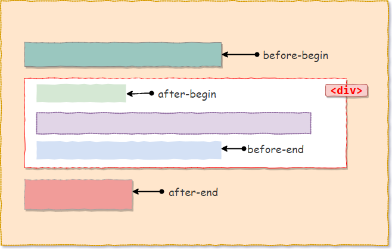
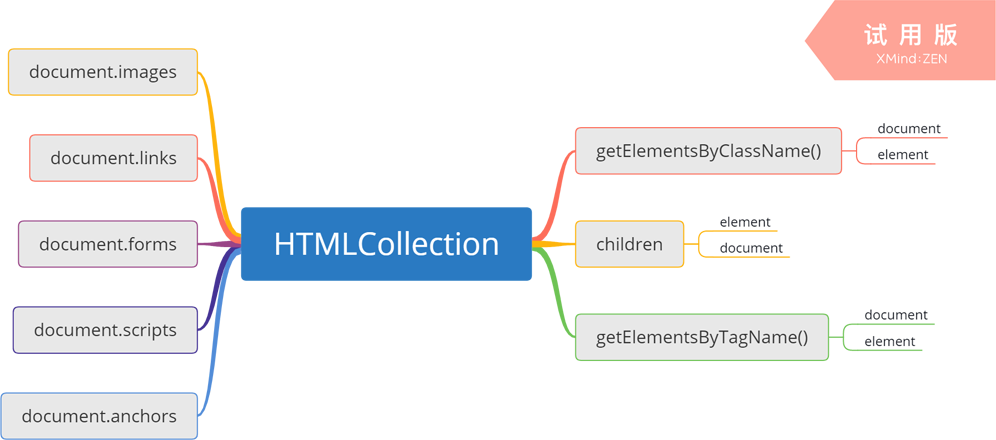

# 《JavaScript 高级程序设计》第十一章 : DOM 扩展

## DOM 扩展

“DOM 扩展是” W3C 对核心 DOM (DOM Core) 的扩展，主要有两个方面：

- Selectors API : 选择器 API
- Element Traversal : 元素遍历

### Selectors API

Selectors API 为 `Document`、`DocumentFragment`、`Element` 等类型扩展了两个新的 DOM 查询方法：

- querySelector()
- querySelectorAll()

它让 JavaScript 支持 “CSS 选择符” 的形式来获取 DOM 节点，从而让 JavaScript 与 CSS 对 HTML 标签元素的选择上趋于统一，让 DOM 元素的获取更加便捷。

> 需要注意的是 IE8+ 才支持这两个方法。

Selectors API 为 `Element` 类型扩展了 `matchesSelector()` 选择符匹配方法。

> 需要注意的是 IE9+ 才支持该方法。

**querySelector()**

`querySelector()` 方法接收一个 CSS 选择符，返回与该选择符相匹配的第一个元素，如果没有找到匹配的元素，返回 null。

```javascript
document.querySelector("body");
document.querySelector("#main");
document.querySelector("img.button");
document.documentElement.querySelector("head");
```

**querySelectorAll()**

`querySelectorAll()` 方法会返回所有符合 “CSS 选择符” 匹配的元素。

```javascript
document.querySelectorAll("div.sections");
```

`querySelectorAll()` 方法的返回值是一个 `NodeList` 集合对象，但是为了性能避免频繁的查询，这个 `NodeList` 对象并不是一个动态的对象，而是每一次执行查询的快照。

**matchesSelector()**

选择符匹配方法，用于判断调用元素是否具有指定的 `CSS 选择符`，返回值为布尔值。

如果匹配到，则返回 `true`，否则返回 `false`。

```javascript
document.body.matchesSelector("body"); //true
document.body.matchesSelector("div"); //false
```

不过到目前为止，还没有浏览器原生的实现 `matchesSelector` 方法，但支持通过加浏览器前缀进行实验性的实现，所以在使用该方法的时候，要进行能力检测。

```javascript
function matches(element, selector) {
  if (element.matches) {
    return element.matches(selector);
  } else if (element.webkitMatchesSelector) {
    return element.webkitMatchesSelector(selector);
  } else if (element.mozMatchesSelector) {
    return element.mozMatchesSelector(selector);
  } else if (element.msMatchesSelector) {
    return element.msMatchesSelector(selector);
  } else if (element.matchesSelector) {
    return element.matchesSelector(selector);
  } else {
    throw new Error("matchesSelector is not supported.");
  }
}
```

### Element Traversal

“元素遍历”规范为 `Node` 类型新增了以下 5 个属性，加强了对元素节点特别是元素子节点获取的便捷性。

- childElementCount : 返回调用元素其元素子节点的数量。
- firstChildElement : 返回调用元素的第一个元素子节点。
- lastChildElement : 返回调用元素最后一个元素子节点。
- previousElementSibling : 返回调用元素相邻的上一个元素节点，它是 `previousSibling` 的元素版。
- nextElementSibling : 返回调用元素相邻的下一个元素节点，它是 `nextSibling` 的元素版。

但是采用标准 DOM 方法来获取某个节点的所有子元素节点，依然比较繁琐，需要借助循环遍历，下面是使用 `childNodes` 结合 `nodeType` 的传统方式：

```javascript
var ul = document.querySelector("ul");
var lis = [];
var child = ul.firstChild;
while (child) {
  if (child.nodeType === 1) {
    lis.push(child);
  }
  child = child.nextSibling;
}
```

而采用“元素遍历”规范的方式：

```javascript
var ul = document.querySelector("ul");
var lis = [];
var child = ul.firstElementChild;
while (child) {
  lis.push(child);
  child = child.nextElementSibling;
}
```

相比之下，后者不需要进行条件的判断，其次遍历次数也比前者要少。

### DOM 扩展一览表

|     扩展方法或属性     |              构造函数               |
| :--------------------: | :---------------------------------: |
|    querySelector()     | Document、DocumentFragment、Element |
|   querySelectorAll()   | Document、DocumentFragment、Element |
|   matchesSelector()    |               Element               |
|   childElementCount    |                Node                 |
|   firstElementChild    |                Node                 |
|    lastElementChild    |                Node                 |
| previousElementSibling |                Node                 |
|   nextElementSibling   |                Node                 |

## HTML5 扩展

自从 `WHATWG` 夺取了 `W3C` 对 HTML 与 DOM 的实际控制权后，他们为下一个 HTML 版本即 `HTML5` 扩展了专有的 HTML5 DOM（可以理解为 WHATWG DOM 标准扩展）。

### 与类相关的扩充

#### getElementsByClassName()

HTML5 为 DOM 的 `Document` 与 `Element` 类型扩展了 `getElementsByClassName()` 方法，用于按类(class)来查询 DOM 元素。

> 注意 IE9+ 才支持该方法。

```javascript
document.getElementsByClassName("nav"); //HTMLCollection [div.nav]
```

返回值是带有类名的 `HTMLCollection` 集合，如果没有查询到则返回空的 `HTMLCollection`。

#### classList

HTML5 为 DOM 的 `Element` 类型扩展了 `classList` 属性，以加强对样式名(className)的添加、切换、删除、判断等操作。

先看下使用原始方式对元素样式名的操作：

```javascript
function removeClass(element, name) {
  var className = element.className.split(/\s+/);
  var pos;
  if (className.indexOf) {
    pos = className.indexOf(name);
  } else {
    for (var i = 0; i < className.length; i++) {
      if (className[i] === name) {
        pos = i;
        break;
      }
    }
  }

  if (pos != undefined && pos != -1) {
    className.splice(pos, 1);
    element.className = className.join(" ");
  }
}

function addClass(element, name) {
  var className = element.className;
  className = className ? className + (" " + name) : name;
  element.className = className;
}

removeClass(document.querySelector("div"), "nav1");
addClass(document.querySelector("div"), "nav2");
```

而现在，通过使用 HTML5 加入的 `classList` 属性，对类名的操作将会更简单。

`classList` 属性是新集合类型 `DOMTokenList` 的实例，与其它 DOM 集合类型相同，它也有一个 `length` 表示当前元素有多少个类名，要取得某个类名可以使用 `item(index)` 进行获取，也可以采用数组下标索引的方式。此外，这个新类型还定义了以下方法，用于实现对“类名”的便捷操作：

- value : 返回调用元素 `className` 的值。
- add(name) : 添加新的类名
- remove(name) : 删除指定的类名
- toggle(name) : 如果传入的类名已经存在了则删除，如果不存在则添加。
- contains(name) : 是否存在指定的类名，返回值为布尔值。

```javascript
var div = document.querySelector("div");

div.classList.add("nav2");
div.classList.remove("nav1");
div.classList.toggle("nav3");
div.classList.contains("nav"); //true
```

### HTMLDocument 的扩展

#### 焦点管理

HTML5 为 DOM 的 `Document` 类型扩展了 `activeElement` 属性与 `hasFoucs()` 方法，前者用于获取文档当前获得焦点的元素，而后者则是判断文档是否具有焦点。

`document.activeElement` 属性的值会根据文档的时态发生变化：

1. 当文档加载中，则值为 `null`。
2. 当文档加载完成后，则值为 `body` 元素的引用。
3. 当切换 Tab 键或者是调用 `focus()` 方法时，该属性的值会是当前对应获得焦点元素的指针。

```javascript
document.activeElement; //null
window.onload = function() {
  document.activeElement; //document.body
  var btn = document.getElementsByClassName("mybutton");
  btn.focus();
  document.activeElement; //<button>
  document.hasFoucs(); //true
};
```

#### readyState

`readState` 属性最早由 `IE4` 引入，用于返回当前文档的加载状态，现已被 HTML5 引入 `Document` 类型的标准扩展。

`readState` 属性有两个可能的值：

- `loading` : 正在加载文档。
- `complete` : 文档加载完成。

#### compatMode

`compatMode` 属性最早由 `IE6` 引入浏览器，用于区分当前页面的渲染模式是“标准模式”还是“混杂模式”，现在 HTML5 也将其加入到了 `Document` 类型的扩展中。

`compatMode` 属性有两个可能的值：

- `BackCompat` : 表示混杂模式渲染页面
- `CSS1Compat` : 表示标准模式渲染页面。

#### head

HTML5 将 `head` 属性纳入了 `Document` 类型的扩展中，以方便对 `head` 元素的引用。

```javascript
document.head || document.getElementsByTagName("head")[0];
```

#### charset

返回当前文档采用的字符编码，通常默认为 `UTF-8`。

### 自定义数据属性

自定义数据属性可义看作是自定义属性的子集，HTML5 重新定义了一套属性设置方案，用于简化或者是替代标准 DOM 设置自定义属性的方法。

回顾下标准 DOM 方式进行自定义属性设置的方法：

- setAttribute /getAttribute /removeAttribute/hasAttribute
- attributes
- setAttributeNode/getAttributeNode/removeAttributeNode

现在 HTML5 提供的方式：

- html 标签通过 `data-*` 的格式来设置数据属性
- JavaScript 中通过 DOM 的 `dataset` 属性进行读取与设置自定义数据属性。

在 HTML 中直接设置

```html
<div data-idx="1"></div>
```

通过 `dataset` 属性进行读取与设置

```javascript
div.dataset.idx; //1
div.dataset.idx = 2;
div.dataset.key = 0;
```

最后会自动实时反馈到对应的标签元素上

```html
<div data-idx="2" data-key="0"></div>
```

### HTML 字符串操作

在进行大批量的 HTML 内容写入/读取时，采用标准 DOM 方式将非常麻烦，因此 HTML5 标准加入了两个新属性，用于直接读取/插入 HTML 字符串。

#### innerHTML

`innerHTML` 最早由 IE 引入浏览器，现被 HTML5 纳入标准。

在读取模式中，会以字符串的形式返回调用元素的所有子节点（包括元素节点、文本节点、注释节点）。

在写入模式中，会根据赋值的 HTML 字符串创建新的 DOM 树，然后覆盖之前的节点树。

使用 `innerHTML` 属性需要注意以下几个方面：

1. 不同的浏览器对返回的 HTML 字符串内容其标签名的大小写并不一样，而且返回值的缩进格式也不相同。
2. 使用 `innerHTML` 插入脚本，脚本代码不会执行。
3. 使用 `innerHTML` 插入样式，可以正常加载并解析。
4. 使用 `innerHTML` 插入 HTML 代码的时候，需要预防 XSS 攻击。

一般来说，最后一项最重要，虽然现在的绝大多数浏览器都支持屏蔽使用 `innerHTML` 插入的脚本代码，但并没有阻止所有会进行远程异步请求资源的 HTML 标签，例如 ``、`<link />`、`<audio>`

、`<video>` 等，这些请求实际上都是 HTTP Get 请求，而且允许跨域，这就会带来不可控的安全隐患，特别是通过 JS 动态写入内容的时候，极度容易受到 XSS 注入攻击。

另外就是在 IE9-浏览器中，实际上并没有正真做到对 `innerHTML` 插入脚本的屏蔽，只要为插入的 `<script>` 标签添加 `defer` 属性，同时在其之前放置一个“有作用域元素”（可以理解为可见的元素），就会让 IE 浏览器正常加载并执行脚本代码：

```javascript
element.innerHTML = '_<script defer>alert("1")</script>';
element.innerHTML = '&nbsp;<script defer>alert("1")</script>';
element.innerHTML =
  '<input type="hidden" /><script defer>alert("1")</script><div>';
```

不过好在这个 bug 已经在 IE10 中进行了修复。

总的来说，防止 `innerHTML` 产生的 XSS 安全隐患，其解决办法有：

- 尽量避免使用 `innerHTML` 来插入后端返回的数据，或者可以尝试使用 `createTextNode(text)` 来进行一层转义插入。
- 使用过滤方法，在插入代码之前过滤一些危险的因素，比如冒名的 GET 请求，事件处理程序等。

#### outerHTML

`outerHTML` 最早由 IE 引入浏览器，现被 HTML5 纳入标准。

与 `innerHTML` 功能本质完全相同，差异主要在读取时，不仅返回调用元素的子节点还包括调用元素自身；在写入时，不仅会覆盖调用元素的子节点，还包括调用元素自身。

```javascript
element.outerHTML;
//等价于
document.createElement("div").appendChild(element).innerHTML;
```

```javascript
element.outerHTML = "<p>hello</p>";
//等价于
document.createElement("div").appendChild(element).parentNode.innerHTML =
  "<p>hello</p>";
```

#### insertAdjacentHTML()

HTML5 为 DOM `Element` 类型新扩展的 `insertAdjacentHTML(pos,htmlString)` 方法用于按位置插入 HTML 字符串。

它即具有 `innerHTML` API 的批量操作功能，又具有 标准 DOM 方法 `insertBefore` 按位置插入的特点，其中 `pos` 参数是一个说明要插入位置的字符串，取值主要有以下四种：

- beforebegin : 在当前元素之前插入一个相邻的同辈元素。
- afterbegin : 在当前元素的内部插入一个子元素，并成为该元素的第一个子元素。
- beforeend : 在当前元素的内部插入一个子元素，并成为该元素的最后一个子元素。
- afterend : 在当前元素之后插入一个相邻的同辈元素。

而第二个参数 `htmlString` ，便是要插入元素的 html 字符串。

关于四个位置参数的详细说明，可见下图：



其中 `<div>`元素表示的就是当前元素。

```javascript
var div = document.querySelector("div");

div.insertAdjacentHTML("beforebegin", "<p>hello</p>");
div.insertAdjacentHTML('afterbegin','<p>hello</p>);
```

实际上 `whatwg` 还定义了两个类似的 API，`insertAjacentElement(pos,element)` 与 `insertAjacentText(pos,text)`，它们的 `pos` 参数完全相同，不同的是前者只能插入一个元素节点，而后者可以插入普通的文字字符串。

#### 性能优化

在使用 `innerHTML`、`outerHTML`、`insertAdjacentHTML` 等方法进行批量 HTML 字符串插入时，浏览器会创建一个临时的 HTML 解析器，用于高效的 DOM 节点生成，但是如果我们频繁的调用这些方法，比如在一个循环遍历中每次都使用以上方法进行 HTML 字符串的动态插入，那么消耗的性能也是巨大的。

```javascript
for (var i = 0; i < len; i++) {
  ul.innerHTML += "<li>" + (i + 1) + "</li>";
}
```

这样每次循环都先读取一次，再写入一次，共计两次操作，其效率无疑很低，最简单的办法就是事先用一个变量将遍历生成的 HTML 字符串先缓存下来，最终再统一插入。

```javascript
var temp = "";
for (var i = 0; i < len; i++) {
  temp += "<li>" + (i + 1) + "</li>";
}
ul.innerHTML = temp;
```

这种思路与我们使用 `document-fragment` 进行批量 DOM 节点插入的思路相同。

### scrollIntoView()

`scrollIntoView()` 是 HTML5 为 DOM 的 Element 类型新增的方法，用于控制页面或元素的滚动。

`scrollIntoView()` 作用于调用元素所处的容器范围，也就是说如果调用元素是处于 `<body>` 中滚动的，那么该方法的作用范围就是文档的滚动，如果调用元素是在一个具有局部区域的元素内，那么该方法的作用范围也就是这个局部范围。

`scrollIntoView` 方法接收两种类型的参数，一种是布尔值，另一种是对象类型的值，如果不传入值，则默认为 `true`。

首先看“布尔”类型的值：

```javascript
element.scrollIntoView(true); //将调用元素的顶部与滚动区域窗口的顶部对齐。
element.scrollIntoView(false); //将调用元素的底部与滚动区域窗口的底部对齐。
```

如果传入的是一个对象类型的值，则对象参数的结构如下：

```javascript
{
  block:'start' | 'center' | 'end',
  behavior:'auto' | 'instant' | 'smooth'
}
```

**block**

定义滚动的位置，其中 `start` 与 布尔值为 `true` 相同，而 `end` 则与布尔值 `false` 相同，`center` 则是尽可能的将元素居中在滚动区域的视口中。

**behavior**

定义滚动的效果，默认值 `auto`，其效果与 `instant` 相同，直接干蹦，而 `smooth` 则平滑过渡。

`scrollIntoView()` 实际上还有一个变体 `scrollIntoViewIfNeeded()` 方法，该方法是 `webkit` 内核的私有方法，IE、firefox 均不支持。

`scrollIntoViewIfNeeded()` 方法只能接收布尔值，但是它有一个特点，就是“惰性滚动”，一旦要滚动元素处于可见状态时，该方法不会产生任何效果，这在一些特殊的场景将会很有用。

```javascript
function scrollIntoView(element, params) {
  if (
    (!params || typeof params != "object") &&
    element.scrollIntoViewIfNeeded
  ) {
    element.scrollIntoViewIfNeeded();
  } else {
    element.scrollIntoView(params);
  }
}
```

> 实际上为要显示的元素获取焦点，也可以实现类似的效果（触发浏览器的滚动行为）。

### HTML5 扩展一览表

|     扩展方法或属性     |        构造函数         | 制定方            |
| :--------------------: | :---------------------: | ----------------- |
| getElementsByClassName | Document &#124; Element | WHATWG            |
|       classList        |         Element         | WHATWG &#124; W3C |
|     activeElement      |        Document         | WHATWG            |
|       hasFocus()       |        Document         | WHATWG            |
|       readyState       |        Document         | WHATWG &#124; W3C |
|       compatMode       |        Document         | WHATWG            |
|          head          |        Document         | WHATWG &#124; W3C |
|        charset         |        Document         | WHATWG            |
|        dataset         |         Element         | WHATWG            |
|       innerHTML        |         Element         | W3C               |
|       outerHTML        |         Element         | W3C               |
|   insertAdjacentHTML   |         Element         | W3C               |
| insertAdjacentElement  |         Element         | WHATWG            |
|   insertAdjacentText   |         Element         | WHATWG            |
|     scrollIntoView     |         Element         | W3C               |

## 专有扩展

“专有扩展” 是浏览器厂商为完善自身产品的功能，弥补缺陷，提高产品竞争力而私自扩展的特性或功能。

事实上有很多 “专有扩展” 已经被绝大多数的浏览器支持，成为事实上的标准。

在我看本书的时候，已经有很多专有属性成为 HTML5 或 W3C 的推荐标准，后面我都会在 “专有扩展一览表”中列出。

### 文档模式

“文档模式”是 IE8 引入的一种用于获知当前浏览器(IE)采用那个版本的内核进行页面的渲染。

```javascript
document.documentMode;
```

返回值通常是表示当前 IE 版本的数值，相比使用客户端检测，通过 `documentMode` 这个专有的属性，可以更准确的进行 IE 版本的判断。

另外，IE 浏览器还引入了一个 `meta` 标记，用于自定义设置当前页面的渲染模式。

```html
<meta http-equiv="X-UA-Compatible" content="IE=IEVersion" />
```

其中 `IEVersion` 的可取值有：5 —— 11,如果要固定采用最新的渲染模式，则取值为 `Edge`。

### children

为了解决 IE9 之前版本与其它浏览器在处理空白字符是否为“文本节点”的差异性上，因而引入了 `children` 这个属性。

`children`属性可以返回调用元素的所有元素子节点，其返回值是一个动态的 `HTMLCollection` 集合对象。并且该属性已经被 HTML5 纳入标准。

在我看来，将 `children` 属性纳入标准的最大意义就在于完善 Element Traversal “元素遍历”的功能，在标准 DOM 扩展中，我们可以通过 `firstElementChild`、`lastEelmentChild`、`previousElementSibling`、`nextElementSibling` 便捷的获取到调用元素指定位置的元素子节点，但是如果想获取调用元素内的所有元素子节点，那么不论是通过 `childNodes` 或者是 `Element Traversal` 都无法避免循环遍历，而现在通过 `children` 属性我们可以直接通过浏览器原生功能获取所有元素子节点，其效率无疑是最高的。

如果我们明确的知道调用元素只包含元素子节点，那么 `childNodes` 与 `children` 的返回值是完全相同的。

```javascript
(element.childNodes.length === element.children.length) ===
  element.childElementCount;
```

> 遗憾的是 IE8- 版本中会错误的将注释节点也加入到 `children` 属性的返回值中。

### contains

`contains` 属性最早由 IE 率先引入，用于判断目标元素（调用元素）是否包含给定元素，既给定元素是否在目标元素的节点树内，返回值为布尔值，如果目标元素包含给定元素则返回 `true`，否则返回 `false`。

```javascript
document.documentElement.contains(document.body); // true
document.head.contains(document.body); //false
```

`contains` 属性现已经被 W3C 列入了 DOM Level 4 级推荐标准，相对应的 HTML5 DOM 则提供了一个 `compareDocumentPosition(node)` 方法，它不仅可以判断目标元素与给定元素的包含关系还可以进一步的检测两者之间的位置关系，返回值是一个表示位置与包含关系之和的数值类型掩码。

| 掩码 | 节点关系                                 | 常量属性                            |
| :--: | :--------------------------------------- | :---------------------------------- |
|  1   | 无关（给定节点与目标节点不在一个文档中） | Node.DOCUMENT_POSITION_DISCONNECTED |
|  2   | 居前（给定元素在目标元素之前）           | Node.DOCUMENT_POSITION_PRECEDING    |
|  4   | 居后（给定元素在目标元素之后）           | Node.DOCUMENT_POSITION_FOLLOWING    |
|  8   | 被包含（给定元素包含目标元素）           | Node.DOCUMENT_POSITION_CONTAINS     |
|  16  | 包含 (给定元素被包含在目标元素中)        | Node.DOCUMENT_POSITION_CONTAINED_BY |

假设，令 `x = target.compareDocumentPosition(given)` 的返回值。

如果返回值满足 `x > 8 && x < 16`，那么说明给定元素包含目标元素，且给定元素一定在目标元素之前。

```javascript
document.body.compareDocumentPosition(document.documentElement); //10
```

如果返回值满足 `x > 16`，那么说明给定元素被包含在目标元素之中，且给定元素一定位于目标元素之后。

```javascript
document.documentElement.compareDocumentPosition(document.body); //20
```

如果返回值满足 `x < 8` ，那么则给定元素与目标元素不存在在包含关系，只存在位置关系。

```javascript
document.head.compareDocumentPosition(document.body); //4
document.body.compareDocumentPosition(document.head); // 2
```

如果返回值满足 `x == 1`，那么说明给定元素与目标元素不在一个文档中。

现在我们可以基于 `contains()` 与 `compareDocumentPosition()` 来封装用于元素位置以及包含关系的检测方法。

```javascript
function contains(target, given) {
  if (target.contains) {
    return target.contains(given);
  } else if (target.compareDocumentPosition) {
    /**
     *  当返回值 >=8 && < 16 则说明给定元素包含目标元素。
     *  当返回值 >= 16 说明目标元素包含给定元素，因此返回 ture，其它返回 false。
     */
    return target.compareDocumentPosition(given) >= 16 ? true : false;
  } else {
    var node = given.parentNode;
    do {
      if (node === target) return true;
      node = node.parentNode;
    } while (node != null);
    return false;
  }
}
```

### 文本操作

使用 `innerText` 与 `outerText` 可以用于文本节点的批量操作，与 `innerHTML`以及 `outerHTML` 相同，它们最早都是由 IE 浏览器引入，只是前者用于文本节点的批量操作，而后者则专用于 HTML 字符串的批量操作，但在功能的本质上并没有什么太大的区别。

#### innerText

在写入模式下，个人看来 `innerText` 的批量写入实际作用并不大，因为通过标准 DOM 方法 `document.createTextNode()` 就可以做到，而且它们都支持对 HTML 关键字符进行转义写入：

```javascript
documet.body.innerText = '<script src="1.js"></script>'; //&lt;script src="1.js"&gt;&lt;/script&gt;
document.body.appendChild(
  document.createTextNode('<script src="1.js"></script>')
); //&lt;script src="1.js"&gt;&lt;/script&gt;
```

`innerText` 的魅力在于批量的获取调用元素内的所有文本节点（包括子节点的文本内容），这相当于使用鼠标=拖拉选中的内容。

```html
<dl>
  <dt>items</dt>
  <dd>
    <ul>
      <li>item - 1</li>
      <li>item - 2</li>
      <li>item - 3</li>
    </ul>
  </dd>
</dl>
```

```javascript
var dl = document.querySelector("dl");
console.log(dl.innerText);
/*
items
item - 1
item - 2
item - 3
*/
```

例如执行下面的方法，实际上就是对 HTML 元素的过滤：

```javascript
element.innerText = element.innerText;
```

> 使用 `innerText` 需要注意的是不同浏览器对于返回的文本内容其缩进格式并不一致。

#### outerHTML

`innerText` 属性已经被纳入了 HTML5 标准，相比之下 `outerText` 属性就没有那么幸运了，到本人学习的 19 年为止，该属性依然是一个私有扩展属性。

`outerText` 相比 `innerText` 其作用范围扩大到了调用元素本身，在读取模式下 `outerText` 与 `innerText` 属性完全相同，但在写模式下，`outerText` 不仅会用新的文本节点来覆盖所有子节点，还会覆盖调用元素自身，其操作类似于:

```javascript
var txt = document.createTextNode("text");
element.parentNode.replaceChild(txt, element);
```

### 专有扩展一览表

|       方法或属性        |      扩展构造函数       | 是否为推荐标准 | 扩展方 |
| :---------------------: | :---------------------: | :------------: | :----: |
|      documentMode       |        Document         |       否       |   IE   |
|        children         | Element &#124; Document |       是       | WHATWG |
|        contains         |          Node           |       是       |  W3C   |
| compareDocumentPosition |          Node           |       是       | WHATWG |
|        innerText        |         Element         |       是       | WHATWG |
|        ouerText         |         Element         |       否       |   IE   |

## 集合类对象

### NodeList

`NodeList` 类型的对象是一个动态的集合对象，它内部有序且动态的保存了所有匹配到的 DOM 子节点，包括元素节点、文本节点、注释节点等，而非某一次 DOM 查询的快照(snapshot)。

`NodeList` 类型的对象可以视为一个“类数组(Like Array)”对象，可以通过 `length` 属性来获取其内部 DOM 节点的数量，也支持以数组下标的方式来访问其内部的指定 DOM 节点，同时它也提供了一个 `item(index)` 方法来根据索引获取指定的 DOM 节点。

> 可以使用 `Array.prototype.slice.call(nodelistobj,0)` 将一个 NodeList 类型的对象转换为真正的数组对象。

值得注意的是，通过 `querySelectorAll` 返回的 `NodeList` 集合对象为了性能考量，并非传统意义上的动态集合对象，而是每次执行查询的快照。

下面是以 `NodeList` 类型对象作为返回值的方法或属性：


### HTMLCollection

`HTMLCollection` 类型的对象是一个动态的集合对象，它内部有序且动态的保存了所有匹配到的元素子节点，而非某一次元素查询的快照(snapshot)。

`HTMLCollection` 类型的对象是一个“类数组(Like Array)”对象，可以通过 `length` 属性来获取内部的元素子节点数量，并支持以下方式来访问其内部的元素节点：

- 数组下标的方式
- `item(index)`方法。
- `namedItem(name | id)` 方法
- 以 `name` 或 `id` 作为字符串索引

> 可以使用 `Array.prototype.slice.call(htmlcollectionobj,0)` 将一个 HTMLCollection 类型的对象转换为真正的数组对象。

下面是以 `HTMLCollection` 类型对象作为返回值的方法或属性：



### NamedNodeMap

`NamedNodeMap` 类型对象是通过元素节点的 `attributes` 属性获取以及返回的。

`NamedNodeMap` 类型的对象是一个动态的集合对象，它内部有序且动态的保存了调用元素的所有“属性节点”，而非某一次 DOM 属性节点查询的快照(snapshot)。

`NamedNodeMap` 类型的对象是一个“类数组(Like Array)”对象，可以通过 `length` 属性来获取内部的属性节点的数量，并支持以下方式来访问其内部的属性节点：

- 数组下标索引
- `item(index)`
- 以属性节点的名称作为字符串索引：`namedNodeMap['class']`

除此之外 `NamedNodeMap` 类型还提供了以下方法来对其内部的每项进行操作，它们接受的参数都是要操作的属性节点的名称。

- getNamedItem()
- setNamedItem()
- removeNamedItem()

> 可以使用 `Array.prototype.slice.call(namednodemapobj,0)` 将一个 HTMLCollection 类型的对象转换为真正的数组对象。

### DOMTokenList

`DOMTokenList` 类型对象是通过元素节点的 `classList` 属性获取以及返回的。

`DOMTokenList` 类型的对象是一个动态的集合对象，它内部有序且动态的保存了调用元素 `class` 属性的值。而非某一次通过 “DOM 对象属性方式” 或者是元素通用属性方法 `getAttribute()` 来获取的快照(snapshot)。

`DOMTokenList` 类型的对象是一个“类数组(Like Array)”对象，可以通过 `length` 属性来获取其内部“标记”(类名)的数量，并支持以下方式来访问其内部的“标记”：

- 数组索引下标的方式
- 内部提供的 `item(index)` 方法。

> 关于“标记”我们可以理解为就是一组使用空格进行分隔的字符，DOMTokenList 类型会根据空格来将字符串拆分成一个个“标记”，然后有序的保存，考虑到目前 DOM 中最常用到该类型的地方就是元素的 class 类 ，所以我们可以代入 `Element.classList` 的返回值去理解。

`DOMTokenList` 类型还提供了以下方法来对其内部的每项进行操作，它们接受的参数就是要进行操作的“样式类名”：

- value : 返回调用元素的 `class` 完整的值（即以空格分隔的一组字符串）
- add : 向调用元素的 `class` 属性中加入一个“类名”。
- contains : 检测指定的类名是否已经存在。
- remove : 从调用元素的 `class` 属性中移除指定的“类名”。
- toggle : 如果调用元素的 `class` 属性中没有该“类名”则添加，反则删除。

> 可以使用 `Array.prototype.slice.call(domtokenlistobj,0)` 将一个 DOMTokenList 类型的对象转换为真正的数组对象。
