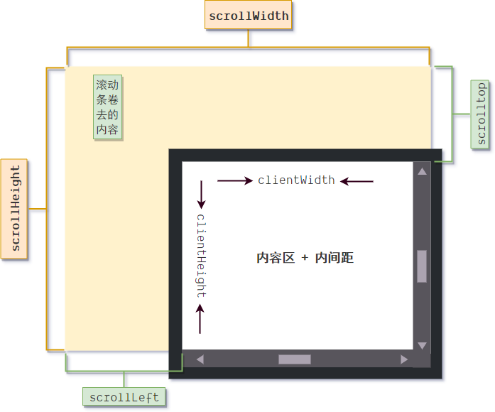

# 《JavaScript 高级程序设计》第十二章 : DOM2 级和 3 级

## 简介

**DOM0** 级我们可以认为就是 `DHTML` 技术，但它并不实际存在。
**DOM1** 级则是 W3C 对混乱的 `DHTML` 技术进行标准化而制定的 ，它主要有以下几个部分内容：

- DOM 基础核心（DOM core）：针对任何结构化文档的标准模型。
- HTML DOM ： 针对 HTML 文档的快速标准模型。
- XML DOM ： 针对 XML 文档的快速标准模型。

DOM1 级的使命就是如何将一份 HTML 文档映射成具有层次化 DOM 节点的文档树，它描绘了 DOM 体系的基础结构，定义了不同类型的 DOM 节点接口，规定了接口之间的继承与分布关系，同时也为不同类型的接口赋予了基本的属性和方法，以为 JavaScript 赋予了操作 HTML/XML 的基本能力，从而终结 `DHTML`技术不同阵营乱成一团的局势。

**DOM2** 级则是建立在 DOM1 级的基础上为不同的节点类型扩展了更多的方法与属性：

- 在 DOM core 的基础结构上扩展了更多的属性和方法
- 在 HTML DOM 基础上扩展了更多的属性、方法和新接口类型。

除了对 DOM1 级的扩展，DOM2 级也增加了一些新模块，这些新模块本身也包含了大量的新属性，新方法以及新接口。

- DOM2 级视图(DOM Level2 Views)：为文档定义了基于样式信息的不同视图
- DOM2 级样式(DOM Level2 Style)：定义了如何以编程的形式来访问和改变 CSS 样式信息
- DOM2 级事件(DOM Level2 Event)：说明了如何使用事件与 DOM 或者文档进行交互。
- DOM2 级遍历和范围(DOM Level2 Traversal and Range)：引入了如何遍历 DOM 以及选择文档特定部分的新接口。

总的来说，DOM2 级在增强了 DOM1 级对文档内容和 DOM 树的操作能力外，还新增了操作文档样式与处理事件交互的能力。

**DOM3** 级则是建立在 DOM2 级的基础上，又加入了以下新的模块：

- DOM 加载和保存模块（DOM Load and Save）：引入了以统一方式加载和保存文档的方法
- DOM 验证模块（DOM Validation）：定义了验证文档的方法
- DOM 核心的扩展（DOM Core XML）：完全支持 XML 1.0 规范，涉及 XML Infoset、XPath 和 XML Base

关于 DOM0、DOM1、DOM2、DOM3 这几个级别的关系图，可以如下图所示：


本章的主要内容有以下几个方面：

- DOM2 级为不同节点类型扩展的方法与属性
- DOM2 级的视图内容。
- DOM2 级的样式接口。
- DOM2 级的遍历与范围接口。

对于 DOM2 级的“事件”以及 DOM3 级的内容，分别会在以后的章节中进行介绍。

> 注意：由于 DOM 标准事实的制定权已经在超文本工作小组（WHATWG）手上，所以 DOM 最高的等级就是 DOM3 级，而 W3C 后续制定的 DOM4 级并不被浏览器厂商承认，原因在于固定化的标准不适宜浏览器的版本迭代，标准是服务于产品，而非产品跟着标准走，因为产品最终要服务的是使用人员，而非标准的制定人员。

> 本章 DOM2 and Dom3 级中的新属性与新方法，可以看作是第 11 章中介绍到的 “W3C 扩展”（ W3C 对 DOM 更多的扩展）。

## DOM 变化

DOM 变化指的是 DOM1 相对于 DOM2 级所发生的变化。

### 针对命名空间的变化。

**首先是概念**
“命名空间 (Namespace)”是 XML 中的概念，有了命名空间，不同 XML 文档的元素就可以混合在一起，共同构成格式良好的文档，而不必担心发生命名冲突。
HTML 虽然也支持命名空间，但并不支持通过标签属性 `xmlns` 来设置文档或元素的命名空间，而且 HTML 文档默认的命名空间就是`XHTML`。

```js
document.body.namespaceURI; //http://www.w3.org/1999/xhtml
```

默认的命名空间是只读不可修改的，假设通过 `xmlns` 属性来设置文档的命名空间：

```html
<!DOCTYPE html>
<html xmlns="http://custom.org/1999/xhtml" lang="en">
  <head>
    <title>Document</title>
  </head>
  <body></body>
</html>
```

然后再用 js 获取对应的命名空间，可以发现依然是默认的命名空间

```js
document.documentElement.namespaceURI; //http://www.w3.org/1999/xhtml
```

**接着 HTML 中如何创建命名空间？**

- 使用具有固定命名空间的 HTML 标签
- 通过 JS DOM 方法来创建自定义命名空间元素。
- 使用 `document.implementation.createDocument()` 方法来创建自定义命名空间的文档。

一个 HTML 文档实际上是可以包含多种文档的内容，例如在 HTML 文档中嵌入 SVG 的内容。

```html
<!DOCTYPE html>
<html lang="en">
  <head>
    <title>SVG</title>
  </head>
  <body>
    <svg></svg>
  </body>
</html>
```

此时通过 JS 来获取`svg`标签，我们可以发现 `<svg>` 这个标签就定义了一个固定的命名空间，其内的所有节点都属于该命名空间。

```js
document.getElementsByTagName("svg")[0].namespaceURI; //"http://www.w3.org/2000/svg"
```

除了使用具有固定命名空间的 HTML 标签，还可以通过 JS DOM 方法来创建具有自定义命名空间的标签元素。
与使用 `createElement()`方法创建普通的标签元素一样，其对应的 `createElementNS()` 命名空间版便可以创建具有自定义命名空间的元素。

```js
var node = document.createElementNS("http://custom.org/1999/xhtml", "div");
var svg = document.createElementNS("http://www.w3.org/2000/svg", "svg");
document.body.appendChild(node);

node.namespaceURI; //http://custom.org/1999/xhtml
```

而如果要创建具有自定义命名空间的文档，则可以使用 `document.implementation.createDocument(namepaceURI,root,doctype)` 方法。

**最后不同节点类型对于命名空间的变化有：**

#### node

DOM2 级为了完善对“命名空间”的支持，首先在 `Node` 接口上扩展了以下方法以及属性：

- namespaceURI : 返回节点命名空间的 URI，如果没有指定则为 null,默认为 `http://w3.org/1999/xhtml`。
- localName : 返回不带命名空间前缀的节点名称。
- prefix : 返回调用节点的命名空间前缀
- isDefaultNamespace(namespaceURI) : 判断调用节点的命名空间 URI 是否与传入的 URI 相等，返回值为布尔值。
- lookupNamespaceURI(prefix) : 返回给定 `prefix` 的命名空间 URI。
- lookupPrefix(namespaceURI) : 返回给定 `namespaceURI` 的命名空间前缀。

例如，前面我们说过 HTML 默认的命名空间是 `xhtml`。

```js
alert(document.body.isDefaultNamespace("http://w3.org/1999/xhtml")); //true
```

> 注意： IE8-和 Firefox 不支持该方法。

#### #document

DOM2 级中 Document 类型为了支持“命名空间”也扩展了以下方法：

- createElementNS(namespaceURI,tagName) : 创建具有指定命名空间的元素节点。
- createAttributeNS(namespaceURI,attrName) : 创建具有指定命名空间的属性节点。
- getElementsByTagNameNS(namespaceURI,tagName) : 获取给定命名空间中的元素节点。

#### element

“DOM2 级核心”中有关 `Element` 对“命名空间”的支持，主要涉及操作特性(属性)。新增的方法如下。

- hasAttributeNS(namespaceURI,localName)。
- getAttributeNS(namespaceURI,localName)。
- getAttributeNodeNS(namespaceURI,localName)。
- setAttributeNS(namespaceURI,attrName,attrValue)。
- setAttributeNodeNS(attrNode) ： 可以通过 `createAttributeNS()` 来创建具有命名空间的属性节点。
- removeAttributeNS(namespaceURI,localName)。

这些方法与 DOM1 级中定义的完全相同，只是多了一个 `namespaceURI` 的参数，以实现对“命名空间”的支持。

#### attr

最后 DOM2 级中为“属性节点”的集合对象 `NamedNodeMap` 也新增了三个方法，以完善对“命名空间”的支持，

- getNamedItemNs(namespaceURI,localName)
- setNamedItemNs(attrNode)
- removeNamedItemNs(namespaceURI,localName)

### Document 类型的变化

**defaultView**

DOM2 级的视图模块为 Document 接口新增了一个 `defaultView` 属性，用于返回包含当前文档的窗口(window 对象)的引用，常用于多文档嵌套的使用场景。

> IE9+ 才支持改属性，但是 IE8-中有一个类似功能的属性：`parentWindow`。
> 跨浏览器获取当前文档所处的窗口对象：

```js
var parentWindow = document.defaultView || document.parentWindow;
```

**implementation**
DOM1 级的时候 `implementation` 只有一个沦为无用的 `hasFeature()` 方法(因为它总是返回 true)。
DOM2 级则为其新增了三个方法，其中属于 DOM2 Core(核心)扩展的方法有:

- document.implementation.createDocumentType(doctype,publicId,systemId)
- document.implementation.createDocument(namespaceURI,root,doctype)

通过结合使用 `createDocumentType()` 与 `createDocument()` 方法我们可以创建具有指定命名空间的 XML 文档或 HTML 文档。

```js
//<!docType html>
var htmlDocType = document.implementation.createDocumentType(
  "html",
  null,
  null
);

var htmlDoc = document.implementation.createDocument(
  "http://www.w3.org/1999/xhtml",
  "html",
  htmlDocType
);
var xmlDoc = document.implementation.createDocument("", "", null);
```

> 其中 `root` 就是文档的根节点，在 html 文档就是 `html` 元素。

在 XML 还在流行的时候，我们常用 `createDocument` 来创建 XML 文档，然后使用核心的 DOM 方法来动态的向文档中加入节点和内容，最后借助 XML 的解析 API 进行类型转换。

```js
var xmlTools = {
  createXMLDoc: function() {
    if (document.implementation && document.implementation.createDocument) {
      return document.implementation.createDocument("", "", null);
    }
    if (window.ActiveXObject) {
      return new ActiveXObject("Microsoft.XMLDOM");
    }
    return alert("抱歉，您的浏览器不支持XML");
  },
  parseXMLDoc: function() {
    if (window.ActiveXObject) {
      return xmlDoc.xml;
    } else if (
      document.implementation &&
      document.implementation.createDocument
    ) {
      return new XMLSerializer().serializeToString(xmlDoc);
    }
  },
  stringifyXMLDoc: function() {
    var parser = new DOMParser();
    var xmlDOM = parser.parseFromString(str, "text/xml");
    return xmlDOM;
  }
};
```

具体示例：

```js
function addXMLContent() {
  var CATEGORY = ["children", "cooking", "web"];
  var TITLE = ["Harry Potter", "Everyday Italian", "Learning XML"];
  var AUTHOR = ["J K. Rowling", "Giada De Laurentiis", "Erik T. Ray"];

  var xmlDoc = xmlTools.createXMLDoc();
  xmlDoc.appendChild(
    xmlDoc.appendChild(xmlDoc.createComment(" Copyright w3school.com.cn"))
  );
  xmlDoc.appendChild(
    xmlDoc.appendChild(
      xmlDoc.createComment(" W3School.com.cn bookstore example")
    )
  );
  var bookstore = xmlDoc.createElement("bookstore");

  for (var i = 0; i < CATEGORY.length; i++) {
    var book = xmlDoc.createElement("book");
    var title = xmlDoc.createElement("title");
    var author = xmlDoc.createElement("author");

    book.setAttribute("category", CATEGORY[i]);
    title.setAttribute("lang", "en");

    title.appendChild(xmlDoc.createTextNode(TITLE[i]));
    author.appendChild(xmlDoc.createTextNode(AUTHOR[i]));

    book.appendChild(title);
    book.appendChild(author);
    bookstore.appendChild(book);
  }

  xmlDoc.appendChild(bookstore);
  return xmlDoc;
}

console.log(addXMLContent());
console.log(xmlTools.parserXMLToString(addXMLContent()));
console.log(
  xmlTools.parserStringToXMLDOM(xmlTools.parserXMLToString(addXMLContent()))
);
```

而 DOM2 级的 HTML DOM 则为 `implementation` 对象新增了一个用于快捷创建 HTML 文档（节点）的`createHTMLDocument()`方法 ，该方法可以接收一个作为文档 `title` 值的参数。

```js
var htmlDoc = document.implementation.createHTMLDocument("example page");
```

此时会创建一个 HTML 文档，且结构自动生成为：

```html
<!DOCTYPE html>
<html lang="en">
  <head>
    <title>example page</title>
  </head>
  <body></body>
</html>
```

创建自由 HTML 文档的好处，在我看来可以将每个 document 都作为一个隔离的沙箱来独立执行特定的代码。并且这些自由的 HTML 文档要比“文档片段”更接近真实的文档，但美中不足的则是这些自由文档的窗口对象都为 `null`。

```js
document.implementation.createHTMLDocument("example").defaultView; //null
```

### Node 类型的变化

DOM3 级引入了节点的比较方法，分别是 `isSameNode()` 与 `isEqualNode()`，它们都接收一个节点对象作为参数，然后与调用节点进行比较，返回布尔类型的值。

- `isSameNode(diffNode)`：进行节点的“相同性”匹配，它会判断调用节点与要比较的节点是否为相同的对象引用，通常使用 `===` 严格相等运算符也能实现同样的效果。

- `isEqualNode(diffNode)`：进行节点的“相等性”匹配，它会比较两个节点的内容与信息是否相等，例如节点的名称、节点的类型、节点的属性(attributes)、节点的子节点(childNodes)。

```js
var div1 = document.createElement("div");
var div2 = document.createElement("div");

div1.isSameNode(div2); //false
div1.isEqualNode(div2); //true
div1.isSameNode(div1); //true

div1.setAttribute("idx", "101123");
div1.isEqualNode(div2); //false
```

### 框架类型的变化

DOM2 级为框架类型(HTMLFrameElement | HTMLIframeEelement)的元素节点新增了一个 `contentWindow` 属性，以实现无需借助框架的`window`对象来直接获取框架元素内部的文档对象。

```js
var ifr = document.querySelector("iframe");
ifr.contentDocument;
```

目前 IE8-版本还不支持该属性，但是支持一个 `contentWindow` 属性来获取调用节点（框架元素）的窗口对象，从而间接实现对 document 的引用。
下面是兼容性写法：

```js
function getFrameDocument() {
  return ifr.contentDocument || ifr.contentWindow.document;
}
```

## 样式

在学习 CSS Level 2 级的 Style 模块之前，让我们先预习下 CSS 的基础知识 —— CSS 的组成。

下图是一个标准的 “CSS 规则(Rule)”，它是组成样式表的基本单元，每个 CSS 规则又由两部分组成：“选择符”与“规则语句块”。


“选择符”用于在 CSS 中匹配某个 HTML 标签，以为其赋予样式信息。另外在 DOM 中实际也有应用，例如 `Selectors` API 提供的 `querySelector(selector)` 方法就是根据 CSS 选择符来匹配 DOM 节点。

“规则语句块” 就是用大括号括起来的部分，它是 CSS 规则的核心，保存了所有的样式信息，这些信息都是由一个个 `Key/Value` 结构构成的键值对，而这样的键值对我们称之为 “样式声明(Declaration)”，每条声明都是由作为 key 的“CSS 属性(property)”与做为 Value 的“属性值”构成。

了解了 CSS 的基本组成后，现在我们来看下 CSS 的种类划分，通常我们会根据样式的引入方式以及使用方式的不同，将 CSS 样式分为以下三种：

- 行内样式 - 标签的 `style` 属性引入，直接作用在元素上。
- 外部样式 - `link` 标记引入。
- 内部样式 - `style` 标记引入。

但是对于 DOM2 级的 Style 模块来说，它并不关心样式的引入方式，只关心样式的使用方式，因而对其而言只有以下三种类型的样式：

- 行内样式 ： 以“样式声明”为基本构成单位（也就是一条条的 CSS 属性与值的键值对的集合）。
- 样式表样式 ： 将外部样式与内部样式进行合并，因为它们都是以 CSS 规则为基本组成单元。
- 计算样式：获取“行内样式”或“样式表样式”最终被浏览器渲染后的样式信息。

为了能让 JavaScript 具有操作与读取不同种类样式的能力，DOM2 级的 Style 模块则围绕这些样式机制，提供了一套对应的 API 接口。

### 行内样式

“行内样式”就是通过标签元素 `style` 属性附加的样式，“行内样式”只会对附加的标签元素有效。
使用 `getAttribute()`方法可以返回字符串形式的“行内样式”，而如果通过元素节点对象来访问 `style` 属性，则返回一个 `CSSStyleDeclaration` 类型的“CSS 样式声明”对象。

```js
element.style; //CSSStyleDeclaration {alignContent: "", alignItems: "", alignSelf: "", alignmentBaseline: "", all: "", …}
```

“CSS 样式声明(CSSStyleDeclaration)”对象是一系列 CSS 属性名称与值的键值对(声明)集合，它默认保存了所有的 CSS 样式声明，直观的理解就是 CSS 规则的语句块部分，不包含选择符。
“CSS 样式声明(CSSStyleDeclaration)”对象中的所有 CSS 声明其默认值为空，如果为标签元素设置了“行内样式”，那么“样式声明”对象中的对应 CSS 属性也会赋予相同的值。

```html
<div style="background:red;height:200px"></div>
```

此时通过 JS 来读取 “CSS 样式对象”中对应的 CSS 属性的值，其结果如下：

```js
element.style.backgroundColor; //"red"
element.style.height; // "200px"
element.style.width; //""
```

我们不仅可以通过 “CSS 样式声明”对象来读取某个 CSS 属性的值，还可以通过为 CSS 属性赋值的方式来修改标签元素的“行内样式”。

```js
element.style.width = "200px";
```

“CSS 样式声明(CSSStyleDeclaration)” 对象除了具有上述基本的用法之外，还具有以下属性和方法：

**length**
获取当前元素的“行内样式”所应用的 CSS 声明条数，需要注意一些综合（rollup）类的 CSS 声明，它们实际上是一系列相关的 CSS 声明的简写。

```js
element.style.background = "red";
element.style.length; //10

for (var i = 0; i < element.style.length; i++) {
  console.log(element.style[i]);
}
/*
background-image
background-position-x
background-position-y
background-size
background-repeat-x
background-repeat-y
background-attachment
background-origin
background-clip
background-color
*/
```

**item(index)**
使用 `item(index)`方法，可以根据索引读取给定位置样式声明的属性名称。
由于 `CSSStyleDeclaration` 类型也是一个“类”数组结构，所以使用数组下标索引的方式来获取某条声明的属性名称更加常用。

```js
element.style.item(1); //"background-position-x"
element.style[2]; //"background-position-y"
```

**cssText**

由于每次一次操作 `CSSStyleDeclaration` 对象只能对一条样式声明进行修改，在效率上无疑是很低的，所以 `cssText` 属性被设计的目的就是为了批量读取批量设置标签元素的“行内样式”信息。

```js
element.style.cssText; //"background: red;"
element.style.cssText = "width:100px;height:100px;background:blue";
```

**getPropertyPriority(propertyName)**
如果指定的 CSS 属性，其值存在 `!important` (优先权标志)，那么则返回 "important"，否则返回空字符串。

```js
element.style.setProperty("width", "100px", "important");
elemnt.style.height = "100px!important"; //此种方式无效

element.style.getPropertyPriority("width"); //"important"
element.style.getPropertyPriority("height"); //""
```

**getPropertyValue(propertyName)**
获取指定 CSS 属性的值（也就是这条 CSS 声明的值）。

```js
element.style.getPropertyValue("background"); //"blue"
```

当然更常用的方式是直接从 “CSS 样式声明”对象中读取。

```js
element.style.background;
element.style.backgroundColor;
element.style.backgroundPosition;
```

**setProperty(propertyName,propertyValue,priority)**
为指定的 CSS 属性设置“值”（也就是为这条 CSS 声明赋值），同时还可以设置优先权标志（"important"值或“空字符串”）。

```js
element.style.setProperty("width", "200px", "important");
```

**removeProperty(propertyName)**
这个移除并不是真的删除某个 CSS 声明，而是将指定的 CSS 属性重置为默认值，这对于我们不能确定某个 CSS 属性的默认值时非常有用。

```js
element.style.removeProperty("width");
```

总的来说：

- `length` 属性与 `item(index)` 方法的目的是为了遍历“行内样式”中应用的样式声明。
- `cssText` 属性的目的是为了批量的获取以及设置行内样式。
- `setProperty` 方法相比于直接操作 `CSSStyleDeclaration` 对象，它可以为 CSS 属性值设置优先权标志(priority)。
- `getPropertyPriority` 方法相比于直接读取 `CSSStyleDeclaration` 对象，它可以获取样式声明的优先权标志。
- `removeProperty` 方法可以重置 CSS 属性的默认值状态。

### 样式表样式

#### CSSStyleSheet

对于 HTML 而言，“样式表样式”就是使用 `style` 标记或 `link` 标记引入的 CSS 样式，它以 CSS 规则为基本组成单位。而对于 DOM 来说“样式表样式”则是基于`CSSStyleSheet` 类型（构造函数）的实例对象实现的 ，通过访问代表“样式表样式”的实例对象，我们不仅可以获取引入该样式表的 HTML 标记（link 或 style）的基本信息，还可以读取、添加、删除样式表中的某条 CSS 规则，以及修改规则中的 CSS 声明。

使用 DOM 来获取“样式表”对象的方法有两种：

1. 通过 `document.styleSheets` 属性来获取文档中所有的 `style` 标记和 `rel=stylesheet` 的 link 标记引入的样式表样式。返回值是一个 `CSSStyleSheetList` 类型的动态集合对象，其内部有序的保存了文档所有的“样式表”对象，通过 `length` 属性可以获取集合中“样式表”对象的数量，使用提供的 `item(index)` 方法或者数组下标索引的方式可以获取集合中对应位置的“样式表”对象。

```js
document.styleSheets.length; //样式表对象的数量，也是文档所具有的样式表样式的数量。
document.styleSheets.item(0) === document.styleSheets[0];
```

2. 通过 `link` 或 `style` 标记的 `sheet` 属性获取对应的“样式表”对象。需要注意的是 IE 低版本则是 `styleSheet` 属性，下面是兼容性写法：

```js
function getStyleSheet(element) {
  return element.sheet || element.styleSheet;
}
```

我们知道 HTML 是通过 `<link>`或`<style>` 标记来引入样式表样式的，而 DOM 2 级的 Style 模块则是通过将样式表样式对象化，以便于使用编程的方式读取或操作样式表内容，而这个对象化的产物就是“样式表”对象，它是 `CSSStyleSheet` 类型的实例，而 `CSSStyleSheet` 类型又继承自 `StyleSheet`类型，因此“样式表”对象所具有的属性与方法如下：

**disabled**
可读可写，值为布尔值。
是否禁用该样式表样式，默认值为 `false`，如果为 `true`则该“样式表”对象对应的样式表样式将不会产生作用（不参与浏览器实际渲染）。

**href**
如果“样式表”对象是外部样式表则返回外部样式表文件的 URL，如果“样式表”对象是内部样式表，则返回值为 `null`。所以通过判断 `href`的值可以很好的区分当前样式表的类别。

**type**
返回样式表的 MIME 类型，固定值为 `text/css`。

**ownerNode**
返回“样式表”对象所依附的元素节点（style 或 link）。如果样式表样式是通过 `@import` 导入的，则该属性的返回值为 `null`。

**parentStyleSheet**
如果当前样式表样式是通过 `@import` 导入的，则该属性返回导入它的“样式表”对象的指针，否则默认值为 `null`。

**cssRule**
返回样式表中所有的 CSS 规则，值是 `CSSRuleList` 类型的动态集合对象。

> IE 不支持该属性，但提供了相同机制的 `rules` 属性。

**insertRule(rule,index)**

向“样式表”对象的 `CSSRuleList` 集合中指定的位置插入一条新的 CSS 规则，其中 `rule` 为规则字符串，IE 不支持该属性，但提供了相同功能的 `addRule` 方法。

```js
var sheet = document.styleSheets[0];
var length = sheet.cssRules.length;

sheet.insertRule("div{background:red}", length);
```

**deleteRule(index)**
删除 `CSSRuleList` 集合中指定位置的 CSS 规则，IE 不支持该方法，但提供了相同功能的 `removeRule` 方法。

**ownerRule**
如果当前样式表是被 `@import` 规则导入进来的，那么该属性便会返回这个导入规则(ImportCSSRule)。

> 这个导入规则便是存放在上层样式表对象的 cssRule 中。

```js
document.styleSheets[0].cssRules[0] ===
  document.styleSheets[0].cssRules[0].styleSheet.ownerRule; //true
```

#### CSSRule

`CSSRule` 类型(构造函数)是一个“基类”，它的下级派生类型用于表示样式表文件中的每个 CSS 规则，例如 `CSSStyleRule(CSS 样式规则)`、`CSSImportRule(CSS 导入规则)`、`CSSFontFaceRule(CSS 字体规则)`、`CSSSupportRule(CSS Support 规则)`、`CSSPageRule(CSS打印规则)`、`CSSMediaRule(CSS 媒体查询规则)`等等。

通过“样式表”对象的 `CSSRules` 属性我们可以取得样式中所有“规则对象(CSSRule)”的引用。`CSSRules` 属性的返回值是一个 `CSSRuleList` 的动态集合对象，其内部有序的保存了当前样式表中所有类型的 CSS 规则，与其它集合类型的对象相同，我们可以使用 `length` 属性获取规则的数量，通过 `item(index)` 方法或数组下标的方式来获取指定位置的 CSS 规则。

```js
document.styleSheets[0].cssRules;
/*
{
    0: CSSImportRule { …}
    1: CSSFontFaceRule { …}
    2: CSSMediaRule{ …}
    3: CSSSupportsRule { …}
    4: CSSPageRule { …}
}
*/
```

每个 CSSRule 对象常用的属性和方法有:

**selectorText**
获取 CSS 规则的选择符。

**cssText**
以文本的形式返回整条 CSS 规则。
该属性是一个只读属性，不能通过赋值的方式来覆盖原有的 CSS 规则。

**href**
如果是“导入规则”，则可以获取导入样式表文件的路径与名称。

**styleSheet**
如果是“导入规则”，则可以获取导入“样式表”对象的引用。

**parentRule**
返回当前规则所处的父级规则的引用。
`parentRule` 属性只对于存在规则嵌套的使用场景才有效，例如 `CSSMediaRule` 规则中，通常默认值为 `null`。

**parentStyleSheet**
返回当前 CSS 规则所属的“样式表”对象的引用。

**type**
返回 CSS 规则类型，值为数值。

**style**
返回一个 `CSSStyleDeclaration` 类型的样式表声明对象，与标签元素的 `style` 属性返回值完全相同。只是前者作用于 CSS 规则下的所有样式声明，而后者则作用于某个元素标签行内样式的样式声明。

CSSRule 对象的 `style` 属性非常重要，因为它是修改样式表样式规则内容的唯一途径。

```js
document.styleSheets[0].cssRules.item(0).style.backgroundColor = "blue";
```

如果需要批量修改或读取样式信息，则可以使用 `CSSStyleDeclaration` 类型的 `cssText` 属性，他不像 `CSSRule.cssText` 是一个只读属性。

> 总结：虽然 DOM2 级的 Style 模块为我们提供了可以读取和操作样式表样式的 `CSSStyleSheet` 接口，但是批量增加 CSS 规则的时候依然繁琐，所以更推荐使用动态样式生成技术。

### 计算样式

“行内样式”与“样式表样式”都是用来定义标签元素被浏览器渲染之前的样式信息。因此，一个标签元素，它的样式信息既可以是通过“行内样式”指定，也可以是受到“样式表样式”的影响（层叠继承），所以想获取某个元素的实际样式信息（即浏览器最终渲染的结果），则必须要同时判断“行内样式”与“样式表样式”的取值情况：

```html
<style>
  div {
    width: 100px;
    height: 100px;
    background: blue;
  }
</style>
<div style="background:red"></div>
```

```js
function getFinalStyle(element, property) {
  if (element.style.getPropertyValue(property)) {
    return element.style[property];
  } else {
    var sheetList = document.styleSheets;
    var result;
    loop: for (var i = 0; i < sheetList.length; i++) {
      var rules = sheetList[i].cssRules;
      for (var j = 0; j < rules.length; j++) {
        var selectorText = rules[j].selectorText;
        if (selectorText && element.matches(selectorText)) {
          result = rules[j].style.getPropertyValue(property);
          break loop;
        }
      }
    }
    return result;
  }
}

var div = document.querySelector("div");

getFinalStyle(div, "background"); // "red",
getFinalStyle(div, "width"); //"100px"
```

但往往实际的应用场景更为复杂，对于“行内样式”来说很简单，但对于“样式表样式”，我们很难定位样式信息具体保存在那个样式表文件中，也很难界定 CSS 规则是通过那个选择符作用在标签元素上，除非我们一直循环遍历下去，而且通过 `@import` 规则导入的样式表对象，我们还需结合“递归”的方案来获取，这在增加程序的复杂度的同时，还带来了性能低下的问题。

为了解决这个问题，DOM2 级为 window 对象扩展了一个 `getComputedStyle(element,pseudo-class))` 方法，用于获取元素被渲染后的最终样式信息 —— “计算样式”。它接收两个参数，一个是要获取计算样式的元素节点，另一则是伪元素字符串，如果不需要获取“伪元素”的计算样式，那么可以为 `null`。

```js
document.defaultView.getComputedStyle(div, null)["width"]; //"100px"
document.defaultView.getComputedStyle(div, null)["backgroundColor"]; //"red"
document.defaultView.getComputedStyle(div, null)["background"]; //"rgb(255, 0, 0) none repeat scroll 0% 0% / auto padding-box border-box"
```

> 需要注意综合(rollup)属性的获取，它们在不同浏览器中支持的情况并不相同。

`getComputedStyle` 方法的返回值是一个 `CSSStyleDeclaration` 类型的样式声明对象（与元素 `style` 属性的返回值相同，使用上也完全相同），唯一不同的是该声明对象是一个只读对象，只能够获取计算样式信息而无法修改样式信息。

如果一个标签元素的某个 CSS 属性的值没有通过自定义样式（行内样式、内部样式、外部样式）来指定，那么它的默认值就是“浏览器样式”中对应的值，例如`visibility` 属性，它在行内样式中默认值为空，但在浏览器样式中，默认为 `visibile`,需要注意的是不同浏览器它们默认的“浏览器样式”也不相同，比如 IE 中 `visibility` 的浏览器样式默认为 `inherit`。

跨浏览器获取某个 CSS 属性在浏览器样式中的默认值可以帮助我们重置某条 CSS 声明，使其回到默认的样式展示形式。例如 jQuery 的 `hide` 与 `show` 方法，对于 `hide` 方法它会统一使 `display:none` 来隐藏调用的元素，而 `show` 方法则会通过创建一个临时的 `iframe`，建立一个独立的文档空间以避免主窗口样式的干扰，然后创建相同的元素节点，通过计算样式来获取 `display` 属性在浏览器样式中的默认值，最终以重置默认值的方式来进行非破坏性的显示。

> 非破坏指的是根据元素类型来设置 CSS 属性的默认值，例如块元素 `display` 的默认值为 `block`，而列表 `li` 元素的默认值为 `list-item`，如果是行内元素则是 `inline`，最后行内块则是 `inline-block`。

```js
function hide(element) {
  element.style.display = "none"; //统一使用 none 来隐藏
}

function show(element) {
  var nodeName = element.nodeName;
  var node = document.createElement(nodeName);
  var ifr = document.createElement("iframe");

  //创建一个临时的iframe来重置display属性的默认值
  ifr.style.cssText = "position:absolute;z-index:-1;opacity:0;left:0;top:0";
  document.body.appendChild(ifr);
  ifr.contentDocument.body.appendChild(node);
  node.style.display = document.defaultView.getComputedStyle(node,null)['display'];
  document.body.removeChild(ifr);
```

通过对以上对三种样式接口的学习，我们可以得出一个结论，在使用 JS 操作 DOM 的 Style 模块时，最常用的还是行内样式与计算样式，通过行内样式来控制元素的渲染，然后通过计算样式来获取渲染后的样式信息，因为它们在使用上更明确，针对与具体的元素，不像样式表样式难于定位且批量增加时还不如使用动态创建样式的方式，因此很少使用。

### Style 模块结构示意图


## 元素大小

元素大小并不属于 DOM2 级 Style 模块里的内容，它是 IE 为 DOM 私有扩展的属性，便于开发者快速获取所要操作元素节点的位置、尺寸、大小等信息。

### 偏移量

“偏移量，(offset dimension)”信息反映了元素在屏幕上占用的所有可见空间。它包括了元素的大小、间距、滚动条的大小、边框线粗细等，但并不包括边距大小。
以下 DOM 属性反映了元素“偏移量”的相关信息：

- offsetHeight : 元素在垂直方向上占用的空间大小，可以认为是元素的高度。
- offsetWidth : 元素在水平方向上占用的空间大小，可以认为是元素的宽度。
- offsetLeft : 元素的左外边框与包含元素的左内边框之间的像素距离。
- offsetTop ：元素的上边框与包含元素的上内边框之间的像素距离。
- offsetParent : 返回当前元素的“包含元素”。

元素“偏移量”示意图：


通过观察上图，我们可以得出以下计算公式：

    offsetWidth = width + padding(Right|Left) + scrollBar(Width) + borderWidth(Right|Left);
    offsetHeight = height + padding(Top|Bottom) + borderWidth(Top|Bottom);

在使用元素的“偏移量”时，以下几点是我们需要注意的：

**包含元素**
`offsetParent` 属性的返回值(包含元素)，主要受两点因素影响：

- 返回距“当前元素”最近的具有可见空间（大小）的顶层父元素。
- 受“当前元素”的文档流影响，例如当前元素与所有的顶层元素都不处于相同的文档流，那么当前元素的“包含元素”便是 `body`元素，也或者是 `html` 元素。

**获取元素位于页面上的偏移量**
如果想获取“当前元素”距离页面左上角的偏移量值，则需要通过 `offsetParent`、`offsetLeft`、`offsetTop` 等属性的组合使用，然后通过循环遍历一直累加到根元素位置。

```js
function getOffset(element) {
  var top = 0;
  var left = 0;
  var parent = element;
  while (parent) {
    top += parent.offsetTop;
    left += parent.offsetLeft;
    parent = parent.offsetParent;
  }
  return {
    left: left,
    top: top
  };
}
```

**性能消耗**
DOM 的偏移量属性是只读属性，但是每次读取的时候都会导致浏览器的重新计算，因此我们要避免频繁的读取这些属性，尽量将值缓存到一个变量中以重复使用。

### 客户区大小

“客户区大小(client dimension)”就是元素内部空间的大小，它包括了元素内容的大小以及间距(padding)占据的空间大小，但并不包括滚动条以及边框线所占据的空间大小。

以下 DOM 属性反映了元素“客户区”大小的相关信息：

- clientWidth : 获取元素客户区的宽度。
- clientHeight: 获取元素客户区的高度。

关于“元素客户区”的详细示意图如下：


通过观察上图，我们可以得出以下计算公式：

    clientWidth = width + padding(Left | Right)。
    clientHeight = height + padding(Top | Bottom)。

> 需要注意的是，客户区的相关属性与“偏移量”属性相同，每次读取时都会触发浏览器的重新计算，因此为了性能考虑，应当使用变量将其缓存下来，避免频繁的访问。

### 滚动大小

“滚动大小”指的是包含滚动内容的元素的大小，它确定了元素内容的实际大小。通常对于 `html` 或 `body`元素而言只要内容超过了自身的客户区大小便会自动出现滚动条，但对于其它的元素，则需要通过 CSS 的 `overflow` 属性进行声明设置才能出现滚动条。

以下是与元素滚动大小有关的 DOM 属性：

- scrollWidth: 在没有滚动条的情况下，元素内容的总宽度，可以理解为元素客户区宽度(clientWidth) 与被滚动条“卷”去的水平宽度之和。
- scrollHeight: 在没有滚动条的情况下，元素内容总高度，可以理解为元素客户区高度(clientHeight)与被滚动条“卷”去的垂直高度之和。
- scrollLeft: 可读可写，获取与设置滚动条的水平位置。
- scrollTop: 可读可写，获取与设置滚动条的垂直位置。

关于“滚动大小”我们可以以“客户区大小”为基础去理解，当元素的内容大小没有超过元素本身的空间大小，通常来说在现代浏览器中其 `scrollHeight` 等于 `clientHeight`，而 `scrollWidth` 等于 `clientWidth`，当元素的内容大小超过元素自身的空间大小时，则滚动大小减去客户端大小，那么得到的差值便是元素实际空间无法存放的内容大小，也就是需要借助滚动条来展示的内容区域大小。

下面是“滚动大小”的详细示意图：



按照“客户区大小”与“滚动大小”的关系，我们在获取页面大小时，可以按照以下方式进行判断：

```js
var docWidth = Math.max(
  document.documentElement.scrollWidth,
  document.documentElement.clientWidth
);
var docHeight = Math.max(
  document.documentElement.scrollHeight,
  document.documentElement.clientHeight
);
```

### 位置信息

W3C 标准定义的 `getBoundingClientRect()` 方法可以获取元素矩形区域四个顶点距离浏览器窗口左上角`(0,0)`位置的距离。
注意的是浏览器窗口是固定不动的，但当页面的大小超过浏览器窗口时，页面(文档)是可以在窗口中进行滚动的，所以受页面滚动的影响，元素的四个顶点距离窗口左上角的距离也是动态变更的，通常如果元素被滚动条卷去的时候，则四个顶点的距离为负值，否则元素顶部距离窗口顶部的距离为 0 或为正值。但随着滚动条的滚动，它们距离窗口左上角的距离会越来越近，直到被卷去距离变为负值。

```js
document.scrollingElement.scrollTop = 0;
element.getBoundingClientRect(); //DOMRect { bottom: 100,left: 0,right: 100, top: 0}

document.scrollingElement.scrollTop = 300;
element.getBoundingClientRect(); //DOMRect { bottom: -200,left: 0,right: 100, top: -300}
```

虽然主流浏览器默认窗口左上角的起始坐标为`(0,0)` ，但是在 IE8-的“混杂模式”下，窗口左上角的起始坐标则为`(2,2)`,因此使用该方法时最好要如下进行兼容性处理。

```js
function getBoundingClientRect(element) {
  var rect = element.getBoundingClientRect();

  if (document.compatMode === "BackCompat") {
    if (typeof arguments.callee.offset != "number") {
      var temp = document.createElement("div");
      var scrollTop = document.scrollingElement
        ? document.scrollingElement.scrollTop
        : document.documentElement.scrollTop || document.body.scrollTop;

      temp.style.cssText = "position:absolute;left:0;top:0;width:0,height:0";
      document.body.appendChild(temp);
      arguments.callee.offset = -temp.getBoundingClientRect().top - scrollTop;
      document.body.removeChild(temp);
    }

    var offset = arguments.callee.offset;

    return {
      top: rect.top + offset,
      right: rect.right + offset,
      bottom: rect.bottom + offset,
      left: rect.left + offset
    };
  }

  return rect;
}
```

当 HTML 文档类型不是标准的 HTML5 文档类型`<!DOCTYPE html>` 时，以及在 `winXP`系统下通过 IE 浏览器工具栏设置“文本模式”为“Quirks”模式，也或者 `Win7+` 系统中通过 IE 浏览器工具栏将仿真下的文档模式设置为 IE5 都会开启“混杂模式”来渲染页面。

在混杂模式下，元素的实际渲染依然是从 `(0,0)` 位置开始的，但是使用 `getBoundingClientRect` 方法获取元素位置时，则又是从 `(2,2)`开始。

```js
element.style.cssText = "position:absolute,left:0;top:0";
document.body.appenChild(element);

element.offsetLeft; //0
element.getBoundingClientRect().top; //2
```

这便带来了一个问题，即通过 `getBoundingClientRect` 方法获取的位置与浏览器实际渲染元素的位置总会差距两个像素，因此我们需要在“混杂模式”下去除这两个像素，以保证二者的统一。

现在我们来分析上面的源码，由于 `getBoundingClientRect` 函数只会被声明且初始化一次，所以在其内部逻辑中判断静态属性`offset` 是否已经存在可以很好的优化性能，避免每次都重复操作 dom。

接着，我们会创建一个标识符为 `temp` 的 DOM 对象，将其定位于文档的左上角(0,0)处，并且自身的高度与宽度都设置为 0，那么便会使`left === right` 和 `top === bottom`以消除 `right` 与 `bottom` 所增加的理解负担。

```js
temp.style.cssText = "position:absolute;left:0;top:0;width:0,height:0";
```

然后整个方法内部的难点就是下面这条语句了：

```js
-temp.getBoundingClientRect().top - scrollTop;
```

这条语句的主要功能就是获取不同模式下元素距离窗口左上角的起始位置，例如在“标准模式”下取得值为 0，这样之后的返回值相加也没有影响；而在“混杂模式”下则取得值为 `-2`，这样之后的返回值相加便会可以减去 2，将多出的 2px 去除。

主要的思路就是利用 `temp` 定位于文档左上角(0,0)位置处，这样当滚动条不滚动时，“标准模式”下 `scrollTop` 的取值为 0，temp 的 `top` 值也为 0，而“混杂模式”下 `scrollTop` 的取值为 0，但 temp 的 `top` 取值为 2。再通过取反，“标准模式”下 `-0-0` 依然为 0 不会影响之后相加的值，而在“混杂模式”下则为 `-2-0` 取得值 -2，从而与之后的值相加实现 2px 的去除。但 `getBoundingClientRect` 方法不会总在滚动条为 0 处调用，也可能是滚动之后再调用，而元素的 `element.getBoundingClientRect` 方法的返回值又会受到滚动位置的影响，所以我们还需要再减去当前的滚动位置，从而返回不同模式下窗口起始位置的差值(即标准下为 0，怪异下为 2)。这样，当在“标准模式”下，`scrollTop` 的值 与 temp 的 `top` 值完全相同，所以结果也总会是 0；而在“混杂模式”下`scrollTop`的值与 `top`属性的值总会相差两个像素，因此取反相减总能获得 -2。

下面是“混杂模式”下 `scrollTop` 与 `top` 属性在不同位置处的取值明细：

| scrollTop | top |                                     备注                                     |
| :-------: | :-: | :--------------------------------------------------------------------------: |
|     0     |  2  |                                                                              |
|     1     |  1  | 滚动条卷出去了 1px，<br/> 但是元素距离窗口左上角还有 1px，所以差距依然是 2px |
|     2     |  0  |                                                                              |
|     3     | -1  |                                                                              |
|     4     | -2  |                                                                              |
|    100    | -98 |                                                                              |

通过对值的比较，我们可以得出 `scrollTop` 与 `top` 之间的差值是 2，最终取反再相减便可以得到我们所需的-2，这样最终结果再加上这个-2，便可以调整实际渲染的位置错位问题。

### 滚动条尺寸

因为“客户区”大小与“偏移量”大小的主要区别在于不包含“滚动条”和边框线所占据的空间，因此通过“偏移量”大小减去“客户区”大小再去除边框线大小，得到的便是每个浏览器下滚动条的实际大小。
例如下面以获得滚动条宽度为例：

```js
function getScrollBarWidth(element) {
  var clientWidth = element.clientWidth;
  var clientHeight = element.clientHeight;
  var offsetWidth = element.offsetWidth;
  var scrollHeight = element.scrollHeight;

  if (scrollHeight <= clientHeight) return;

  var computedStyle = window.getComputedStyle
    ? window.getComputedStyle(element)
    : element.currentStyle;
  var borderLeftWidth = parseInt(computedStyle.borderLeftWidth) || 0;
  var borderRightWidth = parseInt(computedStyle.borderRightWidth) || 0;

  return offsetWidth - clientWidth - borderLeftWidth - borderRightWidth;
}
```

> 注意：因为在 IE7-中客户区大小包含了滚动条大小，所以该方法只支持 IE8+。

当然还有别的思路，例如创建一个空的元素，默认没有滚动条然后获取 `cientWidth`，然后再让其有滚动条，再次获取 `clientWidth`，最终取得两次的差值，但这种方式明显不适用于自定义滚动条样式的场景。

## 遍历

DOM2 级的“遍历与范围模块”提供了两种对 DOM 结构进行顺序遍历的类型：“NodeIterator” 和 `TreeWalker`。
这两种类型都会按照给定的起点对 DOM 结构执行深度优先(depth first) 的遍历操作，深度优先就是每次遍历都会将当前的 DOM 以及后代遍历完成后，才会继续遍历下一个 DOM 节点。

虽然 DOM2 级提供的遍历接口功能强大，但是性能很差，通常只会用于大范围的 DOM 结构遍历，普通的 DOM 结构遍历使用循环遍历即可。

### NodeIterator

使用 `document.createNodeIterator()` 方法可以创建节点迭代器实例，这个方法接受以下三个主要的参数：

- root : 遍历的起点节点。
- whatToShow : 表示要访问那些节点类型，取值为`NodeFilter`对象的常量值。

|              常量值               |        说明        |
| :-------------------------------: | :----------------: |
|        NodeFilter.SHOW.ALL        | 显示所有类型的节点 |
|      NodeFilter.SHOW.ELEMENT      |    显示元素节点    |
|     NodeFilter.SHOW_ATTRIBUTE     |    显示属性节点    |
|       NodeFilter.SHOW_TEXT        |    显示文本节点    |
|      NodeFilter.SHOW_COMMENT      |    显示注释节点    |
|     NodeFilter.SHOW_DOCUMENT      |    显示文档节点    |
|   NodeFilter.SHOW_DOCUMENT_TYPE   |  显示文档类型节点  |
| NodeFilter.SHOW_DOCUMENT_FRAGMENT |  显示文档片段节点  |

- filter : 可以是自定义的“筛选对象”，也可以是一个自定义的“过滤器函数”。如果是“筛选对象”，则这个对象中存在一个名为 `acceptNode` 的过滤方法，但不论是 acceptNode 过滤方法或者是过“滤器函数”，它们的内部都需要通过返回 `NodeFilter.FILTER_ACCEPT` 常量值来控制节点可以被访问到，或者返回 `NodeFilter.FILTER_SKIP` 来跳过给定的节点。

```html
<div class="box" id="box">
  <h1>hellow</h1>
  world
  <p style="width:100%;height:2000px;">text</p>
</div>
```

```js
var box = document.getElementById("box");
var filter = {
  acceptNode: function(node) {
    return node.nodeName.toLowerCase() === "p"
      ? NodeFilter.FILTER_ACCEPT
      : NodeFilter.FILTER_SKIP;
  }
};

var iterator = document.createNodeIterator(box, NodeFilter.SHOW_ALL, filter);
var node = iterator.nextNode();

while (node) {
  node = iterator.nextNode();
}
```

我们创建的节点迭代器实例自动具有 `nextNode()` 与 `previousNode()` 两个方法，通过调用这两个方法，我们可以移动迭代器中的指针指向，`nextNode()` 指向下一个要遍历的 DOM 节点，而 `previousNode()` 则可以返回到上一个遍历的节点，如果遍历的返回值为`null`，则说明遍历已经结束。

如果只需要 `whatToShow` 参数来控制遍历的过滤，那么“过滤对象”或者“过滤器”函数则可以为空，只需要传 `null` 即可。并且 `whatToShow` 参数还支持二进制位运算。

```js
document.createNodeIterator(
  box,
  NodeFilter.SHOW_ELEMENT | NodeFilter.SHOW_TEXT,
  null
);
```

如果第三个参数 `filter` 的值是一个“过滤器”函数，那么它的形式则如下：

```js
var filter = function(node) {
  if (node.nodeType === 1) {
    var tagName = node.tagName.toLowerCase();
    if (tagName === "p" || tagName === "h1") return NodeFilter.Filter_ACCEPT;
  }

  return NodeFilter.Filter_SKIP;
};

document.createNodeIterator(box, NodeFilter.SHOW_ALL, filter);
```

### TreeWalker

`TreeWalker` 可以看作是 `NodeIterator` 的更高级版本，它的实例不仅具有 `nextNode()` 与 `previousNode()` 方法，还具有下列在不同方向上遍历 DOM 结构的方法：

- parentNode() : 遍历到当前节点的父节点。
- firstChild() : 遍历到当前节点内的第一个子节点。
- lastChild() : 遍历到当前节点内的最后一个子节点。
- nextSibling() : 遍历到当前节点的下一个同辈节点。
- previousSibling() : 遍历到当前节点的上一个同辈节点。

同时`TreeWalker` 的实例还具有一个可读可写的 `currentNode` 属性，通过修改这个属性可以修改遍历继续进行的起点。
在使用上，我们通过 `document.createTreeWalker()` 方法来创建 `TreeWalker` 实例。它接受的参数与 `NodeIterator` 完全相同，有三个常用的参数：

- root ： 遍历的起点节点。
- whatToShow : 指定要显示的节点类型。
- filter : 自定义的过滤对象或过滤器函数。

需要注意的是`TreeWalker` 相比较 `NodeIterator` ，其 `NodeFilter` 对象可以多使用一个常量属性，即 `NodeFilter.FILTER_REJECT` ，可以用于中断当前的节点树遍历。

## 范围

使用`document.createRange()` 方法可以创建一个“范围”， 通过范围我们可以在浏览器后台选择文档中的特定部分，创建范围并设置范围的位置后，我们便可以对范围选择的内容进行操作，从而实现对底层 DOM 树更精细的控制。

“范围”是 `Range` 类型(构造函数)的实例，它自身的属性方法以及从构造函数上继承的属性与方法有很多，主要可以分为以下三大类：

### 位置信息

**collapsed**
判断范围是否被“折叠”，既范围的起始位置与结束位置是否相同，返回值为布尔值，`true` 表示相同，`false` 表示不同。

**startContainer**
范围中开始节点的父节点。

**startOffset**
返回范围中“开始节点”所在父节点(startContainer)中的节点位置，值是一个数值。

> 注意：如果父节点是一个文本节点，那么返回的是字符的索引。

**endContainer**
范围中结束节点的父节点。

**endOffset**
返回范围中“结束节点”所在父节点(endContainer)中的节点位置，值是一个数值。

> 注意：如果父节点是一个文本节点，那么返回的是字符的索引。

**commonAncestorContainer**
返回 `startContainer` 与 `endContainer` 共有的父节点。
如果 `startContainer` 与 `endContainer` 是同一个节点，那么 `commonAncestorContainer` 也是这个节点，与它们相同。

### 范围操作

对于“范围(range)操作”，我们可以借助使用“游标卡尺”进行范围测量的方式来形象的理解：

**selectNode(node)**
将整个节点选择到"范围"中。
形象上我们可以理解为将某个物体直接塞入到游标卡尺中，让游标卡尺来适应这个物体所占据的范围。

**selectNodeContents(node)**
只将节点的内容选择到“范围”中。
形象上我们可以理解为只使用游标卡尺测量物体内部容积范围，不包含物体本身的尺寸(厚度)。

**setStart && setEnd**
分别设置范围的起点与终点，它们接收两个参数，分别是参照节点，与参照节点内部子节点的索引（数值）。

```js
range.setStart(node, 1);
range.setEnd(node, 2);
```

上面的功能就是将参照节点 `node` 内索引位置为 1 的子节点作为“范围”的起始节点，索引位置为 2 的子节点作为结束节点。
形象上，我们可以理解为通过移动游标卡尺的两个外部量爪来精确的选择范围。

**setStartBefore && setEndBefore**
这两个方法都接收一个节点作为参数，并以该节点作为“基准节点”来设置范围的起点和终点。
`setStartBefore(node)` ： 将范围的起始位置移动到“基准节点”之前，因此“基准节点”就是范围的起始节点。
`setEndBefore(node)` : 将范围的结束位置移动到“基准节点”之前，因此范围就不会包含“基准节点”，范围中的结束节点则是“基准节点”的上一个(previous) 节点。

**setStartAfter && setEndAfter**
这两个方法都接收一个节点作为参数，并以该节点作为“基准节点”来设置范围的起点和终点。
`setStartAfter(node)` ： 将范围的起始位置移动到“基准节点”之后，因此范围中便不会包含“基准节点”，范围中的起始节点则是“基准节点”的下一个(next) 节点。
`setEndAfter(node)` ： 将范围的结束位置移动到“基准节点”之后，因此“基准节点”就是范围的结束节点。

**collapse()**
折叠范围。`collapse(boolean)` 方法用于折叠所调用的范围，可以接受一个布尔值作为参数，`true` 表示折叠范围并将光标插入到原范围的起始位置，`false` 则表示折叠范围并将光标插入到原范围的结束位置。当一个范围被折叠后，其起始位置会等于其结束位置（本质也是光标的起始与结束位置相同）

折叠范围(collapse) 就是取消已选择的范围区域，清空范围中的内容，并将光标移动到原范围选区的开始或结束位置。最典型的示例就是具有输入编辑功能文本框，当我们通过双击或拖动来选择一个选区范围后，再单击鼠标，则会取消之前的选区，并将光标插入到单击的位置处，只是对于“折叠范围”方法而言，光标只会被移动到原范围选区的开始或结束位置。

```js
range.callapse(true)。
```

通过`collapsed` 属性我们可以获取当前范围的折叠状态，最直观的例子就是创建一个空的 range 范围，此时范围的起点与重点位置相同，范围处于折叠状态：

```js
var range = document.createRange();
range.collapsed; //true
```

**compareBoundaryPoints()**
比较范围。通过比较两个范围的边界点（起点或结束点）以确定这两个范围是否有公共的边界。
`compareBoundaryPoints()`方法接受两个参数，一个是表示比较方式的常量值，另一个则是要比较的范围。返回值则为数值，如果第一个范围中的点位于第二个范围中的
点之前，返回-1；如果两个点相等，返回 0；如果第一个范围中的点位于第二个范围中的点之后，返回 1。

```js
range1.compareBoundaryPoints(Range.START_TO_START, range2);
```

更多的比较方式常量值如下：

|         常量         |                    说明                    |
| :------------------: | :----------------------------------------: |
| Range.START_TO_START |    第一个范围与第二个范围的起点进行比较    |
|  Range.START_TO_END  | 第一个范围的起点与第二个范围的终点进行比较 |
|   Range.END_TO_END   |    第一个范围与第二个范围的终点进行比较    |
|  Range.END_TO_START  | 第一个范围的终点与第二个范围的起点进行比较 |

> 这些比较方式的常量值实际上是构造函数 `Range` 原型对象上的属性。

实例：

```html
<p id="p1">test</p>
```

```js
var range1 = document.createRange();
var range2 = document.createRange();
var p1 = document.getElementById("p1");

range1.selectNodeContents(p1);
range2.selectNodeContents(p1);
range2.setEndBefore(p1.lastChild);

alert(range1.compareBoundaryPoints(Range.START_TO_START, range2)); //0
alert(range1.compareBoundaryPoints(Range.END_TO_END, range2)); //1
```

**cloneRange()**
复制范围。`cloneRange()` 可以创建一个范围的副本。

**detach()**
解除范围。当范围使用完毕后，便可以调用`detach()`方法来解除范围，最好也解除范围的引用，从而让垃圾回收机制回收。

```js
range.detach();
range = null;
```

**toString()**
将“范围”中的内容作为字符串返回。

### 内容操作

范围(range)选择的内容实际就是文档中对应 DOM 节点的引用。所以对范围中的 DOM 节点进行操作，实际上也是对页面中对应节点进行操作。

当我们使用范围来选择内容时，往往我们范围的起始与结束会在平行或独立的两个节点中，而这样选出的范围内容并不是一个格式良好的 DOM 结构，也就无法通过 DOM 来表示，但好在浏览器后台会自动帮我们识别缺少那些开标签与结束标签，以重新构建有效的 DOM 结构方便我们对其进行操作。

**extractContents()**
将范围选择的 DOM 节点移动到一个“文档片段”节点中保存。

> 页面中对应的 DOM 节点便会消失。

**cloneContents()**
为范围选择的 DOM 节点建立一个副本并保存到一个“文档片段”节点中。

**deleteContents()**
删除范围中的 DOM 节点，页面中对应 DOM 节点也会被删除。

**insertNode(node)**
向范围选区的开始位置插入指定的 DOM 节点。

**surroundContents(node)**
环绕节点。用指定的节点来包裹范围选区中的节点。常用于突出显示内容。

> 需要注意环绕节点是被包裹的范围选区中的节点必须是一个完整的节点或者说是格式良好的节点。

### 结语

DOM2 级提供的“范围”模块是组成更为复杂引用的基础部分，建立在其上层的应用例如获取鼠标绘制的选区，再更高一层的比如富文本编辑器技术。
