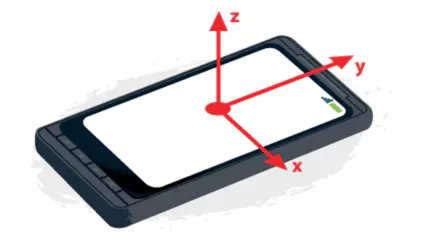
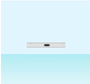
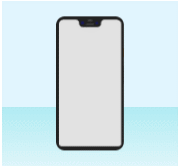

# 《JavaScript 高级程序设计》第十三章：事件

## 简介

JavaScript 与 HTML 的交互是通过“事件”实现的，它相当于两者的枢纽，建立起联接关系。

“事件”就是用户或浏览器自生执行的某种动作，例如用户点击(onclick)，浏览器的资源加载(onload)等，我们可以使用“事件侦听器(Listener)”来预定事件，以便事件发生时执行相应的代码，这种实现模式在软件工程中就被称之为“观察员模式”

“事件”最早出现与 `IE3`, `NetSapce Navigator 2`中，在 `IE4` 与 `NN4` 时 API 开始趋于相似，但直到 DOM2 级的事件模块才开始将其标准化为 DOM 事件。目前 IE9+版本已经完全实现了 DOM 事件的核心部分。

> 浏览器的事件系统除了 DOM 事件，还有 BOM 事件，但是由于 BOM 一直缺乏标准规范（HTML5 已经开始标准化），所以有时会跟 DOM 的某些事件在区分上并不十分清晰。

## 事件流

“事件流”描述的是事件被触发后在文档中的传播与接收的顺序，其中 IE 浏览器提出了“事件冒泡流”，NetSapce 提出了“事件捕获流”，它们是相反的概念

### 冒泡事件流

事件冒泡(bubbling)是 IE 提出的事件流。即事件从触发事件的目标元素起沿着 DOM 树层层向上传播至 `window` 为止，也就是说在此范围内的父元素都可以接收到触发的事件。

示意图：

### 捕获事件流

事件捕获(capturing)是 NetSpace 团队提出的。其思路是事件的触发由最顶层的元素 `window` 开始接收，然后再沿着 DOM 树层层传播至实际触发的目标元素为止。

示例图：

### DOM 事件流

DOM 事件流也是标准事件流，它有三阶段：“捕获阶段”、“目标阶段”、“冒泡阶段”。

- 捕获阶段：当一个事件被触发后，就会由 `window` 发出，然后沿着 DOM 树不断的层层向下传播，直到“目标元素”的父元素为止，这一过程就是“捕获阶段”。在捕获的过程中，所有经过的父节点都会触发这个事件，捕获阶段的任务就是建立事件传递的路线，而之后的冒泡阶段便会顺着这条路线再返回至 `window`。由于捕获阶段不会将事件传递到“目标元素”上，所以理论上事件捕获阶段不会触发目标阶段的事件。
- 目标阶段：当事件捕获阶段传递完毕后，下一个要传递的事件接收节点便是实际触发事件的目标元素节点，因此目标阶段就是捕获阶段传递到实际的目标元素的过程，目标阶段所触发的事件就是我们实际所需要触发的事件处理。如果在这一阶段阻止了冒泡，那么 DOM 事件流就会在这里中止。
- 冒泡阶段：目标阶段完成后，事件便会从目标元素的父元素开始沿着捕获阶段的路线以相反的方向从下向上返回最顶层的 `window` 对象。冒泡阶段可以看作是捕获阶段的逆传播。

由 DOM 事件流的传播机制我们可知，目标元素节点是无法同时指定冒泡阶段与捕获阶段的事件，因为目标元素节点的事件就是我们实际所需要触发的事件，它只会再 DOM 流的目标阶段才会被触发执行，而捕获与冒泡的事件都是目标元素的父级元素具有同类型事件时感知触发的，因此事件流的执行顺序是：父元素捕获阶段的事件 -> 当前（目标）元素的目标阶段事件 -> 父元素冒泡阶段的事件。

虽然我们无法为目标元素节点绑定多种事件流的事件，但是我们可以为其所有的父节点同时绑定多种事件流的事件。

```js
var btn = document.getElementById("btn");
btn.parentNode.onclcik = function() {
  alert("冒泡阶段");
};
btn.parentNode.addEventListener(
  "click",
  function() {
    alert("捕获阶段");
  },
  true
);
btn.onclick = function() {
  alert("目标阶段");
};
```

## 事件处理程序

“事件处理程序” 就是响应某个事件的函数或可执行的 JavaScript 语句，也可以称之为“事件侦听器”、“事件句柄”等。
“事件处理程序” 由两部分组成，一部分是“事件属性名”可以看作是“事件处理程序”的函数名，另一部分便是事件处理函数本身,用于事件触发时执行相应的动作。通常我们约定“事件处理程序”属性名是由前缀“on”加上具体的事件名组成，例如 click 事件的事件处理程序（事件属性名、事件句柄属性名）属性名就是 `onclick`，类似的还有 `onload`、`onmouseover` 等。在 DOM 事件体系中，这些事件属性名通常就是 HTML 标签的事件属性名或者 DOM 对象的事件属性名。

```html
<a onclick="alert(1)" onmouseover="alert('mouse')"></a>
```

```js
console.dir(document.body);

/*
{   
    ....
    onchange:null,
    onclick: ƒ onclick(event),
    onclose: null
    ....
}
*/
```

示意图：

“事件”是浏览器的特定动作，它可以被用户或浏览器自身触发，当一个事件被触发后，它便会去查找对应的事件处理程序属性有没有被赋值，如果有，便会执行该“事件处理程序”。
“事件”一直都是存在的，只不过对应的事件处理程序为 `null` ，因此就算事件被触发也不会进行任何操作，而我们常说的事件绑定，其实并不是真的为 DOM 元素或事件目标绑定事件，而是为其事件处理程序属性（事件属性、事件侦听器属性、事件句柄属性）赋值(事件处理函数)。

事件与事件处理程序关系示意图：

为“事件”指定事件处理程序的方式主要有三大类：事件属性赋值、标准的事件监听器、IE 专有的事件监听器，而“事件属性赋值”又可以分为两种：“HTML 事件处理程序” 和 “DOM0 级事件处理程序”。

### HTML 事件处理程序

某个元素支持的每种事件，都可以使用一个与其事件处理程序同名的 HTML 标签属性来指定（即通过标签属性来为对应的事件处理程序赋值）。

```html
<div onclick="javascript:alert('hello!')"></div>
```

在 HTML 中定义事件处理程序时，标签的事件处理程序属性会事先接收一个匿名函数作为实际的事件处理程序，然后将我们要赋值的事件处理函数或可执行的代码加入到这个匿名的函数内执行。

```html
<script>
  function showMessage(self) {
    console.log(this);
    console.log(self);
  }
</script>
<input type="button" name="button1" onclick="showMessage" />
<input type="button" name="button2" onclick="showMessage()" />
<input type="button" name="button3" onclick="showMessage(this)" />
```

单击上面的按钮，我们会发现 button1 根本不执行，而 button2 中打印的 this 指向的是 `window` ，而不是我们认为的当前 dom 对象，最后只有 button3 的执行符合我们的预期，但是使用方式并非我们所期望的形式，而原因就如上所述，我们指定的事件处理函数并没有真的作为事件处理程序来被事件执行，而是在一个匿名的事件处理程序中被调用执行。

```js
var button1 = document.getElementsByName("button1")[0];
var button2 = document.getElementsByName("button2")[0];
var button3 = document.getElementsByName("button3")[0];

//-------------------- RUN ----------------------------

console.dir(button1.onclick); //ƒ onclick(event) { showMessage}
console.dir(button2.onclick); //ƒ onclick(event) {showMessage()}
button3.click(); //<input type="button" name="button3" onclick="showMessage(this)" />
```

HTML 事件处理程序除了有一个容易让人误导的地方外，它还有一个特点，那就是其事件处理程序的作用域链会被 `with` 使用 `document` 对象进行延长，因此 HTML 中的事件处理程序不仅可以有权访问最顶层的 `window` 对象，还可以访问 `document` 对象中的方法或属性。

```html
<input type="button" name="button" onclick="alert(defaultView === window)" />
```

而且，如果当前元素是一个表单输入元素，那么其事件处理程序还会被 `with` 使用 `Form`（当前表单元素所处的 form 元素）对象来延长其作用域链，这样的好处就是我们可以直接在事件处理程序中使用 `name` 来获取同表单域下的其它表单输入元素。

```html
<form>
  <input name="username" />
  <input type="button" name="button" onclick="alert(username.value)" />
</form>
```

**HTML 中事件处理程序的特点：**

- 我们所指定的事件处理函数会被一个匿名的事件处理程序包裹执行。
- HTML 中的事件处理程序内其 `this` 指向的是当前 DOM 对象自身
- HTML 中的事件处理程序其作用域链会被 `with` 集合 `document` 或者表单对象进行延长。

> 虽然 HTML 事件处理程序有其独特点，但让 HTML 与 JavaScript 代码紧密耦合是其最大的缺陷，因此我们要避免使用，通常都是用于 demo 的验证。

### DOM0 级事件处理程序

DOM0 级事件处理程序是非标准的事件处理程序注册方式。这种方式出现于第四代 Web 浏览器中，现已经被所有浏览器支持，成为事实上通用的标准。
使用 DOM0 级指定事件处理程序就是将一个函数赋值给一个事件处理程序属性，因此对比 HTML 事件处理程序，我们指定的事件处理函数就是实际的事件处理程序，所以当一个函数被赋值给一个事件句柄属性后，其函数内部的 `this` 默认指向的就是事件目标对象自身。

```js
function showMessage() {
  console.log(this.tagName); //'BUTTON'
}
button.onclick = showMessage;
```

由于 DOM0 级指定事件处理程序的方式不支持自定义事件流，所以这种方式添加的事件处理程序只能在事件流的冒泡流阶段被处理。
删除 DOM0 级事件处理程序非常简单，只需要为所需的事件处理程序属性的值置为 null 即可。

```js
button.onclick = null;
```

> 同样的删除原理也可以用于 HTML 事件处理程序。

**DOM0 级事件处理程序特点：**

- 事件处理程序中的 this 默认指向的就是事件目标自身。
- 事件处理程序只能在事件流的冒泡流阶段被处理。

### DOM2 级事件处理程序

DOM2 级指定事件处理程序的方式是标准的事件监听器方式，它有两个方法分别是添加监听器 `addEventListener()` 和 移除监听器 `removeEventListener`，这两个方法是在 `EventTarget` 接口(构造函数)上定义的，因此所有的 DOM 节点都可以调用到这两个方法。

“事件监听器”函数需要传入三个参数，分别是事件名，作为事件处理程序的函数和一个布尔值。前两个参数不在赘述，而最后一个布尔值参数则用来指定事件处理程序是在事件流的那个阶段被执行，如果为 `true` 则表示在捕获阶段被执行，而如果为`false`，则表示在冒泡阶段被执行，默认值为 `false`。

“事件监听器”函数的优点不仅体现于可以指定事件处理程序在事件流中的执行阶段，还可以为一个事件指定多个事件处理程序，并在触发后按照顺序执行。

```js
var button = document.getElementById("btn");
button.addEventListener(
  "click",
  function() {
    alert(1);
  },
  false
);
button.addEventListener(
  "click",
  function() {
    alert(2);
  },
  false
);
```

使用 DOM2 级方式来指定事件处理程序虽然方便，但是移除事件处理程序时将会显得很麻烦，当使用 `removeEventListener()` 方法来移除上面两个事件处理程序，我们必须要保证向其传入的参数与添加时的参数完全相同(也就是说，如果参数是函数，则函数的引用也是相同的)，所以上面那种将匿名函数指定为事件除了程序函数的形式将永远也无法被删除。

**DOM2 级事件处理程序特点：**

- 可以自定义事件处理程序的执行阶段。
- 可以同时为一个事件添加多个事件处理程序。
- 事件处理程序内的 `this` 默认指向 DOM 对象自身
- 移除事件处理程序时传入的参数必须与添加时传入的参数完全相同。

### IE 事件处理程序

IE 中也实现了与 DOM2 级类似的两个方法： `attachEvent()` 和 `detachEvent()`，它们都接受相同的两个参数，分别是“事件处理程序属性名”和“事件处理函数”。
由于 IE8 以及更早期版本只支持事件冒泡，所以通过 `attachEvent()` 与 `detachEvent()` 方法指定的事件处理程序都会被添加到冒泡阶段执行。

```js
btn.attachEvent("onclick", function() {});
```

`attachEvent()`方法可以为一个事件添加多个事件处理程序，但是这些事件处理程序的执行顺序是不能确定的。还需要注意的是，通过 `attachEvent()` 方法指定的事件处理程序，其函数内的 `this` 默认指向的是 window,而非目标 DOM 某元素本身。

最后，与 DOM2 级删除事件处理程序的机制相同，当使用`detachEvent()`方法来删除某个事件处理程序时，必须要保证传入的参数与指定时的参数完全相同，也就是说上面那种指定的匿名函数形式的事件处理程序将永远无法被移除。

**IE 事件处理程序特点：**

- 指定时事件处理程序属性的名称是完整的事件属性名称。
- 可以支持为一个事件添加多个事件处理程序。
- 只支持指定冒泡阶段的事件处理程序。
- 指定的事件处理程序函数内部 `this` 默认指向的是 `window`，而非目标 DOM 元素本身。
- 删除时必须要传入与指定时完全相同的参数。

### 跨浏览器的事件处理程序。

通过使用能力检测的方式来为不同的浏览器选择合适的事件处理程序注册方式。
通常我们的优先级是 DOM2 级事件处理程序方式 -> IE 事件处理程序方式 -> DOM0 级事件处理程序方式。

```js
var eventUtil = {
  addEvent: function(element, type, handler) {
    if (element.addEventListener) {
      element.addEventListener(type, handler, false);
    } else if (element.attachEvent) {
      element["event_" + handler.name] = function(event)) {
        handler.call(element, event ||  window.event);
      };
      element.attachEvent("on" + type, element["event_" + handler.name]);
    } else {
      element["on" + type] = handler;
    }
  },
  removeEvent: function(element, type, handler) {
    if (element.removeEventListener) {
      element.removeEventListener(type, handler, false);
    } else if (element.detachEvent) {
      element.detachEvent("on" + type, element["event_" + handler.name]);
    } else {
      element["on" + type] = null;
    }
  }
};
```

## 事件对象

### DOM 事件对象

当事件触发时会产生一个“事件对象(evnet)”，这个事件对象包含了所有与该事件相关的信息。包括触发事件的“当前元素(currentTarget)”、触发事件的“目标元素(target)”、“事件类型(type)”以及该事件类型特有的细节信息。

DOM 事件对象会作为事件处理程序的形参来传入到事件处理函数中。

```js
element.onclick = function(event) {
  console.log(event.type);
};
element.addEventListener("click", function(event) {
  console.log(event.type);
});
```

但如果是 HTML 事件处理程序方式，那么“事件对象”会保存在 `window` 窗口对象上，通过 `window.event` 属性我们便可以引用到该事件的“事件对象”。

```html
<input onclick="console.log(event)" />
```

下面是 DOM 事件对象常用的属性或方法：

|         属性/方法          |   取值   |                                                         说明                                                          |
| :------------------------: | :------: | :-------------------------------------------------------------------------------------------------------------------: |
|          bubbles           | Boolean  |                                                  该事件是否支持冒泡                                                   |
|        cancellabel         | Boolean  |                                              该事件是否可以取消默认行为                                               |
|       currentTarget        | Element  |                                        事件处理程序当前正在处理事件的那个元素                                         |
|      defaultPrevented      | Boolean  |                              是否已经调用了 `preventDefault()` 方法取消了事件的默认行为                               |
|           detail           | Integer  |                                                 与事件有关的细节信息                                                  |
|         eventPhase         | Integer  |                         该事件处于事件流中的阶段，1 表示捕获阶段、2 为目标阶段、3 为冒泡阶段                          |
|      preventDefault()      | Function |                                                  取消事件的默认行为                                                   |
| stopImmediatePropagation() | Function | 阻止事件流下一个冒泡或捕获阶段的事件处理程序，同时还会立即阻止当前元素后续同类型的事件多个事件处理程序。(DOM3 级新增) |
|     stopPropagation()      | Function |                                    阻止事件流下一个冒泡或捕获阶段的事件处理程序。                                     |
|           target           | Element  |                                                    事件的目标元素                                                     |
|          trusted           | Boolean  |                                      分别事件是浏览器中的事件还是用户自定义事件                                       |
|            type            |  String  |                                                       事件类别                                                        |
|            view            |  Object  |                                            事件对象对 `window` 对象的引用                                             |

> \*如果在事件处理程序中直接返回 `return false`，效果则等同于同时执行 `preventDefault()` 与 `stopPropagation()` 方法。

在阻止事件流的下一个冒泡或捕获阶段的事件处理程序的执行上，我们可选的方案有两个：`stopPropagation()` 与 `stopImmediatePropagation()` ，它们的区别在于后者不仅能阻止事件流的下一步捕获或冒泡的执行，还能阻止当前元素为同一个事件注册的多个后续执行的事件处理程序。

```js
element.addEventListener("click", function(e) {
  console.log("click1");
  e.stopPropagation(); // 执行该方法只会打印 click1 、click2。
  e.stopImmediatePropagation(); // 执行该方法只会打印 click1。
});

element.addEventListener("click", function(e) {
  console.log("click2");
});

document.body.addEventListener("click", function() {
  console.log("body click");
});
```

> 因此 `stopImmediatePropagation()` 方法在 DOM0 级方式的事件处理程序中基本无效，只能用于 DOM2 级注册事件处理程序的方式中。

在事件处理程序的内部 `this` 永远指向的 `currentTarget`，而 `target` 则是指触发事件的实际目标元素，由于目标元素就是事件流目标阶段的元素节点，所以当 `eventPhase` 为 2 时，`this`、`currentTarget`、`target` 三者时完全相同的。

```js
element.onclick = function(e) {
  if (e.eventPhase === 2) {
    console.log(this === e.currentTarget && this === e.target); //true
  }
};
```

最后，事件对象只会存在事件处理程序执行的期间，一旦事件处理程序执行完毕，那么事件对象就会被回收（究其原因还时在于事件对象时一个形参）。

### IE 事件对象

在 IE 浏览器内，不论是在 HTML 事件处理程序方式还是 DOM0 级事件处理程序的指定方式上，IE 独有的“事件对象”都是保存在 window 对象上，需要通过 `window.event` 进行引用，所以早期获取事件对象的兼容性写法如下所示：

```js
element.onclick = function(event) {
  var event = event || window.event;
};
```

这样对于支持标准 DOM 事件的浏览器中直接通过事件处理程序的参数获取事件对象，而 IE 浏览器则通过全局对象来获取引用。
对于使用 `attachEvent()` 方法指定的事件处理程序，其事件对象的获取与 DOM 事件对象的获取方式相同(可直接通过事件处理程序的参数来获取)。

```js
element.attachEvent("onclick", function(e) {
  console.log(e);
});
```

下面是 IE 事件对象常用的属性：

|     属性     |  取值   |                    说明                    |
| :----------: | :-----: | :----------------------------------------: |
| cancelBubble | Boolean |  是否阻止冒泡，如果赋值为 `true`表示阻止   |
| returnValue  | Boolean | 是否取消默认行为，赋值为 `false` 表示取消  |
|  srcElement  | Element | 获取实际的目标节点，类似于 `target` 属性。 |
|     type     | String  |                  事件类型                  |

在 IE 事件对象中 `event.cancelBubble = true` 等同于 `event.stopPropagation()` 方法，但由于 IE8 及更早的版本只支持事件冒泡，所以该属性无法像 `stopPropagation()` 方法那样还支持阻止事件捕获。

在 IE 事件对象中 `event.returnValue = false` 等同于 `event.preventDefault()` 方法，阻止事件默认的行为。

另外由于 `attachEvent()` 方法自身的缺陷，其注册的事件处理程序内部 `this` 指向的是 `window` 对象而非 DOM 事件对象中的 `currentTarget` 当前元素。

```js
element.attachEvent("onclick", function(e) {
  console.log(this === e.srcElement); // false
});
```

### 跨浏览器的事件对象

对大多数浏览器都支持的事件对象属性或方法进行封装。

```js
var eventUtil = {
  addEvent: function() {
    /*...*/
  },
  removeEvent: function() {
    /*...*/
  },
  getEvent: function(e) {
    return e || window.event;
  },
  getTarget: function(e) {
    return e.target || e.srcElement;
  },
  preventDefault: function(e) {
    if (e.preventDefault) {
      e.preventDefault();
    } else {
      e.cancelBubble = true;
    }
  },
  stopPropagation: function(e) {
    if (e.stopPropagation) {
      e.stopPropagation();
    } else {
      e.returnValue = false;
    }
  }
};
```

## 事件类型

根据触发条件的不同，事件可以分为以下几类：

- UI 事件
- 焦点事件
- 鼠标事件
- 键盘事件
- 复合事件(composition event)
- 变动事件
- HTML5 事件
- 设备事件

### UI 事件

UI 事件主要由 “HTML 事件”组成。

UI 事件主要用于保留在 DOM 事件规范出现之前，就已经以这种或那种形式存在着的事件，目的便是为了向后兼容。

常用的 UI 事件有：

- [x] load
- [x] unload
- [x] abort
- [x] error
- [x] select
- [x] resize
- [x] scroll

#### load

`load` 事件会在大多数通过 HTTP 进行资源请求的载体上触发。例如页面及其资源加载完毕后在 `window`对象上触发；框架内的页面加载完毕后在 `iframe` 上触发；图像、脚本、样式加载完毕后在其对应的 `img`、`script`、`link` 标签上触发。

除了可以使用 DOM0 与 DOM1 级方式来为 `window` 对象指定`load`事件的事件处理程序外，还可以通过 HTML 事件处理程序方式为 `body` 元素的 `onload` 属性指定事件处理程序。

```html
<body onload="alert(event.target === document)"></body>
```

通常能在 `window` 上触发的事件，都可以在 `<body>` 元素上通过设置相应的属性进行指定。而事件对象的目标元素(target)则是 `document` 对象。

我们很少会使用 `load` 事件来判断网页整体的加载情况，因为它很慢总会等待所有请求资源加载完毕后才会触发。

`load` 事件被常用于网页局部资源的加载，例如“动态样式”、“动态脚本”、“图像预加载”等技术的应用上。

```js
function loadState(element) {
  if (element.addEventListener) {
    element.addEventListener("load", function(event) {
      alert(event.target);
    });
  } else if (window.attachEvent) {
    element.attachEvent("onload", function(event) {
      alert(event.target);
    });
  } else {
    element.onload = function(event) {
      var e = event || window.event;
      alert(e.target);
    };
  }
}
```

先定义一个统一的加载状态判断方法，接着开始使用 `loadState` 方法来判断外部脚本、外部样式的加载状态：

```js
function loadLink(element) {
  var link = document.createElement("link");
  link.rel = "stylesheet";
  link.type = "text/css";
  loadState(link);
  link.href = "example.css";
  document.head.appendChild(link);
}

function loadScript(element) {
  var script = document.createElement("script");
  script.type = "text/javascript";
  loadState(script);
  script.src = "example.js";
  document.head.appendChild(link);
```

对于脚本与样式而言只有设置了 `src` 或 `href` 属性并将对应元素加入(appendChild)到页面后，浏览器才会进行相关资源的下载，而图片只要设置了 `` 元素的 `src` 属性无需加入到页面中就可以直接触发浏览器下载。

```js
function loadImg() {
  var img = document.createElement("img");
  loadState(img);
  document.body.appendChild(img);
  img.src = "example.jpg";
}
```

另外，DOM0 级还定义了一个 `Image` 接口（构造函数），可以用来快速实例一个 `img` 元素对象。

```js
var img = new Image();
```

利用 `` 这种只要设置 `src` 属性而无需添加到页面中渲染就可以触发加载请求的特性，常用于图片缓存以及站点访问量统计等方面。

#### unload

与 `load` 相反 `unload` 会在页面被卸载后触发，触发页面卸载的动作有：“刷新页面”、“跳转链接”、“表单提交”、“关闭页面窗口”等。

为防止`unload`事件被滥用、大多数浏览器都会屏蔽`unload`事件处理程序中的异步请求以及浏览器原生的交互 UI 组件（alert、confirm 等），但通过下面的代码，我们还是可以直观了解 `unload` 事件的触发机制。

```js
alert(localStorage.getItem("unload"));
window.onunload = function() {
  localStorage.setItem("unload", 1);
};
```

> 当我们刷新页面、跳转链接、关闭窗口后，再次进入该页面且成功的弹出了本地缓存中的值，便说明了 `unload` 事件被成功触发了。

`unload` 事件的常用场景有：

- 清除引用、避免内存泄漏。
- 关闭页面时统计与收集用户的操作信息

由于浏览器大都会阻止 `unload`事件处理程序中的异步请求，因此我们必须要通过一些特殊的技巧绕过这些限制，早期的方案有：

1. 创建一个最长几秒钟的死循环，然后来发送请求，请求发送成功立即终止循环。
2. 在 `unload` 中创建一个图片并设置其 `src` 来延迟卸载以保证数据的发送，因为绝大多数用户代理会延迟卸载以保证图片的载入，所以数据可以在卸载事件中发送。
3. 创建一个同步的 `XMLHttpRequest` 请求。

总的来说，上面的几种方法都会或多或少降低下个页面的载入性能，好在 `W3C` 为 `navigator` 对象制定了一个 `sendBeacon()` 方法，可用以异步的向服务器发送信息且不影响下一个页面的加载。

```js
indow.addEventListener("unload", logData, false);

function logData() {
  navigator.sendBeacon("/log", analyticsData);
}
```

其中　`analyticsData` 就是在页面卸载的时候异步发送的数据，它可以是 ArrayBuffer、Blob、DOMString、FormData 等类型。

与 `load` 事件相同，我们不仅可以使用 DOM0 级以及 DOM2 级的方式来为 `window` 对象指定 `unload` 事件处理程序，还可以通过 HTML 事件处理程序方式为 `body` 元素的 `onunload`属性指定事件处理程序，且事件对象的目标元素为 `document` 。

对于一个简单的页面来说，其事件的生命周期大致的顺序为：`DOMContentLoaded -> onload -> onbeforeload -> onunload`

> 参考
>
> - https://zh.javascript.info/onload-ondomcontentloaded#windowonunload
> - https://developer.mozilla.org/zh-CN/docs/Web/API/Navigator/sendBeacon
> - https://w3c.github.io/beacon/#introduction

#### abort

该事件会在外部资源还在加载时，由用户手动停止或网络中断等原因而导致内容没有加载完成时触发。
该事件被常用于 `img` 图片预加载时的判断。

```js

```

#### error

该事件会在 JS 代码执行错误、图片资源无法请求（地址不存在）、框架无法加载页面时触发。

```js
window.onerror = function(e) {
  console.log(e); //Uncaught error
};

throw "error";
```

使用 `error` 事件我们可以实现页面的错误分析、图片的预加载等。

#### select

当用户选择文本框或多行文本框中的一个或多个字符时触发。

#### resize

当浏览器窗口大小发生变化时触发，由于该事件触发频率过高，通常我们会在其事件处理程序中使用防抖以及节流来进行优化。

由于这个事件是在 `window` 窗口上触发，因此可以通过 HTML 事件处理程序方式为 `<body>` 元素的 `onresize` 属性指定事件处理程序。

```html
<body onresize="console.log(event)"></div>
```

#### scroll

该事件会在事件目标对象存在滚动条且进行滚动时触发。`scroll` 事件可以用于存在滚动条的任何元素或对象上，例如 `window` 对象或可滚动的局部容器元素。

当我们为 `window` 对象指定 `scroll` 事件处理程序时，实际触发滚动的目标元素在“混杂模式”下是 `<body>` 元素，而在标准模式下则是 `<html>` 元素。我们可以通过滚动元素的 `scrollTop` 与 `scrollLeft` 属性来反应滚动的位置：

```js
window.onscroll = function(e) {
  var scrollingElement =
    document.scrollingElement || document.documentElement || document.body;
  console.log(scrollingElement.scrollTop);
};
```

由于 `scroll` 事件会被频繁的触发，所以我们在实际使用时最好要使用防抖、节流函数来进行优化。

因为可以在 `window` 上触发 `scroll` 事件，所以也可以通过 HTML 事件处理程序方式在 `<body>`元素 上为 `onscroll` 属性设置滚动事件处理程序。

滚动条事件除了可以通过鼠标滚轮来触发，还可以通过以下方式进行触发：

1. 通过方向键以及空格键
2. 使用可以改变滚动条位置的属性或方法，例如：`scrollTop`，`scrollBy()`等。

### 焦点事件

焦点事件会在页面元素获得或失去焦点时触发，常用的的焦点事件如下：

- [x] focus : 当元素获得焦点时触发，该事件不会冒泡，但支持捕获。
- [x] foucsin : 当元素获得焦点时触发，该事件与 `focus` 等价，但支持冒泡。
- [x] blur : 当元素失去焦点时触发，该事件不会冒泡，但支持捕获。
- [x] focusout : 当元素失去焦点时触发，该事件与 `blur` 等价，但支持冒泡。

```html
<body>
  <input />
  <script>
    document.addEventListener("foucs", function() {
      console.log("focus");
    });
    document.addEventListener("focusin", function() {
      console.log("focusin");
    });
    document.addEventListener("blur", function() {
      console.log("blur");
    });
    document.addEventListener("focusout", function() {
      console.log("focusout");
    });
  </script>
</body>
```

在上面的例子中，因为 `focus`与 `blur` 不支持冒泡。所以当 `<input />` 获得或失去焦点时只会触发支持冒泡的 `foucsin` 与 `focusout`事件。

```js
var input = document.querySelector("input");
input.addEventListener("focusin", function(e) {
  console.log("focusin");
});
input.addEventListener("focus", function(e) {
  console.log("focus");
});

input.addEventListener("focusout", function(e) {
  console.log("focusout");
});
input.addEventListener("blur", function(e) {
  console.log("blur");
});
```

在这个例子中，我们可以获知焦点事件的触发顺序依次是：`focus` -> `focusin` -> `blur` -> `focusout`。可以看出支持冒泡的焦点事件会最后触发。

使用“焦点事件”结合 HTML5 DOM 扩展中的 `document.activeElement` 属性以及　`document.hasFocus()` 方法，我们可以知晓用户再页面上的行踪。

### 鼠标事件

鼠标是 PC 端 WEB 应用的主要定位设备，当我们移动鼠标、点击鼠标按钮、拨动鼠标滚动等都可以触发相应的鼠标事件。

常用的鼠标事件有（只有前 9 个属于 DOM 事件规范定义）：

- [x] mousedown
- [x] mouseup
- [x] click
- [x] dbclick
- [x] mouseover
- [x] mouseout
- [x] mousemove
- [x] mouseenter
- [x] mouseleave
- [x] mousewheel

鼠标事件主要可以划分为三大类：“鼠标点击”、“鼠标移动”、“鼠标滚轮滚动”。

#### 鼠标点击

鼠标的点击事件主要有：

- **mousedown** : 按下鼠标的任意键触发，该事件不能通过键盘触发。
- **mouseup** : 释放按下的鼠标按钮时触发，该事件不能通过键盘触发。
- **click** : 单击鼠标的主按键（一般时左边的按钮）时触发，对于一些特别的 HTML 标签，也可以在获取焦点时，通过键盘的 Enter 键或空格键触发 `click` 事件。
- **dbclick** : 双击鼠标主按键时触发，该事件不能通过键盘触发。

鼠标点击事件的触发顺序如下：

```js
var btn = document.querySelector("button");
btn.onmousedown = function(event) {
  console.log("mousedown");
};
btn.onmouseup = function(event) {
  console.log("mouseup");
};
btn.onclick = function(event) {
  console.log("click");
};
btn.ondblclick = function(event) {
  console.log("dbclick");
};

/**
* mousedown
* mouseup
* click
* mousedown
* mouseup
* click
* dbclick
* /
```

从中我们可以看出，`click` 事件的触发流程是鼠标的主按钮被按下(mousedown)然后又松开(mouseup)的过程，而 `dbclick` 则是整个 `click` 流程触发两次时触发。不难得出 `mousedown` 触发最快，但在一些用户代理中并不能保证被触发，而 `dbclick` 不会在移动端浏览器触发，反而会在双击后放大浏览器窗口，对于 PC 端而言，`dbclick` 也不能通过键盘的 `enter` 键触发，因此不适用与绑定一些重要的操作，反而 `click` 事件可以再元素获得焦点时通过键盘触发，因此在 PC 端的点击事件首先采用的应该是 `click`，但 `click` 应用在移动端时，在 IOS 系统下会有 200ms 延迟的缺陷。

#### 鼠标移动

- **mouseover** : 当鼠标指针移动到某个元素上时触发，该事件支持冒泡。
- **mouseout** : 当鼠标指针从某个元素上移出时触发，该事件支持冒泡。
- **mousemove** : 当鼠标指针在某个元素上来回移动时触发，该事件支持冒泡。
- **mouseenter** : 当鼠标指针在某个元素上时触发，这个事件不支持冒泡，而且将鼠标移动到当前元素的后代元素上再移回来也不会触发移入事件。
- **mouseleave** : 当鼠标指针从某个元素上离开时触发，这个事件不支持冒泡，而且将鼠标移动到当前元素的后代元素上也不会触发移出事件。

我们必须要注意，鼠标指针在某个元素上的移入/移出是有两种情况存在：一种就是从元素的外部移入，也可能是从当前元素的后代元素中移入回来；另一种则是从当前元素移出到同级的或顶层的其它元素，也可能是在当前元素内部移出到某个后代元素上。

```htm
<div><p></p></div>
```

```js
var div = document.querySelector("div");
div.addEventListener("mouseenter", function() {
  console.log("div");
});
```

此时，将鼠标从外部移入到 `div` 中，会触发 `mouseenter` 事件，但是将鼠标在 `div` 内部移入到 `p` 元素上，再移回便不会触发 `mouseenter` 事件。

#### 鼠标滚轮

鼠标滚动事件会在拨动鼠标中间的滚轮时触发。在早期 IE 与 Chrome 共同私有实现了一个 “mouseWheel”事件，而 Firefox 则单独实现了一个 `DOMMouseScroll`事件,到了后期 W3C 则标准化了一个 `wheel` 的鼠标滚轮事件，因此要跨浏览器使用鼠标滚轮事件，则需要使用下面的方式进行指定：

```js
function wheel(e) {
  console.log(e);
}

document.addEventListener("mousewheel", wheel);
document.addEventListener("DOMMouseScroll", wheel);
document.addEventListener("wheel", wheel);
```

在 `wheel` 与 `mouseWheel` 事件中可以通过 `wheelDelta` 属性获取鼠标滚轮滚动的方向（上或下），而在 `DOMMouseScroll` 中则通过 `detail` 属性来获取方向，下面是它们的兼容性处理：

```js
function getDirection(wheelDelta) {
  return wheelDelta >= 0 ? "up" : "down";
}
document.addEventListener("mousewheel", function(e) {
  console.log(getDirection(e.wheelDelta));
});
document.addEventListener("DOMMouseScroll", function(e) {
  console.log(getDirection(-e.detail));
});
```

鼠标滚轮事件相比于滚动条事件(scroll)，滚动条事件只有目标元素存在滚动条才会被触发，并且在滚动的时候，先触发滚轮事件，然后滚动条滚动，最后触发滚动条事件。

#### 鼠标位置

鼠标位置反应了鼠标事件发生时，鼠标指针所处用户代理的水平与垂直坐标位置，基于参考对象的不同，可以分为以下几种鼠标位置：

**偏移量坐标位置**

`event.offsetX` 与 `event.offsetY` 返回鼠标指针相对于目标元素(target)的 x，y 坐标。

**客户区坐标位置**

`event.clientX` 与 `event.clientY` 返回鼠标指针所处浏览器窗口(浏览器视口-viewport)客户区的 x，y 坐标。

**页面坐标位置**

`event.pageX` 与 `event.pageY` 返回鼠标指针所处整个页面的 x，y 坐标。

通常当页面没有滚动的时候，`pageX`，`pageY` 等同于 `clientX` 与 `clientY`。IE8 及以下版本不支持 `pageX`与`pageY`属性，因此便需要通过 `clientX`，`clientY`结合 `scrollTop`,`scrollLeft` 进行模拟。

```js
document.body.onclick = function(event) {
  var event = event || window.event;
  var pageX = event.pageX;
  var pageY = event.pageY;
  var scrollElement =
    document.scrollingElement || document.documentElement || document.body;

  if (pageX === undefined) {
    pageX = event.clientX + scrollElement.scrollLeft;
  }

  if (pageY === undefined) {
    pageY == event.clientY + scrollElement.scrollTop;
  }

  console.log(pageX, pageY);
};
```

**浏览器坐标位置**

`event.x` 与 `event.y` 可以返回鼠标指针所处浏览器的 x，y 坐标。

> 要区分 clientX 是鼠标所处浏览器视口(viewport)的位置，而 x 则返回的是鼠标指针位于整个浏览器中的位置。

**屏幕坐标位置**

`event.screenX` 与 `event.screenY` 返回鼠标指针所处电脑屏幕的 x，y 坐标。

最后，我们可以通过一张图来直观了解这些鼠标位置的实际含义：

#### 修饰键

在鼠标事件与键盘事件组合使用的场景中，我们可以通过事件对象的“修饰键”属性来获取键盘中某些按键的状态。例如，按住 `ctrl` 键再单击鼠标的操作，其中 `ctrl` 键对应的修饰键属性便是 `ctrlKey`。

“修饰键”属性用来反应某些按键的状态，返回值为布尔值，如果相应的键被按下，则值为 `true`，否则值为 `false`。

鼠标事件所支持的修饰键属性如下：

- ctrlKey : `ctrl` 键是否按下
- altKey :`alt` 键是否按下
- shiftKey : `shift` 键是否按下
- metaKey : 在 window 中为 `window` 键，在苹果机中为 `command` 键。

当鼠标事件发生时，通过检测以上几个修饰键属性的值便可以确定用户是否同时按下了相应的按键。

```js
document.body.onclick = function(e) {
  var event = e || window.event;
  var keys = [];

  if (event.shiftKey) {
    keys.push("shift");
  }
  if (event.altKey) {
    keys.push("altKey");
  }
  if (event.ctrlKey) {
    keys.push("ctrl");
  }
  if (event.metaKey) {
    keys.push("meta");
  }

  console.log(keys.join());
};
```

需要注意的是 Chrome、Firefox 都支持这四个修饰键属性，但是 IE 不支持 `metaKey`，但支持其它三个修饰键属性。

#### 相关元素

“相关元素(relate target)”指的是在事件对象中与“目标元素(target)”具有关联关系的元素。并不是所有事件都有相关元素，通常只有涉及到多个元素的事件才会具有，例如鼠标的 `mouseover` 与 `mouseout` 等。

简单来说，当鼠标进行移入操作时，“目标元素”就是要移入的元素，而“相关元素”则是刚刚移出的元素；当鼠标进行移出操作时，“目标元素”就是当前正在移出的元素，而“相关元素”则是将要移入的元素。因此相关元素要基于具体的事件去考量，同一个元素即可能是目标元素，也可能是另一个事件的相关元素。

在 `mouseover` 与 `mosueout` 事件对象中，我们可以通过 `relatedTarget` 属性来获取当前事件的“相关元素”，这为我们追踪鼠标事件的触发轨迹提供了帮助：

```js
<p id="p1" style="height:100px;background:#ccc;margin:0"></p>
<p id="p2" style="height:100px;background:gray;margin:0"></p>
<script>
    var p1 = document.getElementById('p1');
    var p2 = document.getElementById('p2');

    p1.onmouseover = function (e) {
        console.log(e.relatedTarget.id); //p2
    }
    p2.onmouseout = function (e) {
        console.log(e.relatedTarget.id); //p1
    }
</script>
```

对于 IE8 及以下版本虽然不支持 `relatedTarget` 属性，但具有相同信息的不同名的 `fromElement` 与 `toElement` 属性，因此兼容性方案如下：

```js
function getRelatedTarget(event) {
  return event.relatedTarget || event.fromElement || event.toElement;
}
```

#### 鼠标按钮

鼠标事件对象中的 `button` 属性可以返回被按下的鼠标按钮位置信息，其中 0 表示主按钮(左键)，2 表示次按钮(右键)，1 则表示鼠标滚轮被按下(中键)。

在 IE8 及以下版本中返回的鼠标按钮信息更加详细：

- 0：表示没有按下按钮。
- 1：表示按下了主鼠标按钮。
- 2：表示按下了次鼠标按钮。
- 3：表示同时按下了主、次鼠标按钮。
- 4：表示按下了中间的鼠标按钮。
- 5：表示同时按下了主鼠标按钮和中间的鼠标按钮。
- 6：表示同时按下了次鼠标按钮和中间的鼠标按钮。
- 7：表示同时按下了三个鼠标按钮。

为了兼容标准 DOM 事件的 `button` 属性，我们必须对上面的值进行合并，合并规则如下

    如果有主按钮，则算作主按钮，否则判断是否含有次按钮，既不含有主按钮也不含有次按钮的，则算作中键。

```js
function getMouseButton(e) {
  var button = e.button;
  var ua = navigator.userAgent.toLowerCase();
  var ver = ua.indexOf("msie") != -1 ? ua.match(/msie ([\d.]+)/)[1] : 0;
  if (ver && ver <= 8) {
    switch (button) {
      case 0:
      case 1:
      case 3:
      case 5:
      case 7:
        return 0;
      case 2:
      case 6:
        return 1;
      case 4:
        return 2;
      default:
        return -1;
    }
  }

  return button;
}
```

### 键盘事件

键盘事件主要有三类：`keydown`、`keypress`、`keyup`。

- **keydown** : 按下按键时触发，按住不放会重复触发。
- **keypress** : 当按下的按键会影响屏幕中文本或字符的显示时触发，按住不放会重复触发。
- **keyup** : 释放被按下的按键时触发。

**影响屏幕中文本显示的定义是什么？**

由于使用字母按键、数值按键、空格键(空白字符)、回车键(换行符)等输出的可见字符会影响屏幕中内容的显示，所以此类按键都会触发 `keypress` 事件，而像退格键、删除键、Tab 键、修饰键等插入的不可见字符便不会触发 `keypress` 事件。

键盘事件的触发流程符合键盘中按键的使用顺序，分别是 `keydown` ➞ `keypress` ➞ `keyup`。

在键盘事件的事件对象中有一个很常用的 `keyCode` 属性，它在不同的键盘事件类型中返回的值也不同，对于 `keydown` 以及 `keyup`事件返回的是按键的“键码”，而对于 `keypress` 事件而言则返回对应字符的 ASCII 码。

```js
input.addEventListener("keydown", function(e) {
  console.log(e.keyCode); // 186
});

input.addEventListener("keypress", function(e) {
  console.log(e.keyCode); //59
});
```

上面的例子中，如果向文本框输入一个分号 `;`，则得到的键码是 186,ASCII 码则为 59。

```js
String.fromCharCode(59) === ";"; //true
```

为了消除同一个属性在不同事件中返回值的差异，DOM3 级还引入了一个新属性 `key`，它返回的是被按下按键的英文名称：

```js
input.addEventListener("keydown", function(e) {
  console.log(e.key);
});

//CapsLock
//Shift
//ArrowLeft
//ArrowRight
// ....
```

同时 DOM3 级还提供了一个可以返回被按下按键所处键盘区域位置的 `location` 属性，返回值是标识键盘位置与类型的数值：

- 0 : 表示默认键盘
- 1 : 表示被按下按键处于键盘的左侧(例如左位的 alt 键)
- 2 : 表示被按下按键处于键盘的右侧(例如右位的 shift 键)
- 3 : 表示数字小键盘
- 4 : 表示移动键盘(虚拟键盘)
- 5 : 表示手柄等。

> 键盘事件与鼠标事件相同，也具有 `shiftKey`、`ctrlKey`、`altKey`、`metaKey` 等修饰建属性。

### 复合事件

由于输入法编辑器(IME)会截取键盘事件，获取用户输入的多个字符，按照特定的组合规则输出最终的结果(通常只会有一个字符)，因此 “复合事件(composition event)”便是 DOM3 级用来检测与处理 IME 输入序列而新增的事件。

按照 IME 的触发步骤，复合事件也有对应的三种状态：

- compositionstart : 打开 IME 输入法时触发.
- compositionupdate : 使用 IME 输入期间不断触发。
- compostionend : IME 关闭时触发，此时返回正常的键盘事件。

“复合事件”的事件对象有一个 `data` 属性，可以返回 IME 不同状态的输入结果：

- compositionstart : `data` 通常为空，如果有选择要被替换掉的文本，则 `data` 属性为选中的文本。
- compositionupdate : 类似于 `keypress` 事件在 IME 输入阶段不断返回输入的字符。
- compositionend : 返回 IME 关闭前所有的输入结果。

> 复合事件只会在 IME 打开时才会触发。

### 变动事件

由于 DOM3 级废弃了很多旧版本的变动事件，所以这里只介绍三种最常用未来也仍然会得到支持的变动事件：

- 监听 DOM 节点插入的变动事件
- 监听 DOM 节点移除的变动事件
- 监听 DOM Tree 改变的变动事件

**DOM 节点插入的变动事件**

使用 `DOMNodeInserted` 与 `DOMNodeInsertedIntoDocument` 可以监听 DOM 节点插入时以及插入到文档时的事件。

**DOM 节点移除的变动事件**
使用 `DOMNodeRemoved` 与 `DOMNodeRemovedFromDocument` 可以监听 DOM 节点被移除时以及从文档中被移除时的事件。

**DOM Tree 改变的变动事件**
不论是插入节点还是移除节点都会改变 DOM 树，从而触发 `DOMSubtreeModified` 事件。

```js
var p = document.createElement("p");
var box = document.getElementById("box");

//当有子节点插入时触发
box.addEventListener("DOMNodeInserted", function(e) {
  console.log("DOMNodeInserted");
});

//当节点被插入到文档时触发
p.addEventListener("DOMNodeInsertedIntoDocument", function(e) {
  console.log("DOMNodeInsertedIntoDocument");
});

//DOM树发生改变时触发。
box.parentNode.addEventListener("DOMSubtreeModified", function(e) {
  console.log("DOMSubtreeModified");
});

box.appendChild(p);
```

> 变动事件与鼠标的 mouseover 以及 mouseout 事件相同的相关元素属性 relatedNode

### HTML5 事件

HTML5 事件实际上是对一些浏览器私有的事件进行标准化，同时这些私有的事件也被大多数浏览器支持。

- [x] contextmenu
- [x] beforeunload
- [x] DOMContentLoaded
- [x] readystatechange
- [x] pageshow/pagehide
- [x] hashchange

#### contextmenu

`contextmenu` 事件用于提供自定义的上下文菜单，它属于鼠标事件的一种，对应着通过左键触发的 `click`事件，其触发流程为： `mousedown` ➞ `mouseup` ➞ `contextmenu`。

由于 `contextmenu` 事件本质上是鼠标事件的一种，因此它的事件对象中也包含着鼠标事件有关的信息，通常我们会使用 `event.preventDefault()` 或者 `event.returnValue=false` 方式来阻止浏览器默认的上下文菜单，然后结合鼠标的坐标信息实现自定义的上下文菜单。

`contextmenu` 事件支持冒泡所以我们可以在 `document` 上指定一个事件处理程序用于全局性的处理上下文菜单事件。

```js
document.addEventListener("contextmenu", function(e) {
  var contextmenu = document.getElementById("contextmenu");
  if (contextmenu) {
    contextmenu.parentNode.removeChild(contextmenu);
  }

  var oDiv = document.createElement("div");
  oDiv.id = "contextmenu";
  oDiv.innerText = "contextmenu";
  oDiv.style.cssText =
    "position:absolute;padding:10;background:#ccc;border:1px solid #aaa";
  oDiv.style.left = e.clientX + "px";
  oDiv.style.top = e.clientY + "px";
  document.body.appendChild(oDiv);
  e.preventDefault();
});

document.addEventListener("click", function() {
  var contextmenu = document.getElementById("contextmenu");
  if (contextmenu) {
    contextmenu.parentNode.removeChild(contextmenu);
  }
});
```

#### beforeunload

`beforeunload` 事件会在页面卸载前触发，用于向用户发出提示并让用户来决定是否离开页面。

对于自定义卸载的提示，目前只有 IE11-版本支持，可以通过事件处理程序中的 `return` 来返回提示信息。

```js
window.addEventListener(
  "beforeunload",
  function(e) {
    return "are you sure？";
  },
  false
);
```

而最新版本的 firefox、chrome、Microsft Edge 都已经不支持自定义提示，但是如果要打开系统提示，则必须要使用以下方式来跨浏览器支持：

```js
window.addEventListener(
  "beforeunload",
  function(e) {
    var message = "are you sure？";
    e.preventDefault(); //Edge required
    e.returnValue = message;
    return message;
  },
  false
);
```

`boforeunload` 事件与 `unload` 事件相同都属于页面的生命周期事件，其触发的顺序是 `load` ➞ `beforeunload` ➞ `unload`。

#### DOMContentLoaed

`DOMContentLoaed` 事件会在 HTML 加载完成并形成 DOM 树时触发，由于不需要考虑其它外部资源的加载（图像、样式、脚本），因此它比传统的 `load` 事件能更快的与页面进行交互。

`DOMContentLoaed` 事件对象没有额外的信息，其 `target` 为 `document`元素，我们可以通过 `document` 对象或者 `window` 对象来添加 `DOMContentLoaed` 事件，但最终它会冒泡到 `window` 对象中。

`DOMContentLoaed` 事件也属于页面的生命周期事件，目前已知有关页面生命周期事件的触发顺序是：`DOMContentLoaed` ➞ `load` ➞ `beforeunload` ➞ `unload`。

> 目前支持的浏览器为：IE9+。

#### readystatechange

IE 为页面或页面中的部分元素提供了一个 `readystatechange` 事件，这个事件的目的是提供与文档或元素有关的加载信息。
在支持 `readystatechange` 事件的元素上，会有一个 `readyState` 属性，这个属性的值反应了不同的加载状态，有用的取值如下:

- loading : 加载中。
- loaded : 加载完成。
- interactive : 对象可以操作了，但没有完全加载。
- complete : 加载完成，对象也可以操作了。

虽然上面的取值已经很详细的说明了不同阶段的取值情况，但是在实际的场景中并不总是按照固定的顺序进行的，例如当加载的页面很小的时候，会跳过 `interactive` 阶段直接变成 `complete` 阶段，因此这要让我们在使用时要考虑到更多的情况。

对于文档的加载来说，要同时判断 `interactive` 阶段与 `complete` 阶段，`interactive` 阶段而言 DOM 树已经可以操作了。

```js
document.addEventListener("readystatechange", function(e) {
  if (
    document.readyState === "interactive" ||
    document.readyState === "complete"
  ) {
    //文档加载完毕。
  }
});
```

> 虽然很多浏览器不支持 readystatechange 事件，但是包括 Chrome 与 Firefox 它们都支持 document.readyState 属性。

对于页面中的一些局部元素，例如：`<link>`、`<script>`、``、`<iframe>` 而言，则主要判断 `loaded` 与 `complete` 阶段，因为这两个阶段都说明资源已经可用。

```js
var img = new Image();
img.addEventListener("readystatechange", function(e) {
  var target = e.target;
  if (target.readyState === "loaded" || target.readyState === "complete") {
    //图像资源加载完成。
  }
});
```

总的来说，在 IE 中只要具有外部资源加载需求的元素，都会具有 `readystatechange` 事件，虽然它比 `load` 事件要更为详细，但是 `load` 事件在跨浏览器场景中更为通用。

#### pageshow | pagehide

Firefox 率先引入了一个 `往返缓存(back-forward cache，或 bfcache)` 的特性。它会在页面卸载时将页面的数据与状态(DOM 状态，JS 执行状态)保存到内存中，以便于下次再打开该页面时取得更快的加载速度。对于这一机制，我认为很类似与手机程序的 APP 后台。

当后台缓存中的页面切换到前台显示时是不能触发 `onload`事件的，因为往往有很多开发者会将页面的功能放在 `load` 事件的事件处理程序中，为此 Firefox 又引入了两个新的事件：

- pageshow : 非 bfcache 进入的页面，会在 `load`之后触发；对于从 `bfcache` 中进入的页面，则直接触发且不在触发 `load 事件`。
- pagehide : 当页面离开时会在 `beforeunload` 之后 `unload` 之前触发。

bfcache 事件有一个很重要的事件对象属性 `persisted`，值为布尔值。在 `pageshow` 事件中如果 `persisted` 的值为 `true`，则说明页面是从 bfcache 中打开的，否则则为 `false`；对于 `pagehide` 事件中如果 `persisted` 的值为 `true`，则说明页面离开时会加入到往返缓存中，否则则不会。

```js
window.addEventListener("pagehide", function(e) {
  if (e.persisted === true) {
    //从bfcache中进入页面
  } else {
    //正常打开页面
  }
});

window.addEventListener("pagehide", function(e) {
  if (e.persisted === true) {
    //页面离开时会加入到缓存中
  } else {
    //页面不会加入到缓存中
  }
});
```

支持 `bfcache` 特性的浏览器主要有 `Chrome` 、 `Firefox` 、`Edge`、`IE11+`，目前常用该特性的浏览器主要是移动端的浏览器，目的是为了节省流量，但是 `bfcache` 的特性也为我们实际工作带来了麻烦，例如一个页面需要实时展示最新的数据，结果当从 bfcache 中打开后依然还是之前保存的页面状态，针对这一点我们可以在 `pageshow` 事件对动态数据重新进行处理，也可以判断 `persisted` 的值是否为真，如果为真就重新刷新页面，当然这也违背了 bfcache 的初衷，所以最推荐的方式还是第一中方式。

另外还有一小技巧，如果当页面中指定了 `unload` 事件时往往浏览器会认为该页面需要被销毁，所以便不会触发 bfcache 特性。

#### 页面生命周期事件

从学习事件类型开始，我们接触到的有关于页面生命周期的事件主要有：

- **DOM 标准的页面生命周期事件** : `load`、`beforeunload`、`unload`。
- **HTML5 标准的页面生命周期事件** : `DOMContentLoaded`、`pageshow`、`pagehide`。
- **IE 私有的页面生命周期事件** : `readystatechange`。

下面是有关它们详细触发与执行流程：

在掌握了有关页面生命周期事件的内容后，我们可以实现一个类似 JQ 的 `ready` 函数：

```js
function ready() {
  var flag = false;
  var fns = Array.prototype.slice.call(arguments, 0);

  var handle = function() {
    if (!flag) {
      flag = true;
      while (fns.length) {
        fns[0].call();
        fns.shift();
      }
      removeEvent();
    }
  };

  var removeEvent = function() {
    if (window.addEventListenner) {
      window.removeEventListenner("load", handle, false);
    } else if (window.attachEvent) {
      window.detachEvent("onload", handle);
      window.detachEvent("onreadystatechange", readyState);
    } else {
      window.onload = null;
    }
  };

  if (
    // Properties supported by all browsers
    document.readyState === "complate" ||
    document.readyState === "interactive"
  ) {
    handle();
  } else if (window.addEventListener) {
    window.addEventListener("DOMContentLoaded", handle, false);
    window.addEventListener("load", handle, false);
  } else if (window.attachEvent) {
    window.attachEvent("readystatechange", handle);
    window.attachEvent("onload", handle);
  } else {
    window.onload = handle;
    //由于JS线程是同步的，所以当Loop线程执行了定时器，说明DOM树也已经可以操作了
    setTimeout(() => {
      handle();
    }, 0);
  }
}
```

在实现 `ready` 函数时我并没有加入 `pageshow`的判断，因为 bfcache 的本质就是通过缓存数据状态来提高切面的加载速度。

#### hashchange

`hashchange`事件会在 URL 参数的 hash 值发生改变时触发。主要用来保存 url 参数对应的数据与状态，另外结合 `Ajax` 还可以实现无刷新的页面导航。

`hashchange`的事件对象中分别有一个 `oldUrl` 与 `newUrl` 属性，它们分别返回改变之前的 URL 与改变之后的 URL，由于存在浏览器兼容性，所以更推荐直接使用 `location.href` 进行判断。

```js
window.addEventListener("hanshchange", function(e) {});
```

支持 `hashchange` 事件的浏览器主要有：IE8+，我们可以通过 `in` 运算符来判断 `window` 对象是否存在 `onhashchange` 属性以确定当前的浏览器是否支持。

```js
"onhashchange" in window;
```

### 设备事件

- [x] orientationchange
- [x] deviceorientation
- [x] devicemotion
- [x] Touch

#### orientationchange

`orientationchange` 事件可以获取设备的旋转方向。通常取值为 `-90 | 0 | 90`。

`orientationchange` 的事件对象并不包含什么有用信息，而有关设备方向的信息实际保存在 `window` 对象的 `orientation` 属性中。

```js
window.addEventListener("orientationchange", function() {
  alert(window.orientation); //device direction
});
```

#### deviceorientation

`deviceorientation` 事件可以返回设备方向传感器（陀螺仪）的读数，相比于 `orientationchange` 事件只能返回设备的角度值，`deviceorientation` 事件可以返回每个轴的详细读数。

**地球坐标系**
地球坐标系是相对于地心，以重力和标准的磁定方向为基准。
X：表示东西方向（东为正值）。
Y：表示南北方向（北为正值）。
Z：表示上下方向， 与地面垂直（上为正值）。

**旋转数据**

通常设备在三维空间中是靠 x,y 和 z 轴来定位。当设备静止放在水平表面上时，这三个轴的读数都为 0。x 轴方向是从左往右，y 轴是从下到上，z 轴则是从前往后。



当设备在三位空间中按照任意一个轴旋转时，都会触发 `deviceorientation` 事件，其事件对象中会以欧拉角的形式返回设备坐标与地球坐标之间的差异度数。

**事件对象属性**

- alpha : 在围绕 z 轴旋转时（即左右旋转时）的角度，范围介于 0 到 360 之间的浮点数。
- beta : 在围绕 x 轴旋转时（即前后旋转时）的角度，范围介于 -180 到 180 之间的浮点数。
- gamma : 在围绕 y 轴旋转时 (即扭转翻转时)的角度，范围介于 -90 到 90 之间的浮点数。
- absolute : 布尔值，表示设备是否要范围一个绝对值。
- compassCalibrated : 布尔值，表示设备的指南证是否校准过。

当设备水平且屏幕朝上摆放时，地球坐标系的 Z 轴与设备屏幕垂直，此时旋转 Z 轴效果如下所示：

;

当设备的 `beta` 值为 90° 时，设备垂直立于平面上，此时地球坐标系的 Z 轴与设备平行，而旋转 Z 轴则相当于垂直旋转设备，示意图如下：

;

> 这里的重点我认为是不论设备在三位空间中是何种朝向或倾斜，其旋转都是基于固定的地球坐标系。

#### devicemotion

`devicemotion` 返回设备运动传感器的读数，它包含了设备的加速度、重力加速度、翻转方向等主要数据。

加速度就是描述物体速度变化快慢的物理量，它是一种既有大小又有方向的矢量(向量)。

为什么需要 devicemotion 事件？当我们使用 `deviceorientation` 事件时如果我们确定了设备的方向，那么不论我们如何移动设备，设备各个轴的读数实际上是不会有特别大的改变，而 `devicemotion` 事件则是返回设备运动期间的加速度，并且还可以返回运动时加速度的方向。

**事件对象属性**

- acceleration : 个包含 x、 y 和 z 属性的对象，在不考虑重力的情况下，告诉你在每个方向上的加速度。
- accelerationIncludingGravity : 一个包含 x、 y 和 z 属性的对象，在考虑 z 轴自然重力加速度的情况下，告诉你在每个方向上的加速度。
- interval : 表示从设备获取数据的频率，单位是毫秒。
- rotationRate : 一个包含表示方向的 alpha、 beta 和 gamma 属性的对象。

利用 `devicemotion` 事件返回的加速度信息，我们可以开发 H5 摇一摇功能，因为本质上摇一摇并不需要专门监听设备摇动的方向，而只需要知道设备的摇晃时加速度是否达到我们预设的零界值。

关于零界值的常见范围则为 : 800 ~ 1000。

```js
var THRES_HOLD = 1000; //阈值，控制摇一摇的灵敏度。
var lastUpdate = 0;
var preX = 0;
var preY = 0;
var preZ = 0;
var x = 0;
var y = 0;
var z = 0;

function shakeHandler(e) {
  var time = Date.now();
  var diffTime = time - lastUpdate;
  //(相对比与节流，防抖是否更好？毕竟微信在一直摇的过程中是不会执行摇一摇功能的)
  if (diffTime >= 100) {
    //节流，在快速触发事件的过程中，每隔100ms执行事件处理程序。
    var acceleration = e.accelerationIncludingGravity; //获取具有地球重力加速度的加速度值。

    x = acceleration.x;
    y = acceleration.y;
    z = acceleration.z;

    // 摇一摇的核心算法，求得三轴加速度之和，然后减去上一次触发的三轴加速度之和，然后取得一段时间的平均值。
    var diff = (Math.abs(x + y + z - preX - preY - preZ) / diffTime) * 10000; //(为什么是10000不是1000？应该跟阈值是1000不是100有关系)

    // 当取得的一段时间平均加速度大于我们所预设的阈值，则表示可以触发实际的摇一摇功能。
    if (diff >= THRES_HOLD) {
      alert("Trigger shake event");
    }

    lastUpdate = time;
    preX = x;
    preY = y;
    preZ = z;
  }
}

if (window.DeviceMotionEvent) {
  window.addEventListener("devicemotion", shakeHandler, false);
}
```

上面这种方式是最常用的方式，但是也有其不足之处，例如因为求得的是三个轴的之和，如果用户摇动时的方向较为刁钻，比如 x 为正、y 为负，就可能出现抵消的情况，从而影响摇一摇的灵敏度。

既然摇一摇的核心思路是判断用户摇动手机时的加速度是否达到我们预设的范围，那么实际上只要单个方向的加速度值满足即可。

```js
Math.abs(x - lastX) > speed || Math.abs(y - lastY) > speed;
```

更具体的可以参考 [shake](https://github.com/alexgibson/shake.js) 库的计算方式，它的计算方式更全面一些，包括了斜向摇晃的判断：

```js
this.options.threshold = 15;
deltaX = Math.abs(this.lastX - current.x);
deltaY = Math.abs(this.lastY - current.y);
deltaZ = Math.abs(this.lastZ - current.z);
if (
  (deltaX > this.options.threshold && deltaY > this.options.threshold) ||
  (deltaX > this.options.threshold && deltaZ > this.options.threshold) ||
  (deltaY > this.options.threshold && deltaZ > this.options.threshold)
) {
}
```

还有一种方式通过平方根来求三维空间中任意两点的距离，然后通过距离除以时间，得到速度的变化率，在摇晃过程中摇晃的速度满足条件就表示中奖了。目前来看，这种方式更加科学一点，因为它更能体现出摇一摇的实际情景：摇的快一点，就能摇一摇。

刚开始的时候采用的是第一种计算方式，计算在这一段时间内的平均值，但是在使用的过程中发现并不是很好用，设置的值太小就会比较灵敏，太大又不太灵敏，总是找不到一个合适的值满足条件。后来改用第三种方式，可以得到良好的摇一摇体验。

```js
Math.sqrt( 
    ( x - lastX ) * ( x - lastX ) + 
    ( y - lastY ) * ( y - lastY ) + 
    ( z - lastZ ) * ( z - lastZ ) 
) / diffTime * 10000
```

> 更多阅读：https://juejin.im/entry/57917c128ac247005f083390


#### Touch

“触摸事件”有以下几类：

- touchstart : 当手指触摸到屏幕时触发；即使已经有一个手指放在了屏幕上也会触发。
- touchmove : 当手指在屏幕上滑动时触发，在该事件处理程序中通过 `preventDefault()` 可以阻止滚动。
- touchend : 当手指在屏幕上离开时触发。
- touchcancel: 当系统停止跟踪触摸时触发，例如在触发触摸事件的过程中突然切换到其它程序（也或者来电跳转到通话中断了触摸事件）。

> 关于 PC 端模拟 `touchcancel` 事件的触发可以在目标元素上进行触摸然后使用 `alt+tab` 组合键切换到其它程序。

触摸事件支持冒泡，也都可以取消，另外触摸事件与鼠标事件具有类似的触发机制，因此触摸事件也具有一些鼠标事件的事件属性，例如修改键属性 `shiftKey`、`ctrlKey` 光标（触摸点）位置属性 `clientX`、`pageX`、`screenX` 等。

除此之外，TouchEvent 对象还具有以下几个独有的用来跟踪触摸的事件属性：

**touches**

表示当前触摸事件发生后在触摸设备上所有触摸点(Touch)对象的集合。

例如：第一根手指移动到触摸设备上触发 touchstart，此时触摸点为 1，当第二根手指移动到触摸设备上触发 touchstart 时，此时的触摸点便为 2.

> 注意：当触发 touchend 与 touchcancel 时该事件属性为空。

**targetTouches**

表示当前触摸事件发生后，在事件目标元素(target)上的所有触摸点(Touch)对象的集合。与 `touches` 不同的便是 `targetTouches` 只记录事件目标元素的触摸点对象。

**changeTouches**

表示触摸设备上正在发生改变的所有触摸点(Touch)对象的集合。

能够使触摸点发生改变的操作有：

- 新的触摸点加入到触摸设备上
- touchmove 事件中触摸点在不断的滑动。

> 注意：当触发 touchend 与 touchcancel 时该事件属性为空。

touchstart、touchmove、touchend、touchcancel 反应了触摸事件的各个不同阶段，而 touches、targetTouches、changeTouches 则反应了在触摸事件的不同阶段中触摸设备与目标元素上的触摸点数量。

受事件阶段的影响 touches、targetTouches 属性只存在于 touchstart、touchmove 事件中，而 changeTouches 属性则会存在于所有事件阶段中。在记录触摸点数量上，touches 与 changeTouches 属性会记录当前触摸事件发生时的所有触摸点对象，不同的是 changeTouches 只会记录所有发生改变的触摸点对象，而 targetTouches 属性则只会记录作用在目标元素上的触摸点对象，因此只关注当前元素的触摸点可以使用该属性。

在 touchstart 事件中 touches 属性记录了当前触摸事件触发后的所有触摸点对象；changeTouches 属性则只会记录最新触发触摸事件的触摸点对象，因为在此之前已经触发过的触摸事件不会再发生改变（本质也因为 touchstart 只能监听新触摸点的加入而无法监听已有触摸点的改变）；而 targetTouches 属性只会记录作用在事件目标元素上的触摸点对象 ���

由于 touchemove 事件可以监听触摸点的改变，此时 touches 属性记录的是当前设备上所有的触摸点的集合；而 changeTouches 属性则会记录所有正在发生改变的触摸点对象（表现形式为正在滑动）；而 targetTouches 属性依然只会记录作用在事件目标元素上的所有触摸点对象。

touchend 监控的是触摸对象的离开，因此对于离开触摸设备或目标元素的触摸点，会从对应的 touches 与 targetTouches 属性中移除，所以在 touchend 事件中 touches 与 targetTouches 属性都为空。虽然保留了 changeTouches 属性，但保存的也只是该触摸点（移出触发 touchend 事件的触摸对象）最后一次发生改变的结果（这个改变即可能是在 touchstart 发生时的初始结果，也可能是 touchmove 中触摸点滑动的最后一次）。

代入实际的场景，当我们用一根手指放在触摸设备时（可理解为 html 元素或 body 元素），会触发触摸设备事先绑定好的 touchstart 事件，此时 touches、targetTouches、changeTouches 中保存的触摸点对象都是同一个。当我们把第二根手指加入到触摸设备上的 div 元素上时，此时会触发 div 元素事先绑定好的 touchstart 事件，并且由于触摸事件可以冒泡，所以设备上的 touchstart 事件也会被触发，那么此时 div 元素的 touchstart 事件中，touches 属性中的数量为 2 个（当前触摸事件发生时已经存在两个触摸点对象）、changeTouches 属性中的数量为 1 个（最新触发触摸事件的对象），targetChange 属性中的数量也为 1，因为当前的 div 元素只有一个触摸点对象（便是第二根手指）。接着我们再看因为冒泡又再次触发 touchstart 事件的触摸设备，此时它的 touches 属性数量也为 2，changeTouches 属性中的数量为 1（最新发生改变的触摸点，所以与 div 元素的 changeTouches 属性相同），而 targetChange 属性中的数量也只有一个，即最新一次触摸事件 touchstart 事件发生时由 div 元素冒泡而来的触摸点对象（第二根手指）。

现在我们滑动两根手指来触发在设备以及 div 元素上事先绑定好的 touchmove 事件，此时 div 元素的 touchmove 事件中，touches 属性中的数量为 2，保存的是所有的触摸对象，而 changeTouches 则保存了所有正在改变的触摸点对象，如果两根手指都在滑动，那么 changeTouches 属性中的数量为 2，如果两根手指只有一个再滑动，那么数量便为 1，最后的 targetTouches 属性中的数量只会为 1（即第二根手指代指的触摸对象），在两根手指同时滑动时，对于触摸设备的 touchmove 事件，其 touches 与 changeTouches 属性与 div 元素保持一直，但在两根手指同时滑动且 div 元素还会冒泡到时，我们必须要注意此时的 targetTouches 的取值了。

最后，当我们两根手指逐一离开触摸设备与目标元素时会触发事先绑定好的 touchend 事件，其事件对象中的 touches 与 targetTouches 属性值为空，changeTouches 属性中保存的则是当前手指离开后的最后一次改变结果。

不论 touches 、targetTouches、changeTouches 属性，它们都是一个集合对象（伪数组），是所有触摸点对象(Touch)的集合，而每个触摸点对象，又拥有以下常用的属性：

- clientX / clientY : 触摸事件发生时相对于客户区的坐标。
- pageX / pageY : 触摸事件发生时相对于页面的坐标。
- identifier : 标识触摸对象的唯一 ID。
- screenX / screenY : 触摸事件发生时相对于屏幕的坐标。
- target : 触发触摸事件的目标元素。

## 内存与性能

在页面中过多的指定事件处理程序必然会导致内存占用的提升，以及 DOM 的访问次数增多，从而延迟整个页面的交互与就绪时间。

### 事件委托

事件委托也被称之为事件代理，它可以很好的解决“事件处理程序”指定过多的问题。
事件委托利用了“事件冒泡”的原理，为父元素指定一个事件处理程序便可以代为管理所有子元素的同类型事件。

```html
<ul>
  <li class="link-jump">link jump</li>
  <li class="open-window">open window</li>
</ul>
```

```js
var ul = document.querySelector('ul');
ul.addEventListener('click',function(e){
  switch(e.target.classList.value){
    case 'link-jump':
        location.href = 'http://www.mysite.com';
        break;
    case 'open-window':
        window.open('http://www.mysite.com');
        break;
    default:
        alert('can't find');
  }
})
```

理论上我们可以将代理事件处理程序指定到 `document` 对象上，这样就可以处理页面上发生的所有特定类型的事件。
这种做法相比较传统的为每个 DOM 都指定事件处理程序的优点在于：

- document 对象很快就可以访问，无需等待 DOMContentLoaded 或 load。
- 设置的事件处理程序变少，访问与操作 DOM 的次数也变的更少。
- 页面占用的内存空间更少，从而提升整体的性能。

## 模拟事件

如果“内置事件”是用户或浏览器自身触发的特定动作，那么模拟事件就可以看成是由 JS 创建并触发的自定义动作，它可以被应用于 WEB 应用测试。
模拟事件的主要知识点有三块，分别是“创建模拟事件的事件对象”、“指定模拟事件的事件处理程序”、“触发模拟事件的事件处理程序”。

**创建模拟事件的事件对象**
使用 `document.createEvent(eventType)` 方法并传入表示事件类别的字符串便可以创建不同类别的事件对象。
模拟事件的事件对象会承载着该模拟事件的所有有关信息与状态，并作为指定和触发模拟事件事件处理程序的依据。

**指定模拟事件的事件处理程序**
与内置事件相同，可以使用 `addEventListener(type,fn)` 方法为节点或目标对象指定模拟事件的事件处理程序。其中 `type` 的值就是模拟事件对象与模拟事件事件处理程序关联的依据。

**触发模拟事件的事件处理程序**

`element.dispatchEvent(event)` 方法用于触发调用节点上的模拟事件。它是 `EventTarget` 接口（构造函数）原型对象上定义的方法，因此可以被绝大多数的节点继承。

`dispatchEvent(event)` 方法接收的参数是一个模拟事件对象，它会根据事件对象上 `type` 属性的值来触发对应的模拟事件。返回值是一个布尔值，当模拟事件被触发后，在其事件传播的过程中如果调用了 `e.preventDefault()` 方法，那么值为 `false`，否则为 `true`。

当模拟事件被触发后，其模拟事件对象的 `target` 属性则自动设置为调用的节点元素(这里便是调用 dispatchEvent 方法的 element 元素)。

**总结**

使用 `document.createEvent()` 方法创建一个事件对象，然后使用 `addEventListener()` 方法并基于事件对象 `type` 属性的值来关联事件处理程序，最终再使用 `dispatchEvent()` 方法来触发传入所传入事件对象 `type` 属性所对应的事件处理程序。

以上的所有流程便是构成模拟事件的全部功能与内容。

### 标准的事件模拟

#### DOM2 级事件模拟

JavaScript 从 DOM2 级开始支持模拟事件。使用 `document.createEvent(eventType)` 方法并传入以下事件类别字符串便可以创建不同类别的事件对象：

- UIEvents : 指的是与用户界面或文档操作相关的事件，但本质是用于保留在 DOM 事件规范之前就已经以这种或那种形式存在着的事件。目的便是向后兼容，像鼠标事件、键盘事件等都是继承自 UI 事件。
- MouseEvents : 鼠标事件类别。
- MutationEvents : DOM 变动事件类别。
- Events : 基本事件类别。
- HTMLEvents : HTML 事件类别。其事件对象中的属性与 `Events` 类别完全相同，且 DOM3 级以及废弃了该类别，所以可以被 Events 类别所替代。

创建的每种类别事件对象都会有一个 `init` 初始化方法，用于对该事件对象的有关信息进行初始化(为事件对象的属性赋值)，其具体名称在不同类别的事件对象中也不相同。

不同类别的事件对象它们的事件属性也不相同，例如鼠标类别(MouseEvent)的事件对象具有一个 `button` 属性，用于保存按下的鼠标按钮位置，而从属于 `HTMLEvents` 类别的事件对象便不具有该属性，但总体来说我们创建的每种事件对象都会具有一些通用的事件属性，分别是：事件类别(type)、是否冒泡(bubbles)、事件是否可取消(cancelable)、事件的关联视图(views)等。

对于事件对象创建时自带的内置事件属性，我们只能使用该事件对象专有的初始化方法才能设置内置属性的值，而为事件对象手动添加的自定义事件属性，则可以自由的设置与修改值。

```js
// 创建一个模拟鼠标类别的事件对象
var MouseEvent = document.createEvent("MouseEvents");

// 使用该事件对象专有的初始化方法来设置内置成员属性的值。
MouseEvent.initMouseEvent("myclick", true, true, document.defaultView);

// 尝试通过自定义扩展事件属性来设置值。
MouseEvent.button = 1;
MouseEvent.keyCode = 65;

MouseEvent.button; //0，可以发现对于内置属性不能直接设置值。
MouseEvent.keyCode; //65，非内置的属性可以自由的添加并设置值。

//在指定的DOM元素上触发模拟事件。
element.dispatchEvent(MouseEvent);
```

当模拟事件触发后，该事件就会跻身官方事件之列，因此也能照样冒泡并引发相应的事件处理程序执行，并且其事件对象的 `target` 属性将自动设置为触发模拟事件的那个 DOM 节点元素（便是 element 元素）。

区分一个事件是真实的事件还是模拟合成的事件，我们可以通过该事件对象的 `isTrusted` 属性进行区分。

下面以模拟键盘事件为例进行说明，需要注意的是 DOM2 级模拟事件规范在完稿前删除了有关模拟键盘事件的草案，唯一实现该草案的浏览器只有 Firefox 浏览器，因此在 DOM2 级中若想模拟键盘事件，要么采用 Firefox 的私有实现：

```js
document.createEvent("keyEvents");
```

要么使用通用事件类别来模拟键盘事件，这里为了兼容性更推荐此种方案：

```js
var keyEvent = document.createEvent("Events");
var element = document.querySelector("input");

keyEvent.initEvent("keydown", true, true, document.defaultView);
keyEvent.ctrlKey = false;
keyEvent.altKey = false;
keyEvent.shiftKey = false;
keyEvent.keyCode = 65;
keyEvent.charCode = 65;

element.addEventListener(
  "keydown",
  function(e) {
    e.target === element; //true
    e.isTrusted; //false
  },
  false
);

element.dispatchEvent(keyEvent);
```

上例从创建、指定、触发等步骤完整的说明了模拟事件的使用，但是事件的触发器方法 `dispatchEvent(event)`，值得我们更多的注意：

```js
element.addEventListener(
  "keydown",
  function(e) {
    e.target === element; //true
    e.isTrusted; //false
  },
  false
);

element.addEventListener(
  "click",
  function(e) {
    console.log("click");
  },
  false
);

element.dispatchEvent(keyEvent);
```

简单分析，`dispatchEvent()` 方法会根据传入事件对象的 `type` 值来触发调用元素节点上与之同名的事件，并将自生的参数作为事件对象传入到事件处理程序中（在此之前会对 isTrusted、target 等属性的值进行处理），所以上面的 `click` 事件不会被 `dispatchEvent` 方法触发，而如果现在通过真实的键盘向文本框中输入内容，则完全也不会影响真实的 `keydown` 事件的触发，且此时的 `e.isTrusted` 的值便为 `true`，表示它是一个真实有效的事件。

`dispatchEvent()` 这样的特性就为我们提供了使用 JS 主动触发内置事件的思路：

```js
var myEvent = document.createEvent("Events");
myEvent.initEvent("scroll", true, true, document.defaultView);

window.addEventListener("scroll", function(e) {
  if (e.isTrusted) {
    //用户真实的滚动事件
  } else {
    //使用 dispatchEvent 触发的模拟事件。
  }
});

window.dispatchEvent(myEvent);
```

> 模拟键盘事件并不能像真实的键盘事件那样在输入框中输入相关内容。

### DOM3 级模拟事件

DOM3 级事件模拟相对于 DOM2 级而言，主要有以下改变：

1. 事件类别名称统一为单数形式。
2. 移除了 HTMLEvents 类别，将其内容拆分到更细致的其它类别中。
3. 新增了自定义事件类别： CustomEvent。
4. 新增了键盘事件类别：KeyboardEvent。

下面是 DOM3 级常用的事件类别：

- UIEvent
- MouseEvent
- MutationEvent
- KeyBoardEvent
- CustomEvent
- Event

使用 DOM3 级事件模拟模拟键盘事件：

```js
var keyEvent = document.createEvent("KeyBoardEvent");
var input = document.querySelector("input");

keyEvent.initKeyboardEvent("keydown", true, true, document.defaultView);
input.addEventListener("keydown", function(e) {
  console.log(e === keyEvent); //true
  console.log(e.isTrusted); //false
  console.log(e.type); //"keydown"
});

input.dispatchEvent(keyEvent);
```

事件类别的抉择取决于所要模拟的事件是否类似于该事件类别，如果要模拟的事件没有与之接近的事件类别，则可以使用通用事件类别或自定义事件类别，此两种类别的事件属性很少，因此纯净，非常适合自定义扩展。

> 关于自定义事件对象的属性，我们只能扩展该事件对象本身不存在的属性，对于其内置的属性成员，我们只能调用其自身专有的 init 方法来进行初始化。

## IE 中的事件模拟

IE8 及以下版本支持私有的事件模拟方法，可以使用 `document.createEventObject()` 创建一个通用的事件对象(event)，然后手动为这个通用事件对象自定义扩展或初始化成员属性，而无需调用相关的初始化方法。

与 `dispatchEvent(event)` 方法相同，IE 中提供了一个类似的 `fireEvent(type,event)` 方法，它接收两个参数，第一个参数是必须的。

- type : 要触发的事件类别，字符类型。
- event : 要触发的事件对象。

使用 `fireEvent(type,event)` 方法触发模拟事件后，它会自动为事件对象的 `type`与 `srcElement` 属性赋值。其中 `type` 属性的值就是其第一个参数，而事件对象中的 `srcElement` 属性的值则是调用 `fireEvent` 方法的那个元素节点。

下面以一个模拟单击(onclick) 事件为例，进行说明：

```js
var event = document.createEventObject(); //创建并返回一个通用的事件对象。
var btn = document.getElementById("button");

//手动扩展事件对象的成员并初始化值。

event.clientX = 100;
event.clientY = 100;
event.button = 0;

//使用attachEvent来绑定模拟事件
btn.attachEvent("onclick", function(e) {
  window.event.button; //0
});

//使用fireEvent来触发模拟事件。

btn.fireEvent("onclick", event);
```

与 `dispatchEvent(event)` 方法不同的是，`fireEvent(type,event)` 方法只能触发所调用 DOM 元素节点支持的事件句柄属性，而不能是完全自定义的事件名称，简而言之，我们只能在目标对象已有的事件上进行模拟触发。

```js
if ("click" in btn) {
  //该节点不存在 `click` 事件句柄属性，所以不能模拟该事件。
}
if ("onclick" in btn) {
  btn.fireEvent("onclick", event);
}
```

`fireEvent(<type>[,event])` 方法的第二个参数可以为空，如果为空，便表明此时我们是通过 JS 来触发调用目标对象的内置事件。

```js
btn.fireEvent("onclick"); //直接触发btn的内置onlick事件（如果有绑定的话）。
form.fireEvent("onsubmit"); //直接触发form的内置onsubmit事件（如果有绑定的话）。
```

> WebEvent 大全 ： https://developer.mozilla.org/en-US/docs/Web/Events
> H5摇一摇：https://www.cnblogs.com/libin-1/p/6260488.html