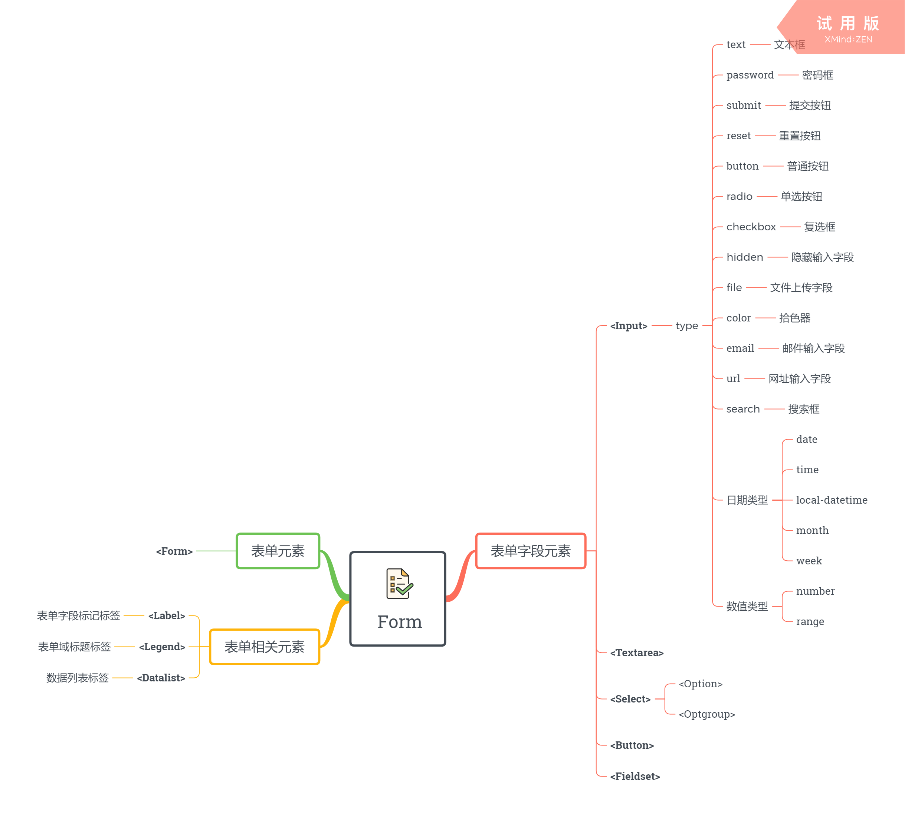

# 《JavaScript 高级程序设计》第十四章：表单脚本

## 表单元素概览



## 表单基础知识

在 HTML 中“表单”是用 `<form>` 标记表示，而在 JavaScript 中“表单”表示的是一个 `HTMLFormElement` 类型的 DOM 元素节点对象。

`HTMLFormElement` 类型又继承自 `HTMLElement` 类型，所以表单元素不仅具有常规 HTML 标记的属性与方法还具有以下它独有的属性与方法：

* **name** : 表单元素的名称，该属性的值可以作为表单元素的字符串索引。
* **acceptCharset** : 服务器可以接收的字符集。
* **action** : 接收请求服务的 URL 地址。
* **elements** : 该表单元素内的所有表单字段(控件)元素，返回值为 `HTMLCollection` 类型的集合对象。
* **length** : 该表单的表单字段元素数量，等同于 `form.elements.length` 。
* **enctype** : 请求的编码类型。
* **method** : 表单发送的 HTTP 请求类型。
* **target** : 接收请求响应的窗口名称。
* **submit()** : 提交表单方法。
* **reset()** : 重置表单方法。

### 获取表单

获取表单元素的方式有两种：

**使用标准 DOM 技术提供的节点获取方法**

* document.getElementById()
* document.getElementsByTagName()
* document.querySelector()
* document.querySelectorAll()

**使用快捷属性：document.forms**

`document.forms` 属性在 DOM0 级之前便已存在，它可以获取文档中所有的表单元素，返回值是一个 `HTMLCollection` 类型的集合对象。

我们可以用表单元素在 HTML 文档中的顺序作为数值索引或者使用表单元素的 `id` 也或者 `name` 属性的值作为字符串索引，来这个从动态的集合对象中获取指定的表单元素。

``` js
document.forms.length; //获取文档中表单元素的数量
document.forms[0]; //获取文档中第一个表单元素。
document.forms["myname"]; //根据name属性的值获取指定的表单元素。
```

### 提交表单

触发提交表单的方式有三种：

**键盘按键行为**

当表单中任意一个表单控件（字段）元素获得焦点时（ `<textarea>` 元素除外），敲击键盘上的回车键(enter)便可以触发表单提交。

**点击提交按钮**

在表单元素中 `<button>` 标记或者指定 `type="submit"` 的按钮都被认为是提交按钮。

``` html
<button>submit</button>
<button type="submit">submit</button>
<input type="submit" value="submit" />
```

**表单提交方法**

使用 JS 来调用表单元素对象的 `submit()` 方法来提交表单。

``` js
document.forms[0].submit();
```

这三种提交方式的区别在于最后一种不会触发表单的 `onsubmit` 事件，因此需要我们在提交表单之前就要先校验各个控件元素的值。通常而言我们会在 `onsubmit` 事件中校验表单各个元素的值，从而确定是否调用其事件对象的 `preventDefault()` 方法来阻止表单的提交。

最后，如果要在表单中加入普通按钮（非提交按钮）我们必须要声明其 `type` 属性为 `type="button"` 。

``` html
<input type="button" value="button" />
<button type="button">button</button>
```

### 重置表单

重置表单的方式有量种：

**点击重置按钮**

`type="reset"` 的按钮便是重置按钮。

``` html
<button type="reset">reset</button>
<input type="reset" value="reset" />
```

**表单的重置方法**

JS 调用表单元素对象的 `reset()` 方法便可以触发表单重置

这两种方式的区别在于最后一种不会触发表单的 `onreset` 事件，通常我们可以调用其事件对象的 `preventDefault()` 方法来决定是否阻止表单的重置操作。

### 表单字段

“表单控件元素”也称之为“表单字段元素”。
表单字段元素的获取既可以通过标准 DOM 技术提供的节点获取方法，也可以使用表单对象的 `elements` 属性。
表单元素的 `elements` 属性保存了该表单内的所有表单字段元素，返回值为 `HTMLCollection` 的动态集合对象。每个字段元素在 `elements` 集合中的顺序就是它们出现在 `<form>` 标记内的 HTML 标记顺序。
 
由于是 `HTMLCollection` 类型，因此支持以下方式来获取指定的表单字段元素：

1. 数值索引（对应的方法为：item()）方式。
2. 字符串索引（对应的方法为：namedItem()）方式。

需要注意的是如果有多个 `name` 值相同的表单字段元素并且通过字符串索引的方式从 `elements` 集合中获取，那么返回的值则是一个 `NodeList` 类型的集合对象，而使用普通的数值索引则完全没有这个问题。

``` JS
// JavaScript
var form = document.forms[0];
var colorFields = form.elements['colors'];
var firstField = form.elements[0];

firstField == colorFields; //false
firstField == colorFields[0]; //true
```

**表单字段共有的属性**

除了 `fieldSet` 元素之外，所有表单字段元素都具有以下属性：

* name : 表单字段元素名称。
* value : 表单字段元素的值。
* disable : 布尔值，禁用该表单字段。
* readyonly: 布尔值，表示当前字段元素是否只读。
* type : 表单字段元素的类型。
* tabIndex : 表单字段 tab 键切换的顺序
* form : 读取或设置该表单字段元素所属的表单对象，常用于表单之外的表单字段元素。
* autofocus : 页面加载时是否获得焦点。

> 注意：除了 `<input />` 元素的 `type` 属性是可读可写的，其它的比如 `<select>` 与 `<textarea>` 等只读的。

**表单字段元素共有的方法**

所有表单字段元素都具有： `focus()` 与 `blur()` 方法。
使用 `focus()` 方法可以让表单字段元素获得焦点，但在使用之前最好判断下 `autoFocus` 属性是否已经获得焦点：

``` JS
// JavaScript
var input = document.forms[0].elements[0];

if (input.autoFocus !== true) {
    input.focus();
    document.activeElement === input; //true
}
```

在早期的 WEB 技术中我们会利用 `blur()` 方法失去焦点的特性来模拟 `readyonly` 属性的效果：

``` JS
// JavaScript
document.forms[0].elements[0].blur();
```

**表单字段共有的事件**

除了支持键盘，鼠标和 HTML 事件之外，所有的表单元素都支持以下 3 个事件：

* blur: 当字段元素失去焦点时触发。
* change : 对于 `<input/>` 与 `<textarea>` 等标记而言会在其失去焦点且 `value` 属性的值发生改变时触发，而对 `<select>` 而言当选项发生改变时就会触发。
* focus : 当字段元素获得焦点时触发。

调用表单字段元素的 `focus()` 或 `blur()` 方法会触发对应的 `onfocus` 与 `onblur` 事件，这一点与调用表单的提交/重置方法有很大区别。

**总体概览**


## 文本框脚本

文本框有“单行文本框”与“多行文本框”。
“单行文本框”具有下列独有的属性：

* size : 设置单行文本框显示的字符个数。
* maxlength : 设置单行文本框最大可输入的字符个数。

“多行文本框”独有的属性有：

* rows : 设置多行文本框的行数。
* cols : 设置多行文本框的列数。
* wrap : 设置多行文本框中内容的换行方式，可取值有： `soft` (默认值，提交内容不包含换行符) 与 `hard` (提交内容含换行符)。

它们都支持的属性则有：

* value : 文本框的值
* defaultValue : 文本框的默认值
* autofocus : 是否页面一加载就默认获得焦点。
* placeholder : 默认提示文字
* 其它所有表单字段的共有属性。

需要注意的是单行文本框的值是放在 `value` 属性中，而多行文本框的默认值则是放在 `<textarea>` 与 `</textarea>` 之间。

### 选择方法与事件

**select()**

调用文本框的 `select()` 方法可以全选文本框中的内容。

**select**

使用鼠标或调用 `select()` 方法选择文本框中的内容都可以触发文本框的选择事件。

### 取得选择的内容

使用 HTML5 为文本框新增的 `selectionStart` 和 `selectionEnd` 属性可以在触发文本框的选择事件时取得实际的选择内容。

``` JS
// JavaScript
function getSelectedText(textbox) {
    // require HTML5
    if (typeof textbox.selectionStart === 'number') {
        return textbox.value.substring(textbox.selectionStart, textbox.selectionEnd);
    } else {
        //IE8及以下的版本需要基于IE私有的选区对象创建一个范围，然后返回范围的文本。
        return document.selection.createRange().text;
    }
}
```

> 实际上也可以通过标准 DOM 选取对象来获取选择的内容 `document.getSelection().toString()` 

### 选择部分内容

使用 JS 主动选择文本框中的部分内容需要借助于 HTML5 为文本框新增的 `setSelectionRange(start,?end)` 方法，它接收两个参数，分别是选区范围的起始于结束位置。
使用形式上与 `substring()` 完全相同。

``` JS
// JavaScript
textbox.setSelectionRange(0, textbox.value.length);
textbox.focus();
```

> 要想看到选择效果，必须要在调用 `setSelectionRange()` 方法之前或之后为文本框获得焦点。

IE8 及以下版本可以使用 IE 为文本框提供的私有方法 `createTextRange()` 方法，来基于文本框创建一个文本范围对象。

``` JS
// JavaScript
function selectedText(textbox, start, end) {
    // require HTML5
    if (typeof textbox.setSelectionRange != undefined) {
        textbox.setSelectionRange(start, end);
    } else {
        var textRange = textbox.createTextRange();

        textRange.collapse(true); //折叠范围，此时范围的起始位置与结束位置相同。
        textRange.moveStart("character", start);
        textRange.moveEnd("character", end - start);
        textRange.select(); //IE方式下看到选中效果。
    }

    textbox.focus(); // 标准DOM方式下看到选择效果。
}
```

### 过滤输入

向文本框中输入内容的方式有两种，一种是通过键盘输入，另一种则是使用鼠标或结合键盘进行复制粘贴。

对于第一种方式，我们可以在 `keypress` 事件中调用 `event.preventDefault()` 方法来阻止输入。

``` JS
// JavaScript
if (!/\d+/.test(String.fromCharCode(keyCode)) && !event.ctrlKey) {
    return event.preventDefault();
}
```

而第二种方式，我们则需要使用到剪贴板事件与剪贴板对象。
需要注意的是目前还没有针对剪贴板对象(clipboard)与剪贴板事件(clipboardEvent)的统一标准。
目前各浏览器支持较为完善的剪贴板事件有以下三个：

* **copy** : 在发生复制时触发，包括键盘快捷键(ctrl+c)、右键菜单、执行 `document.execCommand('copy')` 命令。
* **cut** : 在发生剪切时触发，包括键盘快捷键(ctrl+x)、右键菜单、执行 `document.execCommand('cut')` 命令。
* **paste** : 在发生粘贴时触发，包括键盘快捷键(ctrl+v)、右键菜单。

为了防止对剪贴板的未授权访问，只有在剪贴板事件期间其事件对象(event)的 `clipboardData` 对象才有效，而在 IE 中， `clipboardData` 对象是作为 window 对象的全局属性，它可以随时被访问到，因此一直有效。

`clipboardData` 对象提供了三个常用的方法，用以访问与操作剪贴板内容，但需要注意的是这些方法在不同时期的事件中时有一定差异与限制的。

**getData(format)**

从剪贴板中取得数据，其中 `format` 参数是要取得数据的格式。在 IE 中只有 `text` 和 `URL` 两种格式，而在现代浏览器中既可以兼容 `text` 类型也可以是具体的 MIME 类型，例如 `text/plain` 。

> 注意：无法在 `copy` 或者 `cut` 事件中单独使用该方法，但可以结合 `setData()` 一起使用。

``` JS
// JavaScript
input.addEventListener('copy', function(event) {
    var clipboardData = event.clipboardData;
    clipboardData.setData("text/plain", clipboardData.getData("text") + "\r\n来自XXX网站");
    return event.preventDefault(); //阻止原生的复制行为。
});
```

**setData(format, value)**

设置剪贴板中的数据，相同的 `format` 参数在 IE 中只支持 `text` 与 `URL` 。而现代浏览器中只支持 MIME 类型并不能像 `getData()` 方法那样还可以识别 `text` 类型。

> 注意： 该方法只能在 `copy` 与 `cut` 事件中使用，无法使用于 `paste` 事件。

``` JS
// JavaScript
// require IE
input.oncopy = function() {
    var event = window.event;
    window.clipboardData.setData("text", event.srcElement.value + "\r\n来自XXX网站");
    event.returnValue = true;
}
```

**clearData(format?)**

清除剪贴板中的数据，如果 `format` 参数不为空，便表示清空所有该类型的数据。

> 注意：与 `setData()` 方法相同，该方法无法被应用到 `paste` 事件中。

总的来说阻止第二种的粘贴输入与第一种阻止键盘输入的方法相同，在剪贴板事件中调用 `preventDefault()` 方法阻止默认行为即可。

``` JS
// JavaScript
if (!/\d+/.test(event.clipboardData.getData("text"))) {
    event.preventDefault():
}
```

### HTML5 中的文本框

#### 更多的输入类型

HTML5 为 `<input>` 的 `type` 属性新增了以下属性：

* 数值类型：number | range
* 日期时间类型：date | time | week | month | local-datetime
* email(邮箱地址)
* url(网址)
* color(拾色器)
* search(搜索框)

其中为数值类型扩展增加了以下属性与方法：

* 数值类型：number | range
  + min : 范围最小值。
  + max : 范围最大值。
  + step : 改变的步长值。
  + stepUp() : 在当前值的基础上增加指定的值，默认每次调用加 1。
  + stepDown() : 在当前值的基础上减去指定的值，默认每次调用减 1。

``` HTML
<!-- HTML -->
<input type="number" min="1" max="10" step="2" />
<input type="button" value="add" />
```

``` JS
// JavaScript
var input = document.forms[0].elements[0];
var button = document.forms[0].elements[1];

button.onclick = function() {
    input.stepUp(); //add 2
    input stepUp(5); //add 5
};
```

#### 约束验证 API

1. 必填项

``` JS
// JavaScript
if ('required' in document.createElement('input')) {
    console.log(input.required);
}
```

2. 输入模式

可以通过 `pattern` 属性来使用自定义的正则表达式来验证文本框中的值。

``` HTML
<!-- HTML -->
<input type="text" pattren="\d+" />
```

``` JS
// JavaScript
if ('pattern' in document.createElement('input')) {
    console.log(input.pattren);
}
```

3. 检测有效性

使用 `checkValidity()` 方法可以检测表单元素或表单字段元素的有效性，返回值为布尔值， `true` 表示验证通过， `false` 表示无效。

``` JS
// JavaScript
document.forms[0].checkValidity();
document.forms[0].elements[0].checkValidity();
```

`checkValidity()` 方法检测的依据是以上介绍到的约束属性以及输入字段自身的输入类型限制。

若想查看有效性的具体详情，则可以访问表单元素或表单字段元素的 `validity` 属性，返回值是包含一系列属性的对象。

``` JS
// JavaScript
// validity - ValidityState 
{
    //标识当前输入是否是无效输入，比如number控件，输入的却是字符串，true表示无效输入。
    badInput: false,
    //标识当前是否是自定义验证错误信息，true表示是。
    customError: false,
    // 标识输入内容是否与pattern规定的规则匹配，true表示是。
    patternMismatch: false,
    // 标识输入的数值是否超过max属性限制，true表示超过。
    rangeOverflow: false,
    // 标识输入的数值是否小于min属性限制，tru e表示小于。
    rangeUnderflow: false,
    // 标识输入的数值是否符合step属性限制，true表示不符合。
    stepMismatch: false,
    // 识输入的字符串长度是否超过maxlength属性限制，true表示超过。
    tooLong: false,
    // 标识输入的字符串长度是否小于minlength属性限制，true表示小于。
    tooShort: false,
    // 标识输入的内容是否格式不符合规定，不符合url或者email等限制，true表示不符合。
    typeMismatch: false,
    // 标识当前表单输入是否完全符合要求，true表示满足。
    valid: true,
    // 标识当前表单元素未满足required要求，true表示未满足。
    valueMissing: false
}
```

4. 禁用验证

通过设置表单元素的 `novalidate` 属性可以让整个表单不验证。

``` JS
// JavaScript
document.forms[0].novalidate = true;
console.log(document.forms[0].novalidate);
```

也可以为某个提交按钮指定 `formnovalidate` 属性，从而使用该提交按钮提交表单时无需验证表单的有效性。

``` HTML
<!-- HTML -->
<form method="post" action="test.php">
    <input type="submit" value="submit" formnovalidate />
</form>
```

## 选择框脚本

选择框控件是由 `select` 、 `optgroup` 、 `option` 三个元素组成。

`select` 元素是 `HTMLSelectElement` 类型的实例，除了拥有所有表单字段元素共有的属性和方法外，它还提供了以下独有的属性与方法：

**options**

保存了该 `select` 元素内的所有 `option` 元素的集合，返回值是一个 `HTMLCollection` 
类型的动态集合对象。

**multiple**

布尔值，是否允许多选，它的取值会影响 `type` 属性的值，如果为“真”时 `type` 属性的值为 `select-multiple` ，如果为“假”时则为 `select-one` 。

**size** 

选择框的行高（行数），类似于 `<textarea>` 元素的 `rows` 属性。

**selectedIndex**

可读可写，读取时返回选择中已选择项的位置索引，当返回值为-1 是则表示没有选中项；写入时，传入指定选项的位置索引便可以在选择框中将其置为选中状态。

**value**

该属性是表单字段元素共有的属性，但在选择框中其取值较为特殊，遵循以下规则：

1. 如果选择框没有选中项，那么 `value` 属性的取值为“空字符串”。
2. 如果选择框有一个或多个选中项，那么选择框的 `value` 属性值则是所有选中项中的第一个选中项(option)的 `value` 属性的值，哪怕是这个选中项的 `value` 属性值为空字符串。
3. 如果选中项的 `value` 属性未定义(undefined)或不存在(null)，则取该选中项(option)的 `text` 属性的值。

**add(newOption, relOption?)**

向选择框中加入一个新选项(newOption)，并将其插入到指定选项(relOption)之前。

**remove(optionIndex)**

移除选择框中指定位置索引的选项。

在 DOM 中选择框内的每个选项 —— `option` 元素，都是 `HTMLOptionElement` 类型的实例，为便于访问数据 `HTMLOptionElement` 类型的原型对象上添加了以下的属性：

**index**

该选项在选择框中的位置索引，返回值为数值型。

**text**

选项的文本。

**value**

选项的值。（也是所有表单字段元素共有的属性值）

**selected**

布尔值，该选项是否被选中。

一个或多个 `<option>` 选项可以放在 `<optgroup>` 中作为一个整体的“选项组”。它是 `HTMLOptGroupElement` 类型的实例，为了便于对选项组的整体进行操作， `HTMLOptGroupElement` 类型提供了以下属性：

**disabled**

布尔值，禁用整个选项组。

**label**

读取或设置选项组的标签名称。

``` JS
// JavaScript
var select = document.forms[0].elements[0];
var childrens = select.children;

for (var i = 0; i < children.length; i++) {
    if (children[i].nodeName.toLowerCase() === 'optgroup') {
        children[i].disabled = true;
        children[i].label = 'disabled';
    }
}
```

### 选择选项

**选择一项**

``` JS
// JavaScript
select.selectedIndex = 1;
select.options[select.selectedIndex]; //取得选中项
```

**选择多项**

通过修改 `option` 的 `selected` 属性取值来实现选择多项。

> 选择框的 `selectedIndex` 属性只能选择一项。

``` JS
// JavaScript
select.multiple = true;
select.options[0].selected = true;
select.options[1].selected = true;
```

循环 `options` 集合，取得所有选中的项保存到一个数组中。

``` JS
// JavaScript
function getSelectedOption(select) {
    var result = [];
    var values = [];
    var texts = [];
    var option = null;

    for (var i = 0; i < select.options.length; i++) {
        option = select.options[i];
        if (option.selected) {
            result.push(option);
            values.push(option.value);
            texts.push(option.text);
        }
    }

    return {
        values: values,
        texts: texts,
        result: result
    };
}
```

### 添加选项

创建选项（option）对象的方式有两种，使用标准 DOM 技术提供的 `document.createElement(tagName)` 方法，以及使用 DOM0 级便已经存在的 `Option()` 构造函数。

`Option(text,value)` 构造函数接受两个参数，分别是选项实例的“文本(text)”与“值(value)”。

``` JS
// JavaScript
document.createElement('option');
new Option("red", "rgb(255,0,0)");
```

向选择框中添加选项的方式也有两种，标准 DOM 技术提供的 `appendChlid()` 方法，以及 `select` 元素对象自身的 `add(newOption,relOption)` 方法。

``` JS
// JavaScript
select.appendChild(option1);
select.add(option2, undefined); //兼容性写法可以在选择框的尾部添加一个选项。
select.add(option3, option2); //在option2选项之前新增一个option3选项。
```

下面是它们的具体实现：
标准 DOM 技术

``` JS
// JavaScript
var select = document.forms[0].elements[0];
var option = document.createElement('option');

option.appendChild(document.createTextNode("red"));
option.setAttribute("value", "rgb(255,0,0)");

select.appendChild(option);
```

最佳实现方式：

``` JS
// JavaScript
var select = document.forms[0].elements[0];
var option = new Option("red", "rgb(255,0,0)");

select.add(option, undefined);
```

### 移动选项

利用 DOM 元素在文档中的唯一性（对文档中已存在的元素进行移动，会先从该元素的父节点中移除它，然后再添加到指定的位置）。我们可以使用标准 DOM 技术提供的 `insertBefore(newNode,Node)` 方法进行移动。或者使用私有的 `add()` 方法添加指定选项之前。

``` JS
// JavaScript
//向前移动一项
select.insertBefore(option, select.options[option.index - 1]);
// 向后移动一项
select.add(option, select.options[option + 2]);
```

> 当然我们也可以基于要移动的“选项”完全克隆一份，然后删除克隆之前的选项，再将克隆的选项插入到新的位置以实现选项的移动。

### 删除选项

使用 `select` 元素对象自带的 `remove(index)` 方法便可以删除指定位置的选项，如果 `remove()` 方法什么参数都不传则表示删除整个 `select` 元素。

``` JS
// JavaScript
select.remove(0); //删除第一个选项。
select.remove(1); //删除第二个选项（注意第一个选项被删除，会导致选项重拍，这里删除的是原有选项中的第三个）。
select.remove(); //参数为空，表示删除整个 select 元素节点。
```

> 如果想删除 `select` 中的所有选项(option)，则可以在循环中一直调用 `remove(0)` 。

### 选项重排

当选择框的 `options` 集合内容发生改变（添加、移动、删除）时都会触发其内部的 `option` 重排，重排就是浏览器会重新分配改变后的每个选项(option)的最新位置索引。

## 表单序列化

表单序列化可用以更灵活的提交表单数据，例如应用于 `AJAX` 中。
表单序列化的判断依据是基于表单字段元素的 `type` 属性值来组合其 `name` 值与 `value` 值（使用 `=` 等号联接），多个条目之间用 `&` 符号进行分隔。

详细规则如下：

> 1. 对表单字段元素的 `name` 值与 `value` 值进行 URL 编码，并用 `=` 号进行联接，多个条目在使用 `&` 符号进行分隔。
>
> 2. 不提交禁用状态的表单字段元素；不提交 `type` 属性值为 `button` 与 `reset` 的按钮；不提交未选中的单选按钮或复选框；不提交 `type="file"` 的文件上传字段。
>
> 3. 选择框有多个选中项则每个选中项都是单独一个条目。
>
> 4. `<select>` 元素的值是选中项(option)的 `value` 值，如果选中项没有 `value` 属性，则取该选项的文本值(text) 。
>
> 5. 单击提交按钮提交表单的情况下也会发送提交按钮，否则不发送，包括 `type` 为 `image` 的图片按钮。

大致实现如下：

``` JS
// JavaScript
function serialize(form) {
    var result = [];
    var elements = form.elements;
    var element = null;
    var option = null;

    for (var i = 0; i < elements.length; i++) {
        element = elements[i];
        switch (element.type) {
            // 无需序列化的表单字段元素
            case 'button':
            case 'reset':
            case 'file':
            case undefined:
                break;
            case 'radio':
            case 'checkbox':
                // 不提交未选中的单选按钮与复选框
                if (element.checked) break;
            case 'select-one':
            case 'select-multiple':
                // 选择框中的每个选项单独一个条目。
                for (var j = 0; j < element.options.length; j++) {
                    option = element.options[j];
                    if (option.selected && element.name.length) {
                        result.push(encodeURIComponent(element.name) + '=' + encodeURIComponent(option.value));
                    }
                }
                break;
            default:
                // 序列化其它未禁用的表单字段元素。
                if (element.name.length && !element.disabled) {
                    result.push(encodeURIComponent(element.name) + '=' + encodeURIComponent(element.value));
                }
        }
    }

    return result.join('&');
}
```

## 富文本编辑

富文本编辑，又称之为 WYSIWYG(What You See Is What You Get) 即“所见即所得”编辑，例如 WPS 与 MS Office 等文字处理软件。

### 开启富文本

主要有两种方式可以在 WEB 页面中开启富文本编辑功能：

**designMode**

`designMode` 是 `document` 对象的属性，可取值有 `on` 与 `off` ， `on` 表示开启。
该属性只能通过 JS 脚本的方式来读取与设置值。

``` JS
// JavaScript
document.designMode; //off。
document.designMode = 'on';
```

由于 `designMode` 属性是 `document` 的属性，所以它的作用范围是整个文档，如果想实现页面局部区域的富文本编辑器，那么还需要结合 `iframe` 内联框架一同使用。

``` JS
// JavaScript
var iframe = window.frames[0];
iframe.document.designMode = 'on';
```

**contentEditable**

相比于 `designMode` 属性 `contentEditable` 属性可以作用在所有的 HTML 标签上，因此便无需结合内联框架（iframe） 就可以实现页面局部的富文本编辑功能。

设置标签元素的 `contentEditable` 属性既可以使用 JS 方式，也可以使用 HTML 标签属性的方式：

``` JS
// JavaScript
element.contentEditable = true;
```

``` HTML
<!-- HTML -->
<div contenteditable></div>
```

### 操作富文本

与富文本编辑器的交互实际上就是对（富文本编辑器）选取内容的操作。
`document` 对象提供了以下几个方法，用于便捷的对文档选区的内容进行操作：

**document.execCommand(cmdkey, false, cmdvalue)**

对文档选区执行一些列命令操作。
该方法可操作的命令列表，可查看该链接：[MDN - document.execCommand](https://developer.mozilla.org/zh-CN/docs/Web/API/Document/execCommand)

**document.queryCommandEnabled(cmdkey)**

检查指定的命令是否可用，注意该方法会对 `paste` 命令也返回 `true` ，但实际上并不可用。

**document.queryCommandState(cmdkey)**

检查传入的命令是否已经应用于该选区内容上。

**document.queryCommandValue(cmdkey)**

从选区内容中返回上次执行命令所传入的值。

若想对选区内容做到更加细化的控制，则需要使用“选区对象”。
通过 `document.getSelection()` 方法我们可以返回文档中的选区对象。

``` js
var selection = document.getSelection() || window.getSelection();
```

“选区”（selection）是“范围（range）” 高层次的包装，选区中包含了范围，同时也提供了一些其它的属性与方法，这些属性与方法有的跟“范围”中的属性与方法非常相像。

选区对象常用的属性与方法可以查看该链接：[MDN - Selection](https://developer.mozilla.org/zh-CN/docs/Web/API/Selection)

示例代码：

``` JS
// JavaScript
var selection = document.getSelection() || window.getSelection();
var selectionText = selection.toString();
var range = selection.getRangeAt(0);
var oSpan = document.createElement('span');

oSpan.style.cssText = 'background-color:red';
oSpan.appendChild(document.createTextNode(selectionText));

range.surroundContents(oSpan);
```

对于 IE 低版本则可以使用 IE 专有的选区对象以及基于选区创建范围方式来兼容实现。

``` js
document.selection.createRange();
//基于当前的选区创建一个范围，如果想对选区内容更细化的操作，只需要操作这个范围对象即可。
```

