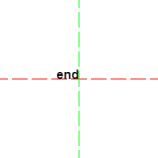

# 《JavaScript 高级程序设计》第十五章：使用 Cavans 绘图

## 简介

`canvas` 即 “画布”的意思，原点起始于左上角 `(0,0)` 处。
`canvas` 支持 2D 上下文与 3D 上下文，本章目前仅限于 2D 上下文内容。
`canvas` 元素会被 HTML, CSS 充当类似于 `` 元素的性质去处理，因此通过样式来设置画布尺寸，实际上只是对画布的放大与缩小。如果不想缩放内容的情况下改变画布的尺寸，我们只能通过 JS 的方式。

``` JS
// JavaScript
var drawing = document.querySelector('canvas');
drawing.width = 500;
drawing.height = 500;
```

画布尺寸设置好后，便可以通过 `getContext('2d')` 方法获取画布的 2D 上下文对象，这相当于获得一支画笔从而才能在画布上绘画。

``` JS
// JavaScript
var context = drawing.getContext('2d');
```

## 全局配置

“全局配置” 指的是对整个绘图上下文全局都有效的配置与设定，它们有一个共同点那就是直接附加在绘图上下文对象自身上。

### 填充

`fillStyle` 属性可接收的填充内容有：

* 颜色 (rgb, hsl, hsla, rgba, 十六进制、颜色名)
* 渐变 (gradient)
* 模式
* 画布 (另外一个 canvas)
* video

### 描边

`strokeStyle` 属性可以接受与 `fillStyle` 属性相同的值，但主要用于设置描边的颜色。

### 线条样式

可配置路径线条、描边线条等样式。

**lineWidth**

设置线条的粗细。

**lineCap**

设置线条末端的形状。

* butt : 平头，默认值。
* round : 圆头，向线条的每个末端添加圆形线帽。
* square : 方头， 向线条的每个末端添加正方形线帽。

**lineJoin**

设置线条的相交方式。

* miter : 斜接，默认值, 创建尖角。
* round : 圆交，创建圆角。
* bevel : 斜交, 创建斜角

``` JS
// JavaScript

var context = canvas.getContext('2d');

context.strokeStyle = '#000';
context.lineWidth = 10;
context.lineJoin = 'round';

context.strokeRect(50, 50, 100, 100)
```

> 注意： `lineCap` 属性无法作用于描边线条。

``` JS
// JavaScript
context.beginPath();
context.lineWidth = 10;
context.lineCap = "round";

context.moveTo(20, 20);
context.lineTo(200, 20);
context.stroke();
```

### 阴影

与阴影有关的属性配置有四个：

* shadowColor : 设置阴影的颜色。
* shadowOffsetX : 阴影的水平方向上偏移量。
* shadowOffsetY : 阴影的垂直方向上的偏移量。
* shadowBlur : 阴影模糊的像素量，默认值为 0，即不模糊。

``` JS
// JavaScript
var context = canvas.getContext('2d');

context.shadowOffsetX = 5;
context.shadowOffsetY = 5;
context.shadowColor = 'rgba(0,0,0,.5)';
context.shadowBlur = 10;

context.fillRect(20, 20, 100, 100)
```

### globalAlpha

`globalAlpha` 属性的值是一个介于 0 与 1 之间的值（包括 0 与 1），它用于指定所有绘制对象的透明度，默认值为 0。

### globalCompositionOperation。

`globalCompositionOperation` 属性我们可以理解为“全局合成模式”。简单的说就是处理多个绘制对象叠加时的显示样式。

* source-over (默认值) : 后绘制的图形位于先绘制图形的上面。
* source-in : 后绘制图形与先绘制图形重叠的部分可见，两者其它部分完全透明。
* source-out : 后绘制图形与先绘制图形不重叠的部分可见，先绘制的图形完全透明。
* source-atop : 后绘制图形与先绘制图形重叠部分可见，先绘制图形不受影响。
* destination-over : 后绘制的图形位于先绘制图形的下方，只有之前透明像素下的部分才可见。
* destination-in : 后绘制的图形位于先绘制图形的下方，两者不重叠的部分完全透明。
* destination-out : 后绘制的图形檫除与先绘制的图形重叠的部分。
* destination-atop : 后绘制的图形位于先绘制图形的下方，在两者不重叠的地方，先绘制图形会变透明。
* lighter : 后绘制的图形与先绘制图形重叠部分的值相加，使该部分变亮。
* copy : 后绘制的图形完全替代与之重叠的先绘制图形。
* xor : 后绘制的图形与先绘制图形重叠的部分执行 “异或” 操作。

> 具体效果可以参见 : https://developer.mozilla.org/en-US/docs/Web/API/CanvasRenderingContext2D/globalCompositeOperation

## 形状

`Canvas` 2D 绘图上下文唯一支持的形状就是 —— “矩形(Rect)”。
与“矩形”相关的方法有：

* fillRect(x, y, width, height); 
* strokeRect(x, y, width, height); 
* clearRect(x, y, width, height); 

这三个方法都接收相同的 4 个参数，分别是矩形的左上角坐标(x, y)与矩形的宽度和高度。

``` JS
// JavaScript
var context = canvas.getContext('2d');

context.fillStyle = 'red';
context.fillRect(0, 0, 100, 100);

context.strokeStyle = 'blue';
context.strokeRect(110, 110, 100, 100);
```

`clearRect()` 方法的原理就是将画布中指定位置大小的矩形区域变透明，这就可以生成一些有意思的效果，比如实现一个矩形的“形状剪切”。

``` JS
// JavaScript
context.fillStyle = 'red';
context.fillRect(0, 0, 100, 100);

//再红色的矩形中间剪切出一个小矩形。
context.clearRect(25, 25, 50, 50);
```

## 路径

通过 `canvas` 提供的 “路径” API，我们可以创造出更多复杂的形状和线条。
要绘制路径必须先调用 `beginPath()` 方法，表示要开始一个新的路径。
然后便可以调用下面的路径 API，绘制路径形状或线条：

**lineTo(x, y)**

从上一点开始到终点(x, y)为止画一条直线。

**rect(x, y, width, height)**

从起点(x, y)开始绘制一个指定宽度与高度的矩形路径（注意区别与 Canvas 唯一提供的形状 API）。

**arc(x, y, radius, startAngle, endAngle, counterclockwise)**
以点(x, y)为圆心以指定半径(radius)来绘制一条弧线，弧线的起始角度与结束角度(弧度制)分别为 `startAngle` 和 `endAngle` 。最后一个参数表示是否要逆时针方向计算，默认值为 `false` 。

**arcTo(x1, y1, x2, y2, radius)**

待补充。

**quadraticCurveTo()**

**bezierCurveTo()**
绘制一条三次贝塞尔曲线（略）。

当一个路径绘制完毕后，需要到新的位置绘制其它路径时，可以调用 `moveTo()` 方法。

* moveTo(x, y) : 将绘图游标移动到指定的(x, y)位置处，这类似于移动画笔笔尖。

在路径绘制完毕后，我们需要对应的调用 `closePath()` 方法表示路径绘制结束。

* closePath() : 路径已经完成。

路径是完全透明的，我们必须对路径进行描边或填充使其可见。

* fill() : 填充路径形状，填充内容由 `fillStyle` 属性设置。
* stroke() : 描边路径，路径样式由 `strokeStyle` 属性设置。

最后还可以调用 `clip()` 方法来裁切路径。

* clip(): 根据当前路径形状的范围来裁切内容，（该方法也可以适用于 fillReact()）

> 只有形状路径才能填充，通过线条路径拼接的形状是不能填充的。

``` JS
// JavaScript
var context = canvas.getContext('2d');

context.beginPath(); //表示路径起始。

var context = document.getElementById("ctx");
var ctx = context.getContext("2d");
context.width = 600;
context.height = 600;
context.style.border = "1px solid red";
let count = 0; //计数
let dig = Math.PI / 20;

var imgs = new Image();
imgs.src = "./img/fox.jpeg";
imgs.onload = function() {
    // 指定每隔0.15秒调用一次addRadial函数
    setInterval("addRadial();", 150);
}

var addRadial = function() {
    ctx.save(); //保存当前绘图状态
    ctx.beginPath(); //开始创建路径
    console.log('dig==', dig)
    ctx.arc(350, 350, 200, 0, dig * --count, true);
    ctx.lineTo(350, 350);
    ctx.closePath(); //关闭路径
    ctx.clip();
    ctx.drawImage(imgs, 120, 120);
    ctx.restore();
}
```

## 文本

### 绘制文本

在 canvas 中绘制文本需要调用文本专有的绘制方法，它们与形状、路径的绘制方法非常相同：

* **fillText(text, x, y)** : 将指定的文本(text)填充到坐标(x, y)处，填充样式由 `fillStyle` 属性设置。
* **strokeText(text, x, y)** : 将指定的文本(text)描边到坐标(x, y)处，描边样式由 `strokeStyle` 属性设置。

### 文本样式

绘制文本的样式则由以下三个属性设置：

* **font**

设置文本的粗细、字号、字体，分别用空格隔开。

``` JS
// JavaScript
context.font = 'bold 12px Arial';
```

* **textAlign**

设置文本的水平对齐方式，取值有: start、end、left、right、center。
推荐使用的水平对齐取值为: start、end、center。
start: 以垂直坐标 `y` 为起始位置（文本首部从 `y` 处开始绘制）。
end : 以垂平坐标 `y` 为结束位置(文本尾部到 `y` 处结束绘制)。
center : 以垂平坐标 `y` 为居中。

具体效果如图示：

 

* **textBaseline**

设置文本的垂直对齐方式，取值有: top、hanging、middle、alphabetic、ideographic、bottom。
常用取值有： `top` 、 `bottom` 、 `middle` 。
top: 文本顶部以水平坐标 `x` 对齐。
bottom: 文本底部以水平坐标 `x` 对齐。
middle : 文本垂直居中与水平坐标 `x` 。

  

### 文本尺寸

受限于字体、字号、粗细以及字符本身大小等因素影响，要想把一段文本控制在某个固定的区域中进行恰当且适合的渲染则比较复杂。

好在 `canvas` 2d 上下文提供了一个辅助计算文本大小的方法 `measureText()` 方法，返回值是一个 `textMetrics` 对象。它基于当前文本的预设样式(font、textAlign、textBaseline) 和字符本身占据的大小来计算指定文本渲染后的实际大小。

所以我们便可以在循环中不断调用 `measureText()` 方法，然后基于返回值不断的判断当前设置的样式是否能适合的渲染指定的文本。

``` js
var fontSize = 100;
context.font = fontSize + "px" + " bold Arial";
context.textBaseline = "top";

while (context.measureText("Hello World").width > canvas.width) {
    fontSize--;
    context.font = fontSize + "px" + " bold Arial";
}

context.fillText("Hello World", 0, 0);
```

> `fillText()` 与 `strokeText()` 方法还支持第四个参数 `maxWidth` ，在渲染文本高度保持不变的情况下，强行设置文本最大的渲染宽度，但要谨慎使用，以免渲染文本宽高比例失调导致失真。

## 图像

注意：

* 只有 `load` 后的图片才能被 `canvas` 2D 上下文获取处理。
* 不是同域或非 HTTP 环境下的图片会被 `canvas` 当作不干净的图像数据。

### 绘制图像

使用 `drawImage()` 方法可以将一幅“图像”或者另一个“画布内容”绘制到当前的画布中。

**将源图像完整的绘制到当前画布中**

``` js
context.drawImage(document.images[0], x, y);
```

将源图像完整的从当前画布的 `(x,y)` 位置处开始绘制。
通过再新增的两个参数，我们可以控制源图像在当前画布中的绘制尺寸，以实现对源图像的缩放绘制。

``` js
document.drawImage(document.images[0], x, y, width, height);
```

**将源图像的部分位置绘制到当前画布中**

``` js
document.drawImage(
    document.images[0],
    sourceX,
    sourceY,
    sourceWidth,
    sourceHeight,
    targetX,
    targetY
);
```

将源图像中由 `(sourceX,sourceY)` 起始到 `sourceWidth` 与 `sourceHeight` 结束的区域绘制到当前画布指定位置 `(targetX,targetY)` 。

当然，依然可以通过再新增两个参数来控制源图像在当前画布中的缩放绘制。

``` js
document.drawImage(
    document.images[0],
    sourceX,
    sourceY,
    sourceWidth,
    sourceHeight,
    targetX,
    targetY,
    targetWidth,
    targetHeigth
);
```

> 通过对源图像的缩放绘制我们可以实现对原始图像数据的压缩。

### 操作图像

`getImageData(x, y, width, height)` 方法可以获取当前画布中指定画面区域的图像数据。

`(x,y)` 设置画面区域的起始坐标位置， `width` 与 `height` 用于最终控制取得区域宽度和高度。

`getImageData()` 方法返回值是一个 `imageData` 实例，它有三个重要的属性: `width` 、 `height` 、 `data` 。

其中 `data` 属性是一个数组，它保存了图像中每个像素点的数据，每个像素点都需要使用 4 个数组元素来保存与表示，分别对应着这个像素点的红、绿、蓝和通道（透明度）值。

``` text
data:[
    R0,G0,B0,A0, //第一个像素点
    R1,G1,B1,A1, //第二个像素点
    R2,G2,B2,A3, //第三个像素点
    ...
]
```

数组中每个元素的值都介于 0 到 255 之间（包含 0 与 255）。当我们对这些像素数据进行处理时，实际上就是对这张图片进行处理，例如下面实现一个简单的灰阶过滤器（图片去色）。

``` js
window.onload = function() {
    context.drawImage(document.images[0], 500, 500, 200, 200, 0, 0, 200, 200);

    var imageData = context.getImageData(0, 0, canvas.width, canvas.height); //取得整个画布的图像数据
    var data = imageData.data;
    var r, g, b, average;

    for (var i = 0; i < data.length; i += 4) {
        r = data[i];
        g = data[i + 1];
        b = data[i + 2];

        //取得三原色的平均值，从而实现去色变灰。
        average = Math.floor((r + g + b) / 3);

        // 向 imageData实例的 data 属性写入处理好的像素数据
        data[i] = average;
        data[i + 1] = average;
        data[i + 2] = average;
    }

    // 将处理好的 iamgeData 实例推入到当前画布中从新渲染。
    context.putImageData(imageData, 0, 0);
};
```

最后的 `putImageData(imageData)` 方法用于将 `imageData` 实例放回到当前画布中。它与 `drawImage` 的本质区别就在于前者接收一张图片或者一个画布内容，而后者则接收图片的像素数据。

## 变换

`canvas` 的 2D 上下文对“图形变换”提供了两种方式：“基本变换”与“高级变换”。

### 基本变换

“基本变换”使用了预定义的变换矩阵配置，提供了 3 个常用的 API：

* `rotate(angle)` : 围绕画布原点将绘制的图形旋转到指定的弧度(angle)。
* `scale(sx, sy)` : 在水平与垂直方向上乘以指定的缩放系数来缩放要绘制的图形，默认的缩放系数为 `1` 。需要注意的是 `scale()` 方法不仅缩放绘制图形本身还会缩放与绘制图形相关的一切数值单位，例如边框的粗细、图形距离原点的起始坐标等。
* `translate(x, y)` : 将画布的“原点”移动到指定的坐标位置 `(x,y)` 处，相比 `moveTo(x,y)` 方法它有时更加的高效，但是要注意它会影响 `scale()` 方法。

### 高级变换

“高级变换” 可以自定义二维矩阵的变换配置。

``` text
Matrix = [
    a, c, e,
    b, d, f,
    0, 0, 1,
]
```

* **a** : 水平缩放，默认值为(1)。
* **b** : 水平倾斜，默认值为(0)。
* **c** : 垂直倾斜，默认值为(1)。
* **d** : 垂直缩放，默认值为(0)。
* **e** : 水平位移，默认值为(0)。
* **f** : 垂直位移，默认值为(0)。

在高级变换中提供了两个 API：

* `transform(a,b,c,d,e,f)` : 通过以上 6 个参数来同时控制要绘制图像的“缩放”、“位移”、“旋转”以及“倾斜”。
* `setTransform(a,b,c,d,e,f)` : 与 `transform()` 方法相同的功能，只是在每次进行变化之前都会将变化矩阵重置为默认状态。

### 叠加继承性

一旦执行了图形变换方法，它就会在当前上下文中一直有效，下次执行的相同变化都会基于上一次变化的值进行累加。

``` js
canvas.width = 400;
canvas.height = 400;

// 从画布的原点开始绘制一个宽100高100的矩形。
context.fillRect(0, 0, 100, 100);

// 将画布的原点移动到(100,100)处然后描边一个矩形
context.translate(100, 100);
context.strokeRect(0, 0, 100, 100);

// 在上次画布原点移动的基础上再移动100像素，因此现在的位置是(200,200);
context.translate(100, 100);
context.fillStyle = "gray";
context.fillRect(0, 0, 100, 100);
```

再比如 `transform()` 方法。

``` js
// 从原点位置开始绘制一个宽高分别100像素的矩形。
context.fillRect(0, 0, 100, 100);

// 通过 transform 实现 translate 的功能，将原点移动到(100,0) 位置处。
context.transform(1, 0, 0, 1, 100, 0);
context.fillStyle = "red";
context.fillRect(0, 0, 100, 100);

// 可以发现当再次移动原点坐标时是基于上一次移动的值累加，因此现在原点的位置是(200,0)
// 同时对绘制矩形进行水平倾斜。
context.fillStyle = "green";
context.transform(1, 0.1, 0, 1, 100, 0);
context.fillRect(0, 0, 100, 100);

// 与上一步完全相同，这里不仅是原点的移动距离进行了累加，同时水平倾斜也进行了累加，只是这里加的是0。
context.fillStyle = "blue";
context.transform(1, 0, 0, 1, 100, 0);
context.fillRect(0, 0, 100, 100);
```

如果想在下一次变化之前将上下文的状态重置为默认值，对于 `transform()` 方法可以通过调用 `setTransform()` 方法轻而易举的实现，

``` js
context.fillStyle = "blue";
context.setTransform(1, 0, 0, 1, 0, 100);
context.fillRect(0, 0, 100, 100);
```

但对于通过普通变换 API 实现的图形变换功能则没有什么好的办法将其重置回默认状态，对于这种情况下最好的办法便是引入状态的保存与恢复，简单的来说就是在每次执行变换之前保存下当前上下文的状态，当变换执行完毕后再恢复上次的状态。

## 状态的保存于恢复

调用 2d 上下文的 `save()` 方法可以将当前上下文的所有状态设置保存到一个“栈”结构中，连续调用则会连续向栈中加入当前状态下的上下文。

当上下文的当前状态被妥善的保存后，我们便可以对上下文进行新的修改与设置，若想回到之前保存的状态，则可以调用 `restore()` 方法，连续调用则可以一级一级返回，则非常类似于数组的 `pop()` 方法。

``` js
// 保存初始状态
context.save();

// 从原点位置开始绘制一个宽高分别100像素的矩形。
context.fillRect(0, 0, 100, 100);

// 通过 transform 实现 translate 的功能，将原点移动到(100,0) 位置处。
context.transform(1, 0, 0, 1, 100, 0);
context.fillStyle = "red";
context.fillRect(0, 0, 100, 100);

// 重置状态与保存当前状态。
context.restore();
context.save();

//因为是基于默认的上下文状态进行变换，所以水平位移要设置为200像素。
context.fillStyle = "green";
context.transform(1, 0.1, 0, 1, 200, 0);
context.fillRect(0, 0, 100, 100);

// 重置状态与保存当前状态。
context.restore();
context.save();

// 因为是基于默认的上下文状态进行变换，所以倾斜状态没有被继承，同时要指定水平位移距离为300像素。
context.fillStyle = "blue";
context.transform(1, 0, 0, 1, 300, 0);
context.fillRect(0, 0, 100, 100);
```

> `save()` 与 `restore()` 方法可以对所有影响上下文状态的设置都有效，例如 `fillStyle` ， `strokeStyle` 以及 `lineWidth` 等属性。

## 渐变

“渐变(gradient)” 分为：“线性渐变(Linear Gradient)” 与 “径向渐变(RadialGradient)”。
创建好的渐变并不能直接使用，必须作为 `fillStyle` 或 `strokeStyle` 属性的值参与图形绘制才会有效。另外需要注意的是“渐变”的位置是相对于画布原点的，因此在应用渐变时要保证渐变与所绘制图形的位置对齐。

### 线性渐变

“线性渐变”是两点之间的颜色过渡，通过设置起始坐标与结束坐标的位置关系，便可以很轻易的创建垂直的线性渐变、水平的线性渐变以及对角线形式的线性渐变。
调用 `createLinearGradient(startX,startY,endX,endY)` 方法创建一个线性渐变对象，这个方法接受四个参数，分别是渐变的起始坐标(startX, startY) 与结束坐标(endX, endY)。

线性渐变对象创建好后，便可以调用渐变对象自带的 `addColorStop(range,colorValue)` 方法来指定色标，它接收两个值，分别是当前色值在渐变中的占比（取值范围为 [0, 1]）以及具体的 CSS 颜色值。

``` js
//创建一个对角线形式的线性渐变对象，其渐变范围为(0,0) 到 (100,100)。
var gradient = context.createLinearGradient(0, 0, 100, 100);

// 调用渐变对象的 addColorStop 方法，指定色标。

gradient.addColorStop(0, "black");
gradient.addColorStop(1, "white");
```

当渐变对象与其色标都指定好后，便可以将其赋值与 `fillStyle` 属性，参与最后的绘制，但是绘制时一定要注意绘制图像与渐变位置保持对齐。

``` js
context.fillStyle = gradient;
context.fillRect(0, 0, 100, 100); //保持与渐变对象的位置对齐。
```

### 径向渐变

“径向渐变”是两个圆之间的颜色渐变过渡。
调用 `createRadialGradient(c1x,c1y,c1r,c2x,c2y,c2r)` 方法可以创建一个“径向渐变对象”，它分别接收两个圆的圆心坐标与半径的值。
径向渐变示意图如下：


开始渐变颜色(startColor)完全从第一个圆(c1)开始，然后过滤渐变到大圆(c2)的结束范围，而大圆之外的范围都是用结束颜色进行填充。

利用上面所示的径向渐变原理，来创建一个蓝色底的夜色背景。

``` js
//创建一个基于canvas画布范围的径向渐变对象。
var radial = context.createRadialGradient(
    canvas.width / 2,
    canvas.height,
    0,
    canvas.width / 2,
    canvas.height,
    canvas.height
);

// 为径向渐变对象指定色标
radial.addColorStop(0, "#035");
radial.addColorStop(1, "black");

// 渲染径向渐变到绘制的图形中。
context.fillStyle = radial;
context.fillRect(0, 0, canvas.width, canvas.height);
```

## 模式

“模式(pattern)”就是可以重复填充或描边使用的图形或图像，这些可重复的图形或图像通常会被充当于纹理或背景来使用。

调用 `createPattern(img,repeat)` 方法便可以创建一个“模式”，它接受两个参数，分别是作为纹理或背景的图片对象以及重复的方式。

重复方式与 CSS 的 `background-repeat` 取值完全相同： `repeat` 、 `no-repeat` 、 `repeat-x` 、 `repeat-y` 。

“模式”创建好后，也需要像渐变一样赋值给 `fillStyle` 或 `strokeStyle` 属性来参与图形的填充绘制。

``` js
var canvas = document.querySelector("canvas");
var context = canvas.getContext("2d");
var image = new Image();

canvas.width = 400;
canvas.height = 400;

image.onload = function() {
    var pattern = context.createPattern(image, "repeat");

    context.fillStyle = pattern;
    context.fillRect(0, 0, canvas.width, canvas.height);
};

image.src = "./wl.jpg";
```

“模式”除了可以接受图像作为填充的内容，还可以接受另一个 canvas 画布以及 video 作为填充样式。

``` js
// 创建离屏画布
function createOffScreenCanvas(res, callback) {
    var canvas = document.createElement("canvas");
    var draw = canvas.getContext("2d");
    var img = new Image();

    img.onload = function() {
        canvas.width = img.width;
        canvas.height = img.height;

        draw.drawImage(img, 0, 0);

        callback(canvas, img);
    };
    img.src = res;
}

createOffScreenCanvas("./wl.jpg", function(offScreenCanvas) {
    var pattern = context.createPattern(offScreenCanvas, "repeat");

    context.fillStyle = pattern;
    context.fillRect(0, 0, canvas.width, canvas.height);
});
```

## toDataURL

该方法会返回画布 `base64` 编码的 `dataURI` 类型的图片数据。

`toDataURL([type,Quality])` 方法可以接受两个参数，分别是图片的 `MIME` 类型，例如 `image/jpg` ， `image/png` 对于 `Chrome` 而言还单独支持一个 `image/webp` 类型。

当指定的 `MIME` 类型为 `jpg` 或 `webp` 时，还可传入第二个参数，控制返回的图片质量，取值范围 0 到 1之间。

``` js
var fullQuality = canvas.toDataURL("image/jpeg", 1.0);
var mediumQuality = canvas.toDataURL("image/jpeg", 0.5);
var lowQuality = canvas.toDataURL("image/jpeg", 0.1);
```

> `toDataURL()` 方法在不传入任何参数时，返回的是 `image/png` 类型的图片数据。

