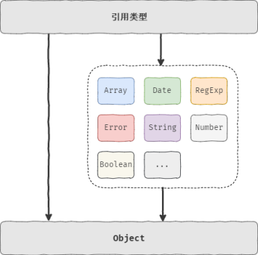
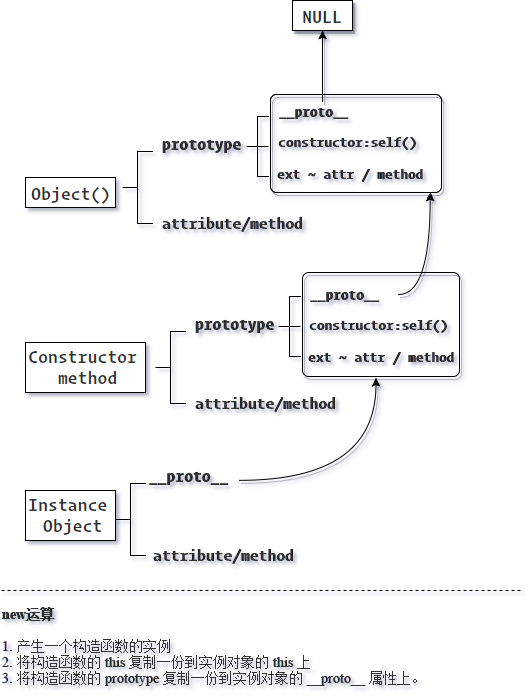

# 《JavaScript 高级程序设计》第五章：Object 类型

## 对象

### 定义

按照 ECMA-262 定义，“对象”是无序属性的集合。每条属性都是由 `key : value` 构成的“键值对”，其中 `key` 称之为“属性名”，`value` 则是属性名对应的“值”。“属性值” 可以是任何数据类型，包括基本值、对象、函数等。需要注意的是如果当 `value` 是一个方法或函数时，我们通常又称 `key` 为方法名。

### 成员组成

“对象” 是无序属性的集合，同理 “对象” 也是一系列无序键值对的集合，更是囊括不同类型数据和方法的集合体。因此对象中的每条 `key/value` 都可以看做成是这个对象的组成“成员”，而 `key` 则是对象的属性名或方法名，`value` 则是对象的属性值或功能方法。

在 ECMAScript 中 `key` 的名称可以由任何属于 `Unicode` 编码的字符组成，但常用的还是数字与字母。

### 成员访问

在 ECMAScript 中成员的访问主要有两种方式：

- "点" 表示法
- "[]" 方括号表示法

它们的区别是 “点” 表示法更通用，更直观，更快捷。但缺点则是无法访问含有特殊字符、关键字、保留字的成员名。

```javascript
Person.first name // Syntax Error
```

此时，括号表示法的强大就体现了出来。

```javascript
Person["first name"];
Person["first" + "name"];
```

## 引用类型与对象

ECMAScript 中有两种数据类型：“基本数据类型” 与 “引用数据类型”，

数据类型，顾名思义就是对数据进行分类，像 `number、Number、string、String、boolean、Boolean、null、undefined、Object、Function、RegExp、Date、Array、Error` 等都可以看做成是 ECMAScript 中的数据，如果对它们进行分类，从变量的角度去看非常好理解，如把 `number、string、boolean、null、undefined` 赋值给某个变量，那么变量中保存的就是这些数据的本身（实际值），属于 “按值访问”，这种数据我们就称之为 “基本数据类型”，而 `Object` 是一个对象，当它被赋值给某个变量时，变量中保存的并非是这个对象本身，而是对象的引用（指针），此时属于 “引用访问”，所以像这种数据类型，我们称之为 “引用类型”。

简而言之，引用类型与对象的关系就是类型与类型具体值的关系，像  `RegExp、Function、Date、Error、Array、String、Number、Boolean` 等类型的值也是属于按引用访问的，所以它们也是对象都属于 “引用类型”。

就如前面所说“引用类型” 的值就是其实例对象。

```javascript
var obj = new Object();
var arr = new Array();
var str = new String();
```

其中变量 `obj、arr、str` 等都是“引用类型”，它们的值分别是构造函数 `Object` 的实例(对象实例)、`Array` 的实例(数组实例对象)、`String` 的实例(字符串实例对象)。

《JavaScript 高级程序设计》中提到：

> `“引用类型” 是一种数据结构，它将数据（属性）与功能（方法）组织在一起。`

其本质还是因为 “引用类型” 值(对象)的特性。虽然在 ECMAScript 中  `Object`  的实例并不具备多少功能，但是利用对象的结构特征，对于应用程序中数据的存储与传输而言，则是非常理想的选择。

个人看来，“引用类型” 是将“对象”数据化的看待角度，因此判断一个值是否为“引用类型”主要有两点

- 值是否是一个对象。
- 对象是否被作为数据进行存储、传递、访问？

虽然我往往会疑惑像 Location、XMLHttpRequest、Window 等虽然也是对象，但是否能被认作为“引用类型”呢?其实评判的标准在于我们站在何种角度上，是以 ECMAScript 的角度还是 Javascript  的角度，对于前者标准中定义的对象类型，无非也就 Object、Array、Date、Number、String、RegExp、Function、JSON、Error 等。而如果扩展到整个 JavaScript  层面则将囊括了“内置对象”  与 “宿主对象”，如果它们又被类似于作为值的形式进行存储、传输，当然满足“我”所认为的“引用类型”的定义。

“引用类型”是一切对象类型的统称，但“对象类型”还可以进一步细分。回到上面的示例代码，我们可以发现对象(obj、arr、str)的产生是调用不同的函数，这些函数我们称之为“构造函数”。“构造函数”无疑是产生对象的工厂或母体（每个对象都是基于一个构造函数创建的），因此“构造函数”的名称便可以自然的用作于“引用类型”的更细致标识。

```javascript
Array() instanceof Array; //true 说明引用类型中的数组类型
Object() instanceof Object; //true 说明引用类型中的对象类型
new String() instanceof String; //true 说明引用类型中的字符串类型
```

又因为 JavaScript 中 `Object` 是一切对象的基础，所以下面的条件也会成立：

```javascript
new Boolean() instanceof Object; //true
new Number() instanceof Object; //true
new Date() instanceof Object; //true
RegExp() instanceof Object; //true
Function() instanceof Object; //true
Error() instanceof Object; //true
```

等后面我们详细学习每个构造函数的时候，我们还会发现有些引用类型的“构造函数”既是“构造函数”也可以充当普通的函数来使用，其实通过上面的两个示例我们就能发现一些端倪：

```javascript
new String() instanceof String; //true
new Boolean() instanceof Object; //true
new Number() instanceof Object; //true
new Date() instanceof Object; //true

String() instanceof String; //false
Boolean() instanceof Object; //false
Number() instanceof Object; //false
Date() instanceof Object; //false
```

最后，在第六章我们会讲通过自定义构造函数来创建自定义的“引用类型”。

## 一切皆对象？

答案并不如此，严谨的说法是 JavaScript  中除了“基本数据类型（值类型，按值访问）”以外所有的“引用类型”的值都是对象。

一切“引用类型”是的值是对象很好理解。那么为什么一切“引用类型”的值又都是 `Object`  类型呢？我们知道  `Object`  类型是众多引用类型的一种，其构造函数就是 `Objec()` ，同级别的还有 `Array、Function、Error`  等。但是为什么像数组、函数等即属于本身的特定引用类型又属于  `Object`  类型呢？这是因为像  `RegExp Function Date Error Array String Number Boolean`  等类型的值在原型链上都继承自  `Object`，所以也被认定为  `Object`  类型。

```javascript
Location.__proto__.__proto__;
Array.__proto__.__proto__;
JSON.__proto__;

/*
{
    constructor : ƒ Object()
    hasOwnProperty:ƒ hasOwnProperty()
    isPrototypeOf:ƒ isPrototypeOf()
    propertyIsEnumerable:ƒ propertyIsEnumerable()
    toLocaleString:ƒ toLocaleString()
    toString:ƒ toString()
    valueOf:ƒ valueOf()
    get __proto__:ƒ __proto__()
    set __proto__:ƒ __proto__()  
}
*/
```

因此  `Object`  在 JavaScript 中是一切对象的基础对象。更直白的说上述的所有对象因为在原型上都继承着  `Object`，所以可以看作是对  `Object`  的扩展对象。因此在我看来“引用类型”与不同的“对象类型”，其关系如下图所示：



通常我们判定一个对象是何种“引用类型”，主要还是判断该对象继承的是那个构造函数的原型。
在 JavaScript  中函数(构造函数)创建对象，而“函数”本身也是对象。所以“函数”无愧是第一等公民。

## 类与构造函数

“类”在面向对象编程语言中，可以很方便快速的创建具有相同属性与方法的对象(实例)，但是 JavaScript 中虽然也有面向对象的概念，但是对象的“继承”是基于原型、原型链的机制，因此严格的来说，JavaScript 是一门“基于原型的面向对象的脚本语言”，而与“类”具有相似的产物便是“构造函数”，但与 Java 这样面向对象语言中的“类”，还是有很大的区别，简要可以概括出三点：

### 创建

Java 中的对象必须由“类”来实例化，而 JavaScript 中对象可以由字面量格式非常简单的定义与创建，在 JavaScript 中对象就是很单纯的数据与功能的集合。

### 调用

Java 中类是不可以直接调用的，只是用来实例化对象，就算是调用方法也只能调用类上的静态方法，而在 JavaScript 中 充当类的构造函数是可以作为函数来调用的，例如：

```javascript
Object(); //{}
String(); //""
Number(); //0
```

另外构造器方法上的静态方法也可以直接使用，例如：`String.fromCharCode(65)`。因此可以看出 JS 对函数式编程支持更好！

### 继承

在面向对象编程语言中 “类” 的重要概念就是继承，由“类”实例化的对象便会继承该类的方法与属性，这种继承关系更类似于派生以及父子关系，而在 JS 中继承被更多的看作成具有相互关联的关系，而这个关系的联接就是我们常说的“原型链(**proto**)”。

```javascript
var Behavior = {
  eat: () => {
    alert("eat");
  }
};

var Tom = { name: "my name is Tom", __proto__: Behavior };
var Bob = { name: "my name is Bob", __proto__: Behavior };

Tom.name; // my name is Tom;
Tom.eat();
Bob.eat();
```

当然 JS 也支持面向对象开发语言的 `new` 运算符，例如常见的：

```javascript
var obj = new Object();
```

但实际上这个 `new` 运算符更多的充当着语法糖角色，大致上来说，`new` 运算符主要有以下功能：

- 新建并返回一个构造器函数的实例对象，`Constructor {}` ，然后将构造函数中的 `this` 对象复制到新建的实例对象 `this` 上。
- 把构造函数的 `prototype` 对象复制到新建对象的 `__proto__` 属性上，以便继承该构造器 `prototype` 对象上的属性与方法，例如：

```javascript
var obj = new Object();
obj.__proto__ === Object.prototype; // true;
```

实例化得到的 obj 对象其 `__proto__` 属性所指向关联（继承）的就是 `Object()` 构造器的 `prototype` 属性（原型属性）。

再比如一个完整的例子：

```javascript
function Student(name) {
  this.name = name;
}

Student.prototype.say = function() {
  //将实例对象的 __proto__ 与自身的 prototype 进行了关联。
  alert(this.name); //复制了this到实例对象上
};

var Tom = new Student("Tom");

Tom.say(); //Tome
```

此时 `new` 运算符做了两件事，第一把 `Student` 中的 `this` 复制到新的实例对象 Tom 上所以 Tom 上也存在 `name` 属性，并且值就是实例化过程中传入的 `Tom`。第二则是把 `Student` 的 `prorotype` 对象复制到 Tom 这个实例化对象的 `__proto__` 属性上。

```javascript
console.log(Student.prototype);
console.log(Tom.__proto__);

/*
{
    say: ƒ()
    constructor: ƒ Student(name)
    __proto__: Object
}
*/
```

从上例可以看出 `Tom.__proto__` 与 `Student.prototype` 指向的都是同一个原型对象，所以就非常好理解通过 `new` 运算符是如何实现继承关系的了。

下面是该原型对象上的具体属性与方法：

- say ： 原型对象上的方法，可以被其实例对象继承。
- constructor : 用于说明当前的原型对象属于那个构造函数，同时也是为了实现一个闭环的循环访问（构造函数通过 `prototype` 访问原型对象，原型对象再通过 `constructor` 属性访问所依附的构造函数 ）。
- **proto** : 该原型对象(prototype)上的原型链属性（用于说明该原型对象自身的继承关系）。

一般来说实例对象的 `__proto__` 属性保存的是其构造函数的 `prototype` 原型对象，而构造函数的原型对象本身也通过 `__proto__` 来说明其自身的继承关系，同样的，原型对象的继承对象也含有 `__proto__` 属性，依次类推我们便可以得出一个 `__proto__` 属性串联出的 “继承链—>原型链”。

以一个实例的数组对象为例：

```javascript
Array()
    length: 0
    __proto__: Array(0){

        map:ƒ map()
        filter:ƒ filter()
        push:ƒ push()
        indexOf:ƒ indexOf()
        sort:ƒ sort()
        ...
        constructor:ƒ Array()
            __proto__:Object{
                constructor:ƒ Object()
                hasOwnProperty:ƒ hasOwnProperty()
                isPrototypeOf:ƒ isPrototypeOf()
                ...
                __proto__ : null
            }
    }
```

从中我们可以看出 JavaScript Object 对象是一切其它对象的最底层最基础的对象，其它对象都是继承自 Object，而 Object 继承的则是 null。

从示例中 `Array()` 方法产生的匿名实例数组，其 `__proto__` 属性指向的是 `Array` 构造函数的 `prototype` 对象，而 `Array` 构造函数的 `prototype` 对象又继承自 `Object()` 构造函数的 `prototype` 原型对象。所以这种链式的继承关系可以如下图所示：



目前我们可以简单的总结下：在 JS 中构造函数类似与面向对象中“类”的关键点就在于方法（函数）具有 `prototype` 原型对象，它可以作为一个方法与属性的公共载体，用于该构造函数的实例对象通过 `__proto__` 属性进行继承，并且其本身也通过一个 `constructor` 属性再循环访问到自身所依附的构造函数。由于普通对象不存在 `prototype` 对象，所以也就无法充当“类”的角色，但是对象自身 `__proto__` 属性天生就是用来主动继承的，所以通过手动修改对象的 `__proto__` 属性也可以很灵活的调整对象与对象之间的继承关系。

## 继承方法

“继承方法”指的是对象实例通过 `__proto__`  原型链属性从其构造函数原型对象  `prototype` 上继承的方法。

**constructor**
保存着创建当前实例对象的构造函数。

```javascript
new Object().constructor; // "ƒ Object() { [native code] }"
```

这说明当前对象的构造函数就是 Object()。

**hasOwnProperty()**

接收一个参数 `key` ，判断这个成员是否为实例对象私有的方法与属性，而非继承着原型。

```javascript
function Test() {}
Test.prototype.custom = 1;

var test = new Test();

test.custom_private = 1;

console.log(test.hasOwnProperty("custom")); // false;
console.log(test.hasOwnProperty("custom_private")); // true;
```

**isPrototypeOf()**

接收一个对象作为参数，判断这个对象是否继承于指定的原型对象。

```javascript
Test.prototype.isPrototypeOf(test); // true
```

**propertyIsEnumerable()**

接收一个参数 `key`，判断这个成员在指定的对象上是否可枚举（遍历访问）。

```javascript
console.log(test.propertyIsEnumerable("custom")); // false;
console.log(test.propertyIsEnumerable("custom_private")); // true;
```

**toLocaleString()**

把对象转换为符合本地区格式的字符串。

**toString()**

把对象转换为字符串。

```javascript
test.toString(); //  "[object Object]"
```

在 JavaScript 中也只有 Object 的 `toString()` 方法才会返回这种格式，因此利用这个特性，我们可以在转换格式统一的基础上进行类型的判断。

```javascript
Object.prototype.toString.call({}); //"[object Object]"
Object.prototype.toString.call([]); //"[object Array]"
Object.prototype.toString.call(""); //"[object String]"
Object.prototype.toString.call(1); //"[object Number]"
Object.prototype.toString.call(true); //"[object Boolean]"
Object.prototype.toString.call(null); //"[object Null]"
Object.prototype.toString.call(undefined); //"[object Object]"
```

**valueOf()**

返回对象自身。
