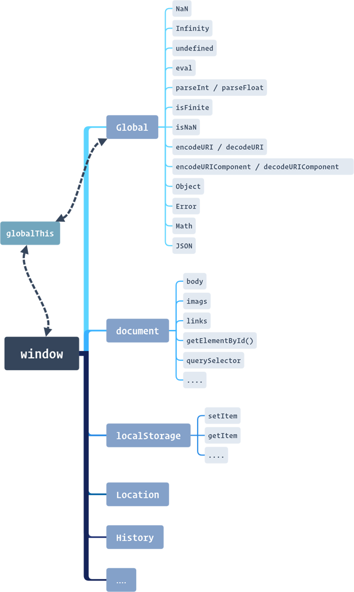

# 《JavaScript 高级程序设计》第五章：单体内置对象

简介
在 JS 中对象可以大致分为两类：“内置对象”与“宿主对象”。

“内置对象”指的是由 ECMAScript 实现并提供的与宿主环境无关的对象接口，例如 Object、Function、Array、String、Boolean、Number、Date、RegExp、Error、EvalError、RangeError、ReferenceError、SyntaxError、TypeError、URIError、Global、Math 等都是内置对象。而像 location 、history、Document、XMLHttpRequest 等则都是由宿主环境实现的对象接口。

“单体内置对象” 指的是不具有 `prototype` 属性的“内置对象”，因此不能结合 `new` 运算符充当构造函数使用，内部也不存在 `[Call]` 属性，所以也不能当作函数来调用。

ECMAScript 中的“单体内置对象”有：`Global` 、`Math` 、`JSON`，它们的关系如下：

```
─ Global
  ├─JSON
  └─Math
```

## Global

`Global` 对象是 ECMA-262 中定义的“唯一全局对象”，在任何 ECMAScript 程序执行之前便已存在，它是所有对象或函数最终极的顶层对象，是一切对象的“根”。

ECMAScript 中所有的变量、方法以及对象都必须要被保存在一个统一的根对象上，也就是不论存在多少个分支，都必须要有一个唯一的树干一般。也因此 ECMAScript 中并不存在真正的全局变量或函数，所谓全局作用域定义的变量与函数，实际上都是 `Global` 对象的属性与方法。

### 值属性

下面是 ECMA-262 标准中全局对象的值属性。

| 方法/属性 | 说明                                 |
| :-------- | :----------------------------------- |
| NaN       | 表示一个非数值，返回 `NaN`           |
| Infinity  | 表示一个 +∞ 的值，返回 `infinity`    |
| undefined | 表示一个未定义的值，返回 `undefined` |

> 在数据类型上 `NaN` 与 `infinity` 都是数值 `number` 类型，而 `undefined` 只是 undefined 类型。

```javascript
typeof window.NaN; //"number"
typeof window.infinity; //"number"
typeof window.undefined; //"undefined"
```

方法属性
下面是 ECMA-262 标准中全局对象的方法属性。

| 方法/属性          | 说明                                                     |
| :----------------- | :------------------------------------------------------- |
| eval               | ECMAScript 解析器(伪)                                    |
| parseInt           | 将数值或字符串数值转化为整数(十进制)，支持不同的进制数。 |
| parseFloat         | 将数值或字符串数值转化为小数(十进制)，支持不同的进制数。 |
| isNaN              | 是否不是一个数值                                         |
| isFinite           | 是否无穷大                                               |
| encodeURI          | URI 编码                                                 |
| decodeURI          | URI 解码                                                 |
| encodeURIComponent | URI 编码                                                 |
| decodeURIComponent | URI 解码                                                 |

parseInt / parseFloat
用于将数值或者是字符串型数值转换为“整数(int)”或者是“浮点数(float)”。

这两个方法都支持将“其它进制”的数转换为“十进制”，但是要转换的值必须附加对应进制数的前缀标识 —— `0`、`0x`。

```javascript
parseInt(070); //56
parseFloat(0x1a); //26
```

`parseInt` 还支持第二个参数，即指明要转换参数的“基数”，默认为 10(十进制)，如果不缺省该参数，则可以缺省被转换参数的前缀标识。

```javascript
parseInt("1a", 16);
```

#### encodeURI / encodeURIComponent

`encodeURI` 与 `encodeURIComponent` 都是依据 RFC3986 文档规定对 URI 进行编码，在编码时只允许包含英文字母（a-zA-Z）、数字（0-9）、-\_.~4 个特殊字符以及所有保留字符`! * ’ ( ) ; : @ & = + $ , / ? # [ ]`。除此之外对于 ASCII 码范围内的，使用 `%` 加上对应字符十六进制 ASCII 码进行编码，而对于超出 ASCII 码范围外的字符，则采用 UTF-8 编码进行编码。

“保留字符”是 URI 中具有特殊功能和含义的字符，使用“保留字符”可以将 URI 划分成若干个组件，协议、主机、路径等部分。例如 `: / ? #`，冒号用于分隔协议和主机，斜杠用于分隔主机和路径，问号用于分隔路径和查询参数，井号则用于分隔锚点位置等等。还有一些字符（!\$&’()\*+,;=）则用于在每个组件内部起到分隔作用，如 = 用于表示查询参数中的键值对，& 符号用于分隔查询多个键值对。当组件中的普通数据包含这些保留字符时，就需要对其进行编码(也就是使用其转义字符进行替换)，不然将会使 URI 发生格式上的错误，也或者会出现数据丢失的情况。例如空格，如果不进行转码 `%20`，在传输的时候可能会将一些有意义的空格丢失掉。

```javascript
encodeURI("a"); // "a"
encodeURIComponent("a"); //"a"

encodeURI("|"); //"%7C"
encodeURIComponent("|"); //"%7C"

encodeURI(String.fromCharCode(128)); //"%C2%80"
encodeURIComponent(String.fromCharCode(128)); //"%C2%80"

encodeURI("我"); //"%E6%88%91"
encodeURIComponent("我"); //"%E6%88%91"
```

总的来说，我们需要对 URL 进行编码，有三点原因：

1.消除歧义: 比如需要将“保留字符”作为普通内容的需求下，也或者需要用可见的编码对一些不可见的字符(控制字符)进行编码从而防止在传输时的错误，也或者是对超出的 ASCII 码表示范围外的字符进行编码，例如中文，以避免乱码可能造成的 bug 等。

2.混淆加密: 对 URL 进行编码在一定程度上也能达到混淆视听的作用。

3.安全考量: 有些字符直接放在 URL 中，可能会产生安全隐患，例如 `<` 与 `>` 如果不进行编码可能会诱发 XSS 攻击等。

在一般在使用上 `encodeURI` 用于对整个 URL 进行编码，而 `encodeURIComponent` 则主要对 URL 中的查询字符串参数或者是 hash 锚点值进行编码。另外就是这两个方法的安全字符范围并不一样`。其中`encodeURIComponent` 方法的编码范围要更广些。

encodeURI（82 个）：!#\$&'()\*+,/:;=?@-.\_~0-9a-zA-Z

encodeURIComponent（71 个）：!'()\*-.\_~0-9a-zA-Z

> 最新的 ECMA 标准推荐使用 `encodeURI` 或者是 `encodeURIComponent` 来替换 `escape` 编码方法。

#### eval()

1. 接收一个 JS 代码字符串作为参数，并用这个代码字符串来覆盖当前位置的 `eval` 代码。
2. 执行这个代码字符串，然后返回执行结果，默认值为 `undefined`。
3. 可以访问所处执行上下文环境中的作用域链。
4. 非严格模式下 `eval` 内部定义的标识符（变量、函数）可以被外部执行环境访问。
5. `eval` 中定义的标识都不会存在“声明提升”，这是因为在执行到 `eval` 代码之前，它们还是处于字符串的形式。

关于 `eval()` 执行代码字符串并返回结果的示例：

```javascript
var sum = eval("1+1");
var data = eval('({"name":"xiaoming"})');

sum; //2;
data; //{name: "xiaoming"}
```

关于 `eval()` 可以访问外部执行环境作用域链以及内部定义的标识符可以被外部代码访问的示例：

```javascript
var msg = "hello";
eval("alert(msg)");
eval('function say(){alert("world")}');
say();
```

这里我们可以理解为当 JS 引擎执行到 eval 代码时，会将 eval 代码所接收的代码字符串转换为真正的 JS 代码，然后插入到原本 eval 代码所在的位置，并替换掉原本的 eval 代码。最终作为当前执行上下文中常规的代码来执行。

关于 `eval()` 中定义的标识符声明提升问题的示例：

```javascript
say(); //Uncaught ReferenceError: say is not defined
eval('function say(){alert("Hi!")}');
```

除了执行 JS 代码字符串，`eval` 另一个常用场景便是充当 `JSON.parse()` 的兼容性方法，用来解析 JSON 字符串，但是往往在解析 JSON 时我们还需要用一对 `()` 圆括号来将 JSON 串括起来。

```javascript
eval('{"age":"26"}'); //Uncaught SyntaxError: Unexpected token :
eval('({"age":"26"})');
```

原因在于如果没有这对圆括号，`{"age":"26"}` 便会被 JS 引擎当作一般的代码进行执行，但是因为存在 `{}` 花括号运算符，所以又会被识别为一个语句块来执行，然后 `"age"` 可以被很正常的识别为字符串常量，但是扫描到 `:` 时，便会抛出语法错误 `Unexpected token :`。

### 构造函数属性

下面是 ECMA-262 标准中全局对象的构造函数属性。

| 方法/属性      | 说明                                  |
| :------------- | :------------------------------------ |
| Object         | 构造函数 Object，对象引用类型。       |
| Function       | 构造函数 Function，函数引用类型。     |
| Array          | 构造函数 Array，数组引用类型。        |
| String         | 构造函数 String，字符串引用类型。     |
| Boolean        | 构造函数 Boolean，布尔引用类型。      |
| Number         | 构造函数 Number，数值引用类型。       |
| Date           | 构造函数 Date，日期时间引用类型。     |
| RegExp         | 构造函数 RegExp，正则表达式引用类型。 |
| Error          | 构造函数 Error                        |
| EvalError      | 构造函数 EvalError                    |
| RangeError     | 构造函数 RangeError                   |
| ReferenceError | 构造函数 ReferenceError               |
| SyntaxError    | 构造函数 SyntaxError                  |
| TypeError      | 构造函数 TypeError                    |
| URIError       | 构造函数 URIError                     |

> 在 ECMAScript 第三版（ECMAScript 3.0）时加入了 `try-cacth` 异常捕获的支持。

#### 错误定义

- **Error()**

基本的错误类型，其他类型都继承自这个类型

- **EvalError()**

eval 函数没有被正确执行。

- **RangeError()**

参数或值超出有效范围。

```javascript
new Array(-1); //Uncaught RangeError: Invalid array length
```

- **ReferenceError()**

引用错误或引用了一个不存在的变量(标识符)：

```javascript
not; //Uncaught ReferenceError: not is not defined
```

或者将变量赋值给一个无法被赋值的对象：

```javascript
console.log() = 1; //Uncaught ReferenceError: Invalid left-hand side in assignment
```

- **SyntaxError()**

语法错误。

```javascript
var 1a; //Uncaught SyntaxError: Invalid or unexpected token
{ "age": 26 } //Uncaught SyntaxError: Unexpected token :
```

- **TypeError()**

类型错误。变量或参数不是预期类型。

```javascript
var a = new 123(); //Uncaught TypeError: 123 is not a constructor
var b = {};

b.say(); //Uncaught TypeError: b.say is not a function
```

`new` 运算符的参数应该是一个“构造函数”，而 `()` 运算符之前应该是个函数类型的标识符。

- **URIError()**

与 url 相关函数参数不正确，主要是 `encodeURI()`、`decodeURI()`、`encodeURIComponent()`、`decodeURIComponent()`、`escape()` 和`unescape()`这六个函数。

```javascript
decodeURI("%2"); //Uncaught URIError: URI malformed
```

这些错误类型，在我们具体编码的时候会根据实际的场景去应用，其中 `Error()` 是基本错误类型，可以用与扩展自定义的错误。

```javascript
function DtoB(value) {
  var result = parseFloat(value);
  if (!isNaN(result)) {
    return Number(result).toString(2);
  }
  throw new TypeError("请输入一个数值");
}

DtoB(100); //"1100100"
DtoB("a"); //Uncaught TypeError: 请输入一个数值
```

#### 错误抛出

ECMAScript 中使用 `throw` 语句抛出异常/错误类型。

#### 错误捕获

ECMAScript 中使用 `try{}catch(e)finally{}` 语句来进行错误的捕获处理。

### 其它对象属性

下面是全局对象的其他属性：

| 方法/属性 | 说明                    |
| :-------- | :---------------------- |
| Math      | 数学对象，单体内置对象  |
| JSON      | JSON 对象，单体内置对象 |

附加方法属性
下面是非标准的附加方法属性：

| 方法/属性 | 说明                                   |
| :-------- | :------------------------------------- |
| escape    | 以十六进制的转义序列对字符进行编码     |
| unescape  | 对使用 `escape` 方法编码的字符进行解码 |
|           |                                        |

`escape` 方法不会对 ASCII 码中的字母、数字 和特定的标点符号 `* @ - _ + . /`   进行编码，除此之外其他所有的字符都会以十六进制的转义序列进行替换。在格式上，`escape` 方法返回的字符编码有两种格式，当编码的字符小于 `0xFF` 范围时,用一个 2 位十六进制的转移序列: `%xx` 表示，大于 `0xFF` 范围的话则使用 4 位 Unicode 编码(UTF-16)`%uxxxx` 进行表示。

```javascript
var char = String.fromCharCode(0xff);
escape(char); //"%FF"
escape("我"); //"%u6211"
escape("a"); //”a“
```

> `escape` 与 `unescape` 都是全局对象附加方法属性，但并非属于标准中的方法，标准更推荐使用 `encodeURI` 或 `encodeURIComponent`。

## JSON

`JSON` 英文全称 JavaScript Object Notation，是一门独立的语言，定义了一种轻量级的数据交换格式。而 `Global.JSON` 这个单体内置对象则是 ECMAScript 对 `JSON` 这门语言的实现和支撑。

`Global.JSON` 包含两个方法，`parse()` 和 `stringify()` 分别用于解析和构造 JSON 数据。

JSON 数据中的值可以是 `Number、String、Boolean、Null、Object、Array、Date(ISO)` 等类型，但不支持 `RegExp` 以及 `Function`，如果值必须是一个正则对象或者函数，那么也只能将其转换为字符串形式进行保存。

JSON 不会对`空格`、`U+2028`、`U+2029`这三个字符进行转义，详细规范遵循于 [RFC4627](https://www.ietf.org/rfc/rfc4627.txt)

### parse ( text [ , reviver ] )

`parse()`   方法用来解析 JSON 字符串，构造由字符串描述的 javaScript 值或对象。

- `text`

是一个符合 JSON 格式的字符串，常见的是 `Object` 与 `Array` 类型，普通的基本类型数据也可以。

```javascript
JSON.parse("{}"); // {}
JSON.parse("true"); // true
JSON.parse('"foo"'); // "foo"
JSON.parse('[1, 5, "false"]'); // [1, 5, "false"]
JSON.parse("null"); // null
JSON.parse("1"); //  1
```

- `reviver(k , v)`

可选的回调函数，在每次解析的时候都会被调用,可用于按需处理(变换、删除)每次解析的结果。

回调函数内必须要通过 `return` 返回处理的结果，否则 `JSON.parse` 默认返回的解析结果是 `undefined`。

回调函数接受的两个参数分别是每次解析时的“属性名(k)”和“属性值(v)”，如果 JSON 字符串是数组格式则 `k` 为每次解析数组元素的索引，如果 JSON 字符串是基本类型则 `k` 值为空。而 `v` 值则是每次解析的属性值，如果要删除某个属性，则对应属性的 `v` 值只需要返回 `undefined` 即可。

回调函数的解析顺序是由内到外的顺序，即存在嵌套的 JSON 结构中，会先按照层级顺序，再按照由内到外的顺序进行遍历解析，当解析到最外层的时候，此时 `k` 的值便为空了。

```javascript
JSON.parse('{"t": 5}', function(k, v) {
  if (k === "t") return undefined; // 删除属性t
  return v;
});

JSON.parse('{"p": 5}', function(k, v) {
  if (k === "") return v; // 如果到了最顶层，则直接返回属性值，
  return v * 2; // 否则将属性值变为原来的 2 倍。
}); // { p: 10 }

JSON.parse('{"1": 1, "2": 2,"3": {"4": 4, "5": {"6": 6}}}', function(k, v) {
  console.log(k); // 输出当前的属性名，从而得知遍历顺序是从内向外的，
  // 最后一个属性名会是个空字符串。
  return v; // 返回原始属性值，相当于没有传递 reviver 参数。
});

// 1
// 2
// 4
// 6
// 5
// 3
// "
```

### stringify ( value [ , replacer [ , space ] ] )

`stringify()` 方法是将一个 javaScript 值(对象或者数组)转换为一个 JSON 字符串，它与 `parse` 是相反的操作。

- value

需要转换为 JSON 字符串的 javaScript 值，普通的基本类型数据也可以。

```javascript
JSON.stringify({}); // '{}'
JSON.stringify(true); // 'true'
JSON.stringify("foo"); // '"foo"'
JSON.stringify([1, "false", false]); // '[1,"false",false]'
JSON.stringify({ x: 5 }); // '{"x":5}'
JSON.stringify(new Date()); // ""2019-04-09T06:14:42.730Z""
```

- replacer

可选值，值是一个函数或者数组。

如果 `replacer` 的值是函数，则与 `JSON.parse` 的 `reviver` 回调相同，也接收两个参数 `replacer(k , v)` 分别是每次转换的键值对(key/value)，`k` 表示属性名，而 `v` 则是对应的属性值，如果要转换的值是一个数组，则 `k` 是每次转换的数组元素索引，而若是基本类型的数据，则为空。

如果需要删除某个要转换的属性，则只需为对应的属性值返回 `undefined` 即可。

```javascript
function replacer(key, value) {
  if (typeof value === "string") {
    return undefined;
  }
  return value;
}

var foo = {
  foundation: "Mozilla",
  model: "box",
  week: 45,
  transport: "car",
  month: 7
};
var jsonString = JSON.stringify(foo, replacer);
//{"week":45,"month":7}
```

> 如果转换的值是一个数组类型，则返回的 `undefined` 会被 `null` 替代，并不能删除对应的数组元素。

如果 `replacer` 的值是数组，则数组元素的值代表将被转换为 JSON 字符串的属性名。

```javascript
var foo = {
  foundation: "Mozilla",
  model: "box",
  week: 45,
  transport: "car",
  month: 7
};
var jsonString = JSON.stringify(foo, ["foundation", "model"]);
//"{"foundation":"Mozilla","model":"box"}"
```

- space

space 参数用来调整 JSON 字符串里面的缩进间距。如果是一个数字, 则在转换为 JSON 字符串时每一级会比上一级多缩进这个数字值的空格（最多 10 个空格）；如果是一个字符串(" "、"\t")，则每一级会比上一级多缩进一个该字符串（或该字符串的前十个字符）。

space 参数的主要作用还是美观 JSON 字符串的展示。

```javascript
JSON.stringify({ uno: 1, dos: 2, values: { a: 1, b: 2 } }, null, 4);
/*
"{
    "uno": 1,
    "dos": 2,
    "values": {
          "a": 1,
          "b": 2
    }
}"
*/
```

如果一个被转换的对象拥有 `toJSON()` 方法，那么 `stringify` 方法会主动调这个 `toJSON()`，并以该方法的返回结果为最终的转换结果。

```javascript
JSON.stringify({ date: new Date() }); // new Date().toJOSN() => new Date().toISOString();
```

利用这个特性，我们可以为要转换的对象自定义一个 `toJSON()` 方法，从而返回我们需要的转换结果。

```javascript
var obj = {
  foo: "foo",
  toJSON: function() {
    return "bar";
  }
};
JSON.stringify(obj); // '"bar"'
JSON.stringify({ x: obj }); // '{"x":"bar"}'
```

### Polyfill

用于在 IE7-版本中对 `JSON` 的兼容性支持。

```javascript
if (!window.JSON) {
  window.JSON = {
    parse: function(sJSON) {
      return eval("(" + sJSON + ")");
    },
    stringify: (function() {
      var toString = Object.prototype.toString;
      var isArray =
        Array.isArray ||
        function(a) {
          return toString.call(a) === "[object Array]";
        };
      var escMap = {
        '"': '\\"',
        "\\": "\\\\",
        "\b": "\\b",
        "\f": "\\f",
        "\n": "\\n",
        "\r": "\\r",
        "\t": "\\t"
      };
      var escFunc = function(m) {
        return (
          escMap[m] ||
          "\\u" + (m.charCodeAt(0) + 0x10000).toString(16).substr(1)
        );
      };
      var escRE = /[\\"\u0000-\u001F\u2028\u2029]/g;
      return function stringify(value) {
        if (value == null) {
          return "null";
        } else if (typeof value === "number") {
          return isFinite(value) ? value.toString() : "null";
        } else if (typeof value === "boolean") {
          return value.toString();
        } else if (typeof value === "object") {
          if (typeof value.toJSON === "function") {
            return stringify(value.toJSON());
          } else if (isArray(value)) {
            var res = "[";
            for (var i = 0; i < value.length; i++)
              res += (i ? ", " : "") + stringify(value[i]);
            return res + "]";
          } else if (toString.call(value) === "[object Object]") {
            var tmp = [];
            for (var k in value) {
              if (value.hasOwnProperty(k))
                tmp.push(stringify(k) + ": " + stringify(value[k]));
            }
            return "{" + tmp.join(", ") + "}";
          }
        }
        return '"' + value.toString().replace(escRE, escFunc) + '"';
      };
    })()
  };
}
```

## Math

`Math` 对象是一个“单体内置对象”，具有很多数学常数属性以及代表数学公式的函数方法。

`Math` 对象在执行数学计算相关任务时,其性能要比我们使用 JS 代码实现的计算功能更好。但受限于不同的 `OS` 以及架构的不同，运算结果的精度也会所有不同。

### 数学常数属性

| 属性名  | 说明                                                                     |
| :------ | :----------------------------------------------------------------------- |
| E       | 自然对数的底数 e 的数字值，约为 2.7182818284590452354                    |
| LN10    | 10 的自然对数的数字值，约为 2.302585092994046。                          |
| LN2     | 2 的自然对数的数字值，约为 0.6931471805599453。                          |
| LOG2E   | 自然对数的底数 e 的以 2 为底数的对数的数字值；约为 1.4426950408889634。  |
| LOG10E  | 自然对数的底数 e 的以 10 为底数的对数的数字值；约为 0.4342944819032518。 |
| PI      | 圆的周长与直径之比 π 的数字值，约为 3.1415926535897932。                 |
| SQRT1_2 | ½ 的平方根的数字值，约为 0.7071067811865476。                            |
| SQRT2   | 2 的平方根的数字值，约为 1.4142135623730951。                            |

数学函数属性

| 属性名                                  | 说明                                                                                                                                                                                                                           |
| :-------------------------------------- | :----------------------------------------------------------------------------------------------------------------------------------------------------------------------------------------------------------------------------- |
| abs (x)                                 | 返回 x 的绝对值。                                                                                                                                                                                                              |
| ceil (x)                                | 返回不小于 x 的且为数学整数的最小 ( 接近 −∞) 数字值。如果 x 已是整数， 则返回 x。 (若 x 小于 0 但大于 -1, 返回结果是 −0.)                                                                                                      |
| floor (x)                               | 返回不大于 x 的且为数学整数的最大 ( 接近 +∞) 数字值。如果 x 已是整数， 则返回 x。                                                                                                                                              |
| max ( [ value1 [ , value2 [ , … ] ] ] ) | 给定零或多个参数，返回其中最大值                                                                                                                                                                                               |
| min ( [ value1 [ , value2 [ , … ] ] ] ) | 给定零或多个参数，返回其中最小值                                                                                                                                                                                               |
| random ( )                              | 返回一个大于或等于 0 但小于 1 的符号为正的数字值，选择随机或在该范围 内近似均匀分布的伪随机，用一个依赖与实现的算法或策略。此函数不需要参数。                                                                                  |
| round (x)                               | 四舍五入，返回最接近 x 的数学整数                                                                                                                                                                                              |
| pow (x, y)                              | 返回 x 的 y 次方的依赖于实现的近似值 .                                                                                                                                                                                         |
| exp (x)                                 | 返回 x 的指数的依赖实现的近似值（e 为 x 次方，e 为自然对数的底）。                                                                                                                                                             |
| log (x)                                 | 返回 x 的自然对数的依赖于实现的近似值 .                                                                                                                                                                                        |
| sqrt (x)                                | 返回 x 的平方根的依赖实现的近似值。                                                                                                                                                                                            |
| acos (x)                                | 返回 x 的反余弦的依赖实现的近似值。结果以弧度形式表示，范围是 +0 到 +π。                                                                                                                                                       |
| asin (x)                                | 返回 x 的反正弦的依赖实现的近似值。结果以弧度形式表示，范围是 −π/2 到 +π/2。                                                                                                                                                   |
| atan (x)                                | 返回 x 的反正切的依赖实现的近似值。结果以弧度形式表示，范围是 −π/2 到 +π/2。                                                                                                                                                   |
| atan2 (y, x)                            | 返回 -- 参数 y 和 x 的商 y/x-- 的反正切的依赖实现的近似值，y 和 x 的符 号用于确定返回值的象限。注：命名为 y 的参数为第一个，命名为 x 的参数为第二个，这是有意，是反正切函数俩参数的惯例。结果以弧度形式表示，范围是 −π 到 +π。 |
| cos (x)                                 | 返回 x 的余弦的依赖实现的近似值。参数被当做是弧度值。                                                                                                                                                                          |
| sin (x)                                 | 返回 x 的正弦的依赖实现的近似值。参数被当做是弧度值。                                                                                                                                                                          |
| tan (x)                                 | 返回 x 的正切的依赖实现的近似值。参数被当做是弧度值。                                                                                                                                                                          |

**最大值/最小值方法**
\*\*
`Math.max()` 与 `Math.min()` 方法结合 `apply` 方法可以很巧妙的求出数组中的最大值与最小的值。

```javascript
Math.max.apply(Math, [1, 2, 3, 4, 5]); //5
```

> 其根本原因在于 `apply` 方法可以接收一个数组作为方法的参数列表。

**舍入方法**
\*\*
`Math` 对象提供的具有舍入功能的方法有：

- `Math.ceil(x)` ：向上取整，总会返回大于等于 x 的最近整数。
- `Math.floor(x)` ：向下取整，总会返回小于等于 x 的最近整数。
- `Math.round(x)` ：标准的四舍五入方法。

```javascript
Math.ceil(25.9); //26
Math.ceil(25.5); //26
Math.ceil(25.1); //26

Math.floor(25.9); //25
Math.floor(25.5); //25
Math.floor(25.1); //25

Math.round(25.9); //26
Math.round(25.5); //26
Math.round(25.1); //25
```

引申开来，也具有舍入特点的其它方法，还有 `Number` 对象的 `toFixed(n)` 实例方法。

```javascript
(25.9).toFixed(); //26
(25.5).toFixed(); //26
(25.1).toFixed(); //25
```

**随机数方法**

`Math.random()` 方法会返回一个大于等于 0 小于不等于 1 的随机数 `x>=0 && x < 1`，区间表示: `[0,1)`。

我们可以封装一个函数，来返回指定起始与结束范围内的所有随机数。

```javascript
function getRandom(start, end) {
  var range = end - start + 1; //line1
  return Math.floor(Math.random() * range + start); //line2
}
```

- `line1` : 最后的值 减 起始值 再 加 上起始值 便得到了 [start,end] 之间数的数量。
- `line2` : 如果随机数为 0 则加上 start 确保了起始值，如果随机数不为 0，Math.floor 则确保了结果不会超出 end。

## window

`Global` 对象在不同宿主环境中的实现并不相同，在浏览器中指的是 `window` 对象，而在 `NodeJS` 环境中却真的存在一个名叫 `global` 的顶层对象。这里我们要学习的是浏览器环境下的 `window` 对象，按照 ECMA-262 标准规定 “全局对象还可以拥有额外的宿主定义的属性。” 所以我们可以将 `window` 对象看成是 `Global` 对象的实现超集。

> **《JavaScript 高级程序设计》**

ECMAScript 虽然没有指出如何直接访问 `Global` 对象，但 Web 浏览器都是将这个全局对象作为 `window` 对象的一部分加以实现的。



> 当然在实际浏览器环境中并不存在 `window.global` 这个对象，但是不妨我们可以将其看作 `window.globalThis` 对象去理解。
