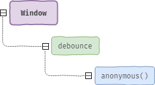
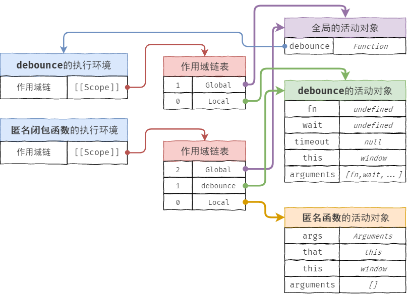

# 《JavaScript 高级程序设计》第七章 :函数表达式

## 热身  

我们知道函数的创建方式有两种：“函数声明” 与 “函数表达式”，而这两者的最大区在于前者具有 “函数声明提升”，而后者因为是将一个函数赋值给一个变量，所以属于“变量声明提升”的范畴。

“函数声明提升”与“变量声明提升”这二者的比较，我们可以发现“函数声明提升”的优先级更高。

```javascript
var a = 1;
function a() {}

console.log(typeof a); //number
```

正因为是属于变量赋值，所以“函数表达式”适用于在语句块中定义，而“函数声明”则无法定义在一个语句块中，因为这违背了语法的基本规则，是严重不符合规范的使用方式。

```javascript
var fn = null;
if (condition) {
  fn = function() {
    alert("true");
  };
} else {
  fn = function() {
    alert("false");
  };
}

fn();
```

“函数表达式”本身是一个匿名函数，这种匿名的函数相比普通的函数（函数声明语句），它们的 `name` 的值为空。

```javascript
console.log(function a() {}.name); //a
console.log(function() {}.name); //""
```

当把匿名函数赋值给一个标识符后，匿名函数的 `name` 就等于其变量标识符的名称。

```javascript
var b = function() {};
console.log(b.name); //"b"
```

“匿名函数” 又被称之为“拉姆达函数(Lambda)”

如果将声明式的函数赋值给一个变量，那么这种形式则称之为“命名函数表达式”。

```javascript
var fn = function f() {};
```

## 递归

“递归” 实际上就是自己调用自己。

“递归” 常用于存在嵌套且具有相同的处理操作的场景中，例如常见的就有“阶乘”、“深拷贝” 等。

```javascript
function factorial(num) {
  if (num < 1) {
    return 1;
  } else {
    return num * arguments.callee(num - 1);
  }
}
```

我们知道 `arguments.callee` 永远都是指向函数自身，但是这种使用方式并不被 ES 严格模式所支持，所以我们应该尽量避免这种方式，而是直接采用函数名来替代。

```javascript
return num * factorial(num - 1);
```

如果不能保证 `factorial` 变量永远存在，那么稳妥的方法可以采用 “命名函数表达式”的方式。

```javascript
var factorial = function recursionFactorial(num) {
  if (num < 1) {
    return 1;
  } else {
    return num * recursionFactorial(num - 1);
  }
};
```

这样 `factorial` 就算被销毁，但是 `recursionFactorial` 依然存在。

## 闭包

“闭包(closure)”实际上就是被返回的函数有权访问其包含函数中定义的变量和标识符。

“闭包”可以访问其包含函数中的变量标识符，原理在于闭包函数的作用域链中引用了包含函数的作用域。

```javascript
function debounce(fn, wait) {
  var timeout = null;
  return function() {
    var args = arguments;
    var that = this;
    if (timeout) clearTimeout(timeout);
    timeout = setTimeout(function() {
      fun.apply(that, args);
    }, wait);
  };
}
```

在这个“防抖”的示例中，`debounce` 就是“包含函数”，而 `debounce` 函数内部通过　`return` 语句返回的匿名函数就是前面我们所说的 —— “闭包函数”。

对于“包含函数”、“匿名闭包函数” 以及全局对象 `window`，它们之间的包含关系，相信很快就会联想到下图。



在了解了关于“闭包”的大致概念后，现在我们来继续了解“作用域”、“作用域链”的相关知识，因为这些才是闭包的底层原理。

首先、“作用域”指的是变量的访问范围，因为 JS 是“词法作用域”(lexical scoping)，即“静态作用域”而非“动态作用域”，所以函数的作用域范围在函数定义的时候便已经确立，在 JS 中每个函数都会有独立的局部作用域，所以我们要说的“作用域链”实际上就是多个函数作用域的串联，这一点非常类似与对象继承关系的“原型链”。但与原型链中原型属性 `[[Prototype]]` 属性与原型对象 `prorotype` 的关联关系又有所不同，“作用域链”实际上是多层级函数嵌套的过程，即作用域链内的每一个环节（作用域）都对应者嵌套的每一层函数，关于这点的理解的图示，可见读书笔记的第四章。

“作用域”与“作用域链”听上去很虚，难以理解，那么我们就寻找它们存在的实物然后参照着去理解，首先我们是否还记得第五章函数类型时我们分析过，当一个函数被执行的时候，首先会创建该函数的执行上下文 `EC`，然后将该上下文加入执行栈中等待执行，实际中当函数的执行上下文创建好后，分别会使用 `this` 以及函数的 `arguments` 和其它函数的形参来初始化执行环境的 “变量对象”，由于这个变量对象只在函数执行的时候才被创建，因此也称之为“活动对象”，同时初始化的还有“作用域链”对象并将其保存在函数内部的 `[[scope]]` 属性中。

```javascript
function fn() {}
console.dir(fn);
/*
arguments: null
caller: null
length: 0
name: "fn"
prototype: {constructor: ƒ}
__proto__: ƒ ()
[[Scopes]]: Scopes[1]
*/
```

抛开“原型链”对象，我们知道“变量对象”实际上是一个 MAP 表结构，存放了当前函数内的所有标识符（私有变量、函数的形参、arguments），当在函数内部去访问这些私有的标识符的时候，都会前往该函数的活动对象中去查找，因此“活动对象”就决定了某个标识符是否能解析获取成功，即“变量对象”就是“作用域”，因为它决定了当前函数内的标识符解析。

每个函数都有自己的”活动对象“，所以每个函数都有自己的独立作用域，而“作用域链”则是指向这些变量对象的指针列表，它只引用但不实际包含变量对象，因此每个函数的作用域链对象中都会有一个引用自身的“变量对象”，如果这个函数还被嵌套在其它函数中，那么其作用域链表的第二个位置就是其嵌套函数“活动对象”，依次类推作用域链表的最顶端一定是全局环境 `window` 的“变量对象” —— 即全局作用域，因为所有的局部代码都是嵌套在全局代码内的，这也很好的说明了为什么我们不论在那里编写代码，总能访问到全局变量。

总结下，“变量对象”或者是“活动对象”就是“作用域”，它们决定了某个变量或标识符能否查询到，而“作用域链”对象则是保存了一张作用域链表，这张表里除了保存当前作用域的引用，还保存了当前作用域上层以及上上层等作用域的引用（如果有的话），最终到达“全局作用域”。



与原型链中原型属性的访问机制相同，如果要解析的标识符没有在当前的作用域对象中查询到，则会沿着作用域链表的顺序依次在每个作用域中进行查找，如果查询到了则会停止解析，哪怕再上层具有同名的标识符也不会去解析 —— 这就是标识符在作用域链中的解析过程。

### 闭包与变量

由于“闭包函数”是在上一层执行环境执行完成后返回的，所以如果闭包函数内部通过作用域链去查询上层活动对象中的标识符，那么只会获得上层活动对象中所有变量的最后阶段的值。

```javascript
function getIndex() {
  var clouser = [];
  for (var i = 0; i < 10; i++) {
    clouser.push(function() {
      console.log(i); //每次都会是10
    });
  }
  return clouser;
}
```

原因很简单，那就是闭包返回的时候上层函数 `getIndex` 已经执行完了，其活动对象中保存的 `i` 变量的值已经是 `10`，此时闭包再去获取总会固定返回 `10`。

如果想每次执行闭包都返回对应的索引，我们可以在闭包函数外面再套一层“立即执行函数表达式”，套的原因在于每次循环的时候都会创建一个匿名函数，然后把循环的索引值作为参数传递这个匿名函数，让每次通过循环生成的立即执行函数使用自己的活动对象来保存每个阶段循环的索引值，然后立即执行函数中再返回闭包，这样闭包就可以通过上层立即执行函数的活动对象来读取循环的每个阶段的值，返回的也总会是每次循环的索引值。

```javascript
function getIndex() {
  var clouser = [];
  for (var i = 0; i < 10; i++) {
    clouser.push(
      (function(index) {
        return function() {
          console.log(index); //每次都会是10
        };
      })(i)
    );
  }
  return clouser;
}
```

然后调用每次循环生成的函数

```javascript
getIndex()[0](); //0
getIndex()[1](); //1
//....
getIndex()[9](); //9
```

### 闭包与 this

其实应该说的是“活动对象”与 `this` ，由于每个活动对象都会存在 `this` 对象，并且当函数或方法不属于某个对象的成员属性，那么其活动对象中 `this` 默认指向的都是 `window`，因此就会造成内部函数每次搜索 `this` 的时候，只会搜索到当前活动对象为止。即永远不会再访问外部函数活动对象的 `this`，而且固定的指向 `window`。

如果内部函数想引用外部函数的 `this` 其实很简单，只需要在外部函数的作用域中在定义一个私有变量，然后保存当前活动对象中的 `this`，那么，当内部函数去解析这个变量标识符的时候，便会沿着作用域链到上层的作用域对象中去取这个变量所引用的 `this`。

```javascript
function Fn() {
  var that = this;
  return function() {
    console.log(that);
  };
}
```

### 闭包与 arguments

与 `this` 的原理相同，因为每个函数的“活动对象”中都存在 `arguments` 对象，所以当内部函数每次搜素 `arguments` 的时候，都只会搜索到当前的活动对象为止，即不会超出当前作用域的范围。

### 闭包回收

对于主流浏览器而言闭包的回收很简单，只需要将引用闭包的变量置为 `null` 即可，但值得我们注意的一点是，如果一个闭包没有被回收，而且这个闭包内部还访问了其它作用域中的标识符，那么保存这些标识符的执行环境以及执行环境中的作用域链对象在执行完成后确实会被销毁，但是这些执行环境中的“活动对象”却永远不会被销毁，因为闭包的作用域链还对这些活动对象具有引用关系。

当然销毁闭包等于销毁一切，但这只是针对采用“标记清除”垃圾回收机制的现代浏览器而言的，对于采用“引用计数”机制的老版本 IE（IE8-），我们在编码的时候就需要具体的考量，以避免循环引用的情况发生。

```javascript
var handleClick = function() {
  var elem = document.getElementById("btn");
  elem.onclick = function() {
    return elem.id;
  };
};
```

原本的本意是定义一个 `handleClick` 的函数用于封装 `btn` 元素的点击事件，但是由于 `elem` 这个 DOM 对象通过 `onclick` 引用了一个匿名函数，而这个匿名函数中又因为返回 `elem.id` 的值，再次引用了 `elem` DOM 元素，因此就产生了循环引用的情况，如果在老版本的 IE，那么这里的标识符将无法被正常的回收。

此时，我们就需要在编码的过程中仔细的考量，谨慎的定义多个对象之间的引用关系。

```javascript
var handleClick = function() {
  var elem = document.getElementById("btn");
  var id = elem.id;

  elem.onclick = function() {
    return id;
  };

  elem = null;
};
```

## 对象的私有变量

对象不像函数，具有独立的作用域且可以定义私有的变量或方法，对象的成员属性具有透明性，即所有的方法都可以访问对象中的任何成员属性或成员方法，对没有进行不可扩展、密封、冻结的对象还可以进行添加、修改、删除该对象成员的操作。

如果要让对象也具有函数私有变量一样性质的私有成员，解决的办法就是通过“对象”与“闭包”来模拟实现，为什么说是“模拟”因为我们所认为的私有成员实际上还是闭包方法的上一层作用域的私有变量，只是该私有变量可以被我们所创建的对象进行引用，而且还只能通过对象上特定的方法才能访问，但本质上该变量并非是对象的实际成员。

我们先从一个简单的全局变量入手，我们定义一个全局的变量 `_g`，然后在一个立即执行函数中为这个全局变量赋值一个匿名函数表达式，这个匿名函数中存在着对上层作用域的变量进行引用。

```javascript
var _g;

(function() {
  var value = "IIFE";
  _g = function() {
    return value;
  };
})();

_g();
```

在这个简单的示例中我们要学会两个概念的定义，例如立即执行函数中的 `value` 是 `私有的变量`，能够访问这个私有的变量只有 `_g` 这个方法，因此我们把有权访问私有变量和私有函数的公有方法称之为 `特权方法`。

继续深入，现在如果现在这个全局变量 `_g` 是一个对象会怎么样呢？

```javascript
var _g = {};

(function() {
  var value = "function expression";
  _g.getValue = function() {
    return value;
  };
  _g.setValue = function(v) {
    value = v;
  };
})();

_g.getValue(); //function expression
```

现在我们就为变量 `_g` 定义了一个模拟的私有成员属性 `value`，这个属性直接通过对象是无法获取到的，只有使用两个特权方法 `getValue` 与 `setVlaue` 才能够获取以及操作。

但是示例的方式都是通过全局变量来引用立即执行函数中的私有函数,而且全局变量与立即执行函数也是分开定义的，缺少整体性与封装性，因此我们还可以继续更一步的改进，即在对象创建的时候就定义私有成员以及特权方法。

### 对象的静态私有变量

“对象的静态私有变量”指的是在对象的构造函数中定义私有变量和特权方法，然后将特权方法作为对象的实例成员随同返回。

```javascript
function Person(name) {
  var name = "blob";
  this.getName = function() {
    return name;
  };
  this.setName = function(n) {
    name = n;
  };
}
```

根据构造函数的特性，每次执行构造函数返回的实例对象都具有独立的私有变量与特权方法，多个实例对象同时对 `name` 进行设置与获取，都是独立的操作。

### 对象的共享私有变量

“对象的共享私有变量” 这种模式下对象的私有成员实际上是一个立即执行函数的私有变量，然后特权方法则定义在构造函数的原型上，这样所有该构造函数的实例对象都可以操作读取这个公共的私有成员属性。

```javascript
(function() {
  var name = "";
  Person = function(n) {
    name = n;
  };
  Person.prototype.getName = function() {
    return name;
  };
  Person.prototype.setName = function(n) {
    name = n;
  };
})();
```

> 注意：只要没有使用关键字声明的变量都是全局变量。

在这种模式下，我们 `setName` 与 `getName` 实际上都是对同一个私有变量进行操作。

### 小结

**“对象的静态私有变量” 与 “对象的共享私有变量”的优点**

相比普通离散的方式，“对象的静态私有变量” 与 “对象的共享私有变量”更具有可封装性，同时还可以定义特定引用类型且具有私有成员变量的对象。

**“对象私有成员变量”的作用？**

例如，我们需要对象的某个成员属性作为缓存空间，来保存特权方法处理的结果，但是又不想让这个成员属性直接暴漏出来，可以被任何的方法进行修改读取等。

**思考**

个人认为使用对象的扩展性、密封性、冻结性等完全可以作为“对象私有成员变量”的替代方案。

## 模块模式

“模块模式” 中的模块实际上就是指函数作用域的封闭性与独立性。

“模块模式” 实际上就是对闭包的一种运用，它定义了一个封闭的空间，然后暴漏出一个接口，只有通过这个接口，才能访问这个模块的内部的私有变量和标识符。

### 模块模式的作用

上面都是对“模块模式”的定义以及模块模式的性质进行说明，而实际运用上，模块模式的最大价值在于保持代码块之间相互独立，清晰地分离和组织项目中的代码单元，而这一点的具体体现就是知名的前端打包工具 `webpack` ，它就是利用了 JS 函数具有模块的封闭性来模拟其它面向对象语言中的 `Package` 概念，除此之外，AMD 模式、CommonJS 模块、IEFF 模块等都是模块模式的典型运用。

### 基本模块模式

就是具有独立作用域的普通声明函数和函数表达式。

```javascript
function applaction() {
  return {};
}

var applaction = function() {
  return {};
};
```

### 经典模块模式

```javascript
var applaction = function(component) {
  var components = [];
  if (typeof components === "object") {
    components.push(component);
  }
  return {
    getComponentCount: function() {
      return components.length;
    },
    registerComponent: function(component) {
      if (typeof components === "object") {
        components.push(component);
      }
    }
  };
};
```

> 实际到了这里我们“面向对象程序设计 - 创建对象”中所说的“稳妥构造函数模式”（我个人喜欢称呼的简单的安全工厂模式）就是对“模块模式”结合对象的创建返回。

### 立即执行的模块模式(IEFF)

```javascript
var applaction = (function() {
  return {};
})();
```

### 可扩展的模块模式

```javascript
(function($) {
  // 获取 jQuery
})(jQuery);
```

### 高级的可扩展模块模式

```javascript
var applaction = (function(module) {
  //add method or add property
  return module;
})(module || {});
```

这种方式的优点在于可以进行异步脚本的执行，比如这个 module 对象还没有获取到的情况。

### Sub-modules

可以基于 Module 建立 Sub Module

```javascript
applaction.sub = (function() {
  return {};
})();
```
