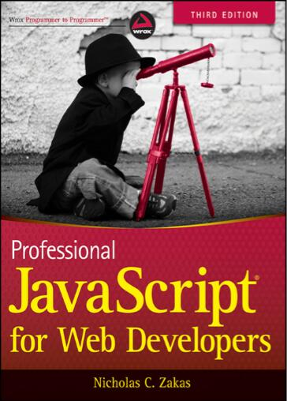

---

## 简介

对《JavaScript 高级程序设计》第三版的阅读、整理、理解、总结、概括、延伸而记录的学习笔记。

## 特色

- **💎 精要总结**
- **🚀 深度扩展**
- **🎉 去旧存新**
- **🎯 浅显易懂**
- **🔎 结构梳理**

## 目录

- [📚 第一章：简介](./Chapter1%20-%20What%20Is%20JavaScript/简介.md)
- [📚 第二章：在 HTML 中使用 JavaScript](./Chapter2%20-%20JavaScript%20in%20HTML/在HTML中使用JavaScript.md)
- [📚 第三章：基本概念](./Chapter3%20-%20Language%20Basics/基本概念.md)
- [📚 第四章：变量、作用域和内存问题](./Chapter4%20-%20Variables%20Scope%20And%20Memory/变量、作用域和内存问题.md)
- 📦 第五章：引用类型
  - [📚 第五章：Object 类型](./Chapter5%20-%20Reference%20Types/Object%20类型.md)
  - [📚 第五章：Array 类型](./Chapter5%20-%20Reference%20Types/Array%20类型.md)
  - [📚 第五章：Function 类型](./Chapter5%20-%20Reference%20Types/Function%20类型.md)
  - [📚 第五章：Date 类型](./Chapter5%20-%20Reference%20Types/Date%20类型.md)
  - [📚 第五章：RegExp 类型](./Chapter5%20-%20Reference%20Types/RegExp%20类型.md)
